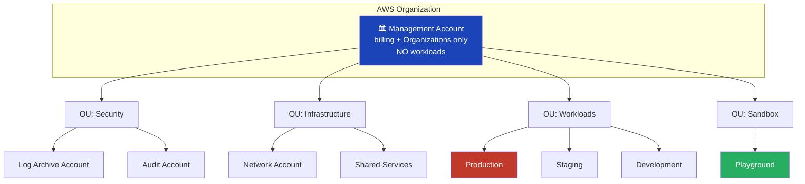
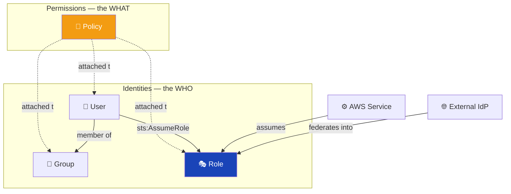
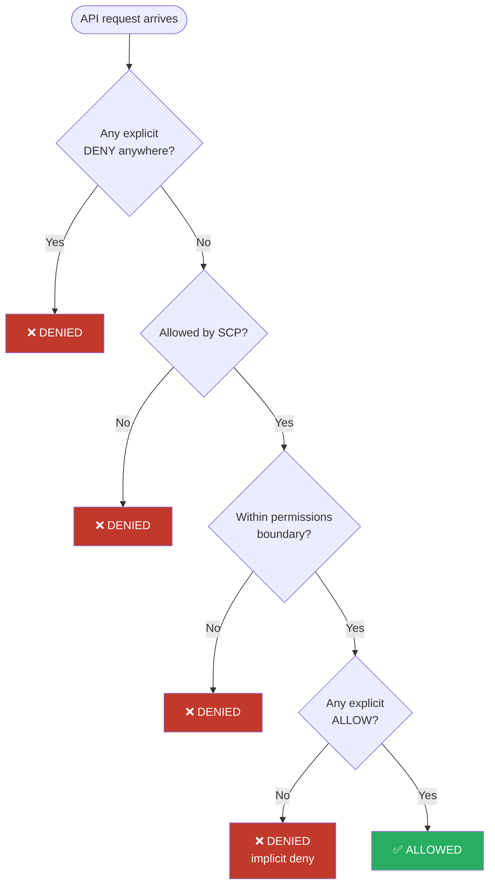
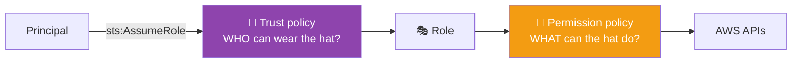
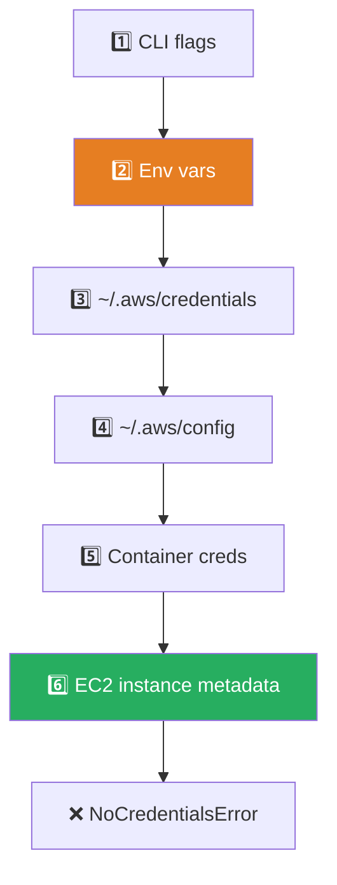
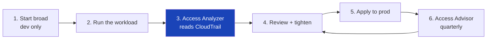
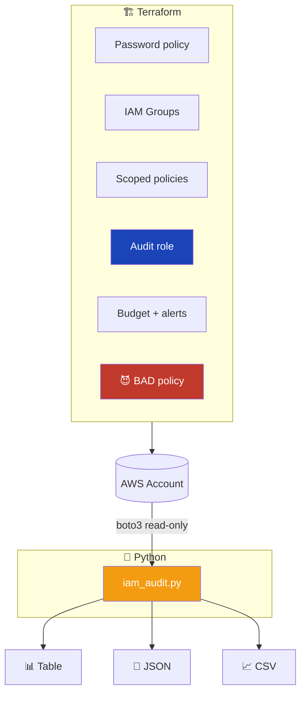
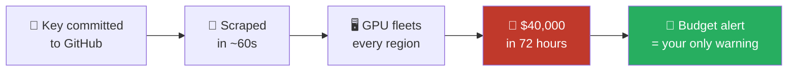

# Day 01 Diagrams

Mermaid source for every diagram used in the Day 01 guide. GitHub renders these natively.
Copy any block into <https://mermaid.live> to edit, or export as PNG/SVG for slides.

---

## 1. Multi-account organisation structure

## 2. IAM identities and policies

## 3. Policy evaluation logic ⭐

## 4. Trust policy vs permission policy

## 5. Credential resolution chain

## 6. Least-privilege discovery loop

## 7. Lab architecture

## 8. Leaked credential attack chain

