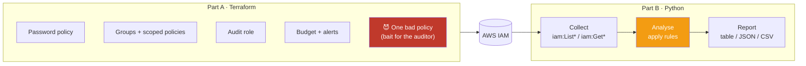

# Lab 01 — Python IAM Security Audit Tool

**Time:** 60 minutes · **Difficulty:** Intermediate · **Cost:** $0 (IAM and Budgets are free)

---

## What you're building

A command-line security tool that connects to an AWS account and answers the question every
auditor, every CISO and every AWS interviewer asks:

> *"Who can do what in this account, and which of those permissions are dangerous?"*

The tool inspects users, groups, roles, policies, access keys and MFA devices, applies a rule set,
and produces a severity-ranked findings report in three formats.



### Findings the tool detects

| ID | Finding | Severity |
|---|---|---|
| `IAM-001` | User with `AdministratorAccess` | 🔴 CRITICAL |
| `IAM-002` | Policy with `Action:*` and `Resource:*` | 🔴 CRITICAL |
| `IAM-003` | Role trust policy allows `Principal: *` | 🔴 CRITICAL |
| `IAM-004` | Console user without MFA | 🟠 HIGH |
| `IAM-005` | Access key older than 90 days | 🟠 HIGH |
| `IAM-006` | Policy with service-wide wildcard (`s3:*`) | 🟠 HIGH |
| `IAM-007` | Policy grants `Resource: *` | 🟡 MEDIUM |
| `IAM-008` | Inline policy attached to an identity | 🟡 MEDIUM |
| `IAM-009` | Policy attached directly to a user | 🟡 MEDIUM |
| `IAM-010` | Unused access key (never used / 90+ days idle) | 🟡 MEDIUM |
| `IAM-011` | User with no group membership | 🔵 LOW |
| `IAM-012` | Cross-account trust without ExternalId | 🟠 HIGH |

---

## Prerequisites

```bash
export AWS_PROFILE=bootcamp
export AWS_REGION=us-east-1
aws sts get-caller-identity          # must return YOUR account
terraform version                    # 1.5+
python3 --version                    # 3.9+
```

---

# Part A — Terraform: build the identity baseline

### Step A1 · Move into the Terraform folder

```bash
cd day-01-aws-setup-iam-security/lab/terraform
cp terraform.tfvars.example terraform.tfvars
```

Edit `terraform.tfvars` and set at minimum your alert email:

```hcl
aws_region        = "us-east-1"
budget_limit_usd  = "10"
alert_email       = "you@example.com"
create_bad_policy = true          # leave true — the auditor needs something to find
```

### Step A2 · Initialise

```bash
terraform init
```

**Expected output:**

```
Initializing the backend...
Initializing provider plugins...
- Installing hashicorp/aws v5.x.x...
Terraform has been successfully initialized!
```

> 💡 `terraform init` downloads the AWS provider into `.terraform/`. That folder is gitignored —
> it's a build artefact, not source.

### Step A3 · Review the plan

```bash
terraform plan
```

You should see roughly **12–14 resources to add** and **0 to change, 0 to destroy**.

**Read the plan.** Not skimming plans is how people accidentally delete production. Confirm you
see: `aws_iam_account_password_policy`, two `aws_iam_group`, several `aws_iam_policy`,
`aws_iam_role`, `aws_budgets_budget`, and — if enabled — `cbc-day01-BAD-example-policy`.

### Step A4 · Apply

```bash
terraform apply
# type: yes
```

**Expected tail:**

```
Apply complete! Resources: 13 added, 0 changed, 0 destroyed.

Outputs:

audit_role_arn        = "arn:aws:iam::123456789012:role/cbc-day01-security-audit"
audit_profile_snippet = <<EOT
[profile bootcamp-audit]
role_arn       = arn:aws:iam::123456789012:role/cbc-day01-security-audit
source_profile = bootcamp
region         = us-east-1
EOT
bad_policy_arn        = "arn:aws:iam::123456789012:policy/cbc-day01-BAD-example-policy"
developers_group_name = "cbc-day01-developers"
```

📧 **Check your email now** — AWS sends a subscription confirmation for the budget SNS topic.
Click confirm, or you'll never receive alerts.

### Step A5 · Verify from the CLI

```bash
# Password policy applied?
aws iam get-account-password-policy

# Groups created?
aws iam list-groups --query 'Groups[?starts_with(GroupName,`cbc-day01`)].GroupName' --output table

# Customer-managed policies?
aws iam list-policies --scope Local \
  --query 'Policies[?starts_with(PolicyName,`cbc-day01`)].[PolicyName,AttachmentCount]' --output table

# Budget in place?
ACCOUNT_ID=$(aws sts get-caller-identity --query Account --output text)
aws budgets describe-budgets --account-id "$ACCOUNT_ID" \
  --query 'Budgets[].[BudgetName,BudgetLimit.Amount]' --output table
```

### Step A6 · Wire up the role-assumption profile

Copy the `audit_profile_snippet` output into `~/.aws/config`:

```bash
terraform output -raw audit_profile_snippet >> ~/.aws/config
```

Test it — the ARN should change from `user/...` to `assumed-role/...`:

```bash
aws sts get-caller-identity --profile bootcamp-audit
```

```json
{
    "UserId": "AROA...:botocore-session-1770000000",
    "Account": "123456789012",
    "Arn": "arn:aws:iam::123456789012:assumed-role/cbc-day01-security-audit/botocore-session-1770000000"
}
```

🎉 You just assumed a role. Those credentials expire in one hour and cannot be leaked permanently.

---

# Part B — Python: build the audit tool

### Step B1 · Install dependencies

```bash
cd ../python
python3 -m venv .venv && source .venv/bin/activate
pip install -r requirements.txt
```

### Step B2 · Understand the boto3 calls you'll need

Every one of these is **read-only**. Nothing in this tool can change your account.

| Goal | boto3 call |
|---|---|
| List users | `iam.list_users()` |
| List roles | `iam.list_roles()` |
| List customer-managed policies | `iam.list_policies(Scope='Local')` |
| Get a policy's current JSON | `iam.get_policy()` → `iam.get_policy_version()` |
| Policies attached to a user | `iam.list_attached_user_policies()` |
| Inline policies on a user | `iam.list_user_policies()` → `iam.get_user_policy()` |
| Groups a user belongs to | `iam.list_groups_for_user()` |
| MFA devices | `iam.list_mfa_devices()` |
| Access keys | `iam.list_access_keys()` |
| When a key was last used | `iam.get_access_key_last_used()` |
| Does the user have console access | `iam.get_login_profile()` (404 = no console) |

**Two things that will bite you:**

1. **Pagination.** `list_users()` returns max 100 items. Always use a paginator:
   ```python
   for page in iam.get_paginator("list_users").paginate():
       for user in page["Users"]:
           ...
   ```
2. **URL-encoded policy documents.** `get_policy_version()` returns the JSON **percent-encoded**.
   Newer botocore versions decode it for you; older ones don't. Handle both:
   ```python
   from urllib.parse import unquote
   import json
   doc = version["PolicyVersion"]["Document"]
   if isinstance(doc, str):
       doc = json.loads(unquote(doc))
   ```

### Step B3 · Do the challenge first 🎯

```bash
cd challenge
python3 iam_audit_challenge.py --profile bootcamp
```

It runs, but reports nothing — every analysis function is a `TODO`. Work through them in order:

| # | Function | What to implement |
|---|---|---|
| 1 | `get_policy_document()` | Fetch + decode the default version's JSON |
| 2 | `analyse_policy_document()` | Detect `*` action, `*` resource, `service:*` |
| 3 | `audit_users()` | MFA, key age, direct attachments, group membership |
| 4 | `audit_roles()` | Parse trust policies, find `Principal: *` and missing ExternalId |
| 5 | `audit_policies()` | Scan all customer-managed policies |
| 6 | `print_report()` | Group findings by severity and print |

Each `TODO` block has a hint comment. Give it 20–30 minutes before opening the solution.

### Step B4 · Run the full solution

```bash
cd ..
python3 iam_audit.py --profile bootcamp
```

**Expected output (abridged):**

```
╔══════════════════════════════════════════════════════════════════════════╗
║           IAM SECURITY AUDIT  ·  CareerByteCode Bootcamp Day 01          ║
╚══════════════════════════════════════════════════════════════════════════╝
Account : 123456789012
Identity: arn:aws:iam::123456789012:user/bootcamp-admin
Scanned : 2026-07-22 09:14:03 UTC

  Users: 2 | Groups: 2 | Roles: 4 | Customer policies: 4

──────────────────────────── 🔴 CRITICAL (2) ────────────────────────────
[IAM-002] Policy grants full administrative access (Action:* on Resource:*)
          Resource : policy/cbc-day01-BAD-example-policy
          Detail   : statement 'FullAdminOops' allows Action=* on Resource=*
          Fix      : Scope actions to the specific APIs required and resources to explicit ARNs.

[IAM-001] User has AdministratorAccess attached
          Resource : user/bootcamp-admin
          Detail   : arn:aws:iam::aws:policy/AdministratorAccess attached directly
          Fix      : Move to a role assumed with MFA; keep one sealed break-glass user.

────────────────────────────── 🟠 HIGH (3) ──────────────────────────────
[IAM-004] Console user without MFA
          Resource : user/bootcamp-admin
...

═══════════════════════════════ SUMMARY ═══════════════════════════════
  🔴 CRITICAL   2
  🟠 HIGH       3
  🟡 MEDIUM     4
  🔵 LOW        1
  ────────────────
  TOTAL        10
  Security score: 42/100  (grade D)

Reports written:
  reports/iam_audit_20260722_091403.json
  reports/iam_audit_20260722_091403.csv
```

### Step B5 · Explore the options

```bash
# JSON only, for piping into another tool
python3 iam_audit.py --profile bootcamp --format json --quiet | jq '.findings[] | select(.severity=="CRITICAL")'

# Only show me the serious stuff
python3 iam_audit.py --profile bootcamp --min-severity HIGH

# Tighter key-age policy
python3 iam_audit.py --profile bootcamp --max-key-age 30

# Run through the assumed audit role instead of your admin user
python3 iam_audit.py --profile bootcamp-audit

# CI mode: exit code 1 if any CRITICAL finding exists
python3 iam_audit.py --profile bootcamp --fail-on CRITICAL
echo "exit code = $?"
```

That last one is the point of the whole exercise: this tool belongs in a pipeline, not in a human's
morning routine. On **Day 04** you'll take this same logic and run it on a schedule inside Lambda.

### Step B6 · Fix a finding and re-run

Prove the loop closes. Delete the bad policy and watch the score move:

```bash
BAD_ARN=$(cd ../terraform && terraform output -raw bad_policy_arn)
aws iam delete-policy --policy-arn "$BAD_ARN"
python3 iam_audit.py --profile bootcamp
```

CRITICAL should drop from 2 to 1 and the score should rise. Then put it back so `terraform destroy`
stays clean:

```bash
cd ../terraform && terraform apply -auto-approve
```

---

## 🎯 Stretch goals

1. **`IAM-013`:** flag any policy allowing `iam:PassRole` on `Resource: "*"` — the classic
   privilege-escalation path. (Pass a role to a service you control, service does what you can't.)
2. **HTML report:** add `--format html` with a styled severity table you could email to a manager.
3. **Allowlist:** support `--ignore-file ignore.txt` so known-accepted findings stop reappearing.
4. **Compare over time:** save a baseline, then report only *new* findings on the next run.
5. **Roles too:** extend `IAM-005` logic to detect roles with `MaxSessionDuration` of 12 hours.

---

## Troubleshooting

| Symptom | Cause | Fix |
|---|---|---|
| `NoCredentialsError` | Profile/env not set | `export AWS_PROFILE=bootcamp` |
| `AccessDenied` on `iam:List*` | Identity lacks read permissions | Attach `SecurityAudit` or `ReadOnlyAccess` |
| `EntityAlreadyExists` in Terraform | Ran a partial apply before, or names collide | `terraform import`, or change `name_prefix` in tfvars |
| Budget email never arrives | SNS subscription not confirmed | Check spam; re-run `terraform apply` to resend |
| `get_login_profile` raises `NoSuchEntity` | Normal — user has no console password | Caught and handled in the solution |
| `Document` is a dict, not a string | Newer botocore auto-decodes | The `isinstance(doc, str)` check handles both |
| `terraform apply` says password policy conflicts | One password policy per account; you already had one | Import it: `terraform import aws_iam_account_password_policy.this iam-account-password-policy` |
| Tool reports 0 findings | `create_bad_policy = false` | Set it `true` and re-apply |

---

## 🧹 Teardown

**Do not skip this.** → [../teardown-checklist.md](../teardown-checklist.md)

```bash
cd ../terraform
terraform destroy      # type: yes
```

---

## What you should be able to say afterwards

- "I can read an IAM policy and immediately spot whether it's least-privilege."
- "I can explain why an API call was denied, using the evaluation flow."
- "I've written a boto3 tool that paginates, handles missing entities, and produces a scored report."
- "I put budget guardrails in place as code before deploying any workload."
