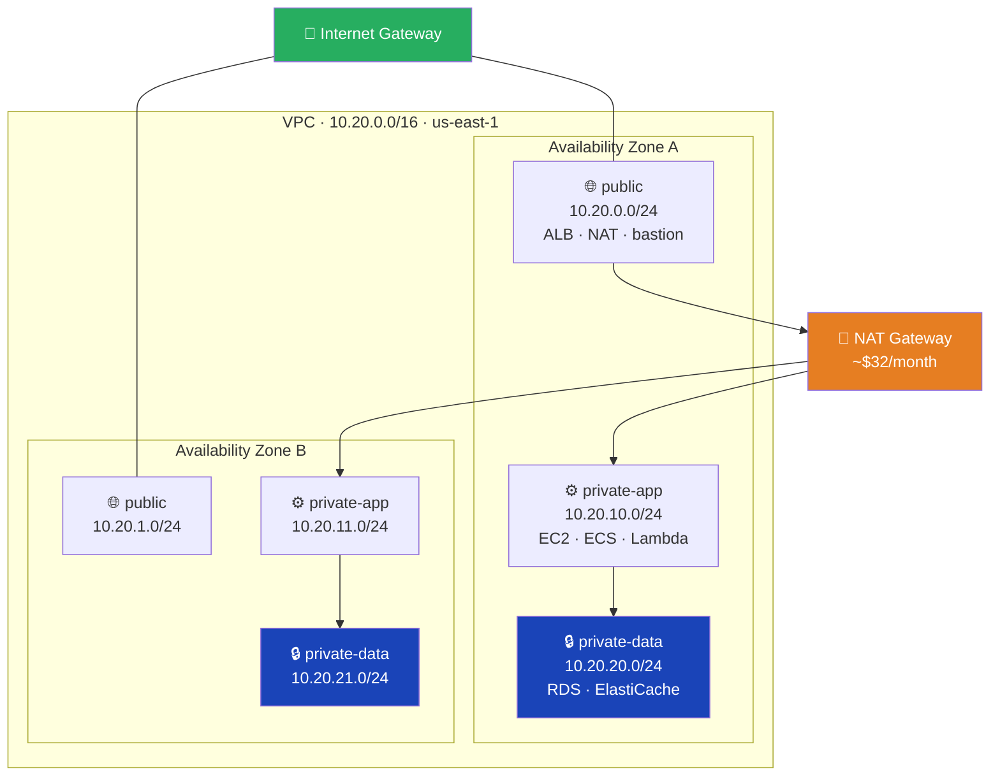
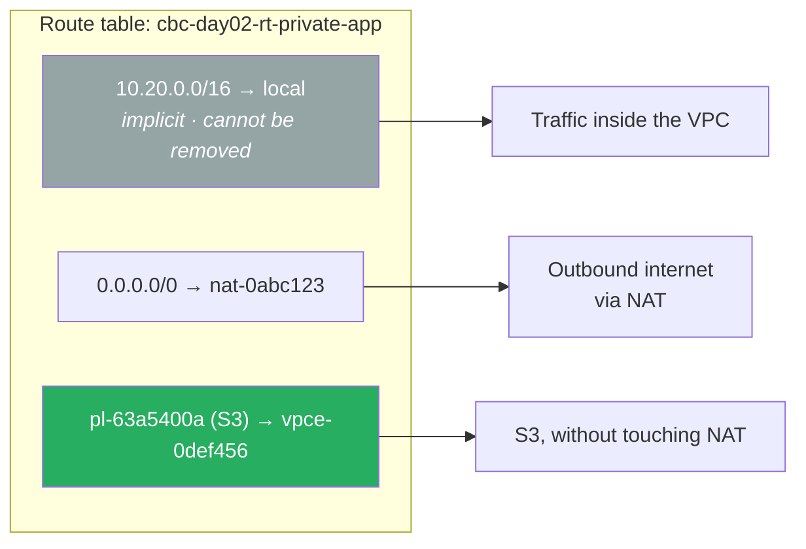
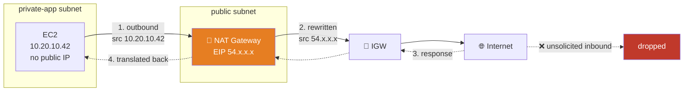
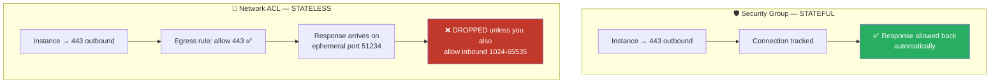
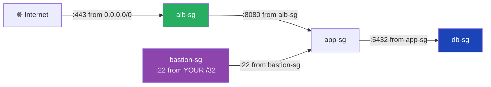
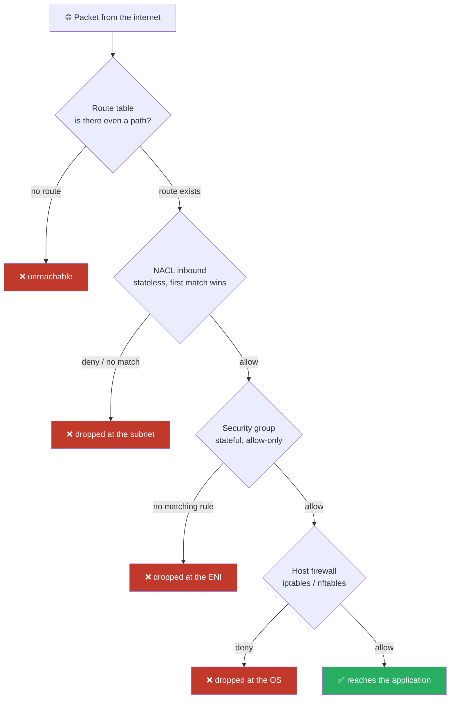
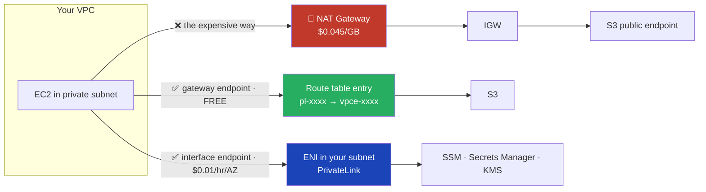
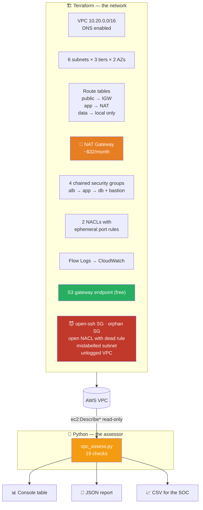

# Day 02 — Enterprise Networking & Security Architecture

`Intermediate` · `Terraform + Python + AI` · `Hands-On Lab` · **3–3.5 hours**

> 💸 **Cost warning — read before you apply anything.** Today introduces the **NAT Gateway**,
> the first resource in this bootcamp that costs real money: **~$0.045/hour (~$32/month)**
> plus $0.045/GB processed, billed from the moment it exists whether or not any traffic flows.
> The lab is designed to be created and destroyed inside one session.
> **[teardown-checklist.md](teardown-checklist.md) is not optional from today onward.**

---

## The enterprise scenario

> The platform needs a secure, segmented network foundation — isolated tiers, controlled
> ingress and egress, and defense-in-depth at every layer.

Yesterday you decided **who** can act in the account. Today you decide **where traffic can flow**.

The application going into this account has a public web tier, an application tier, and a
database that holds customer PII. The security review will ask exactly one question: *"prove
the database cannot be reached from the internet."*

"We set a strong password" is not proof. "The subnet has no route to an Internet Gateway,
the NACL rejects anything outside the VPC CIDR, and the security group only accepts port 5432
from the application tier's security group" — that's proof. Three independent controls, any
two of which can fail without exposing the data.

That's what you're building today.

---

## Learning objectives

By the end of today you will be able to:

1. Design a VPC CIDR and subnet plan that survives contact with growth, peering and VPNs.
2. Explain precisely what makes a subnet *public* — and why it has nothing to do with its name.
3. Choose correctly between Internet Gateway, NAT Gateway, NAT instance and VPC endpoints.
4. Articulate the difference between security groups and NACLs, including the stateful/stateless
   consequences, without hedging.
5. Chain security groups by reference to build tiered, IP-independent network policy.
6. Enable and read VPC Flow Logs, and explain why they must be on before the incident.
7. Predict the cost of a networking design before you apply it.
8. Build a Python (boto3) tool that assesses VPC exposure and produces a scored report.

---

## Session plan

| # | Segment | Time |
|---|---|---|
| 1 | VPC fundamentals, CIDR planning & subnets | 30 min |
| 2 | Route tables — where public and private actually happen | 25 min |
| 3 | Internet Gateway & NAT Gateway patterns (+ the cost conversation) | 30 min |
| 4 | Security Groups vs NACLs — the defining comparison | 40 min |
| ☕ | Break | 10 min |
| 5 | Tiering, secure connectivity & VPC endpoints | 25 min |
| 6 | **Hands-on lab** — VPC Security Assessment Tool | 60 min |
| 7 | Interview drill + wrap-up | 20 min |

---

## Part 1 — VPC fundamentals, CIDR planning & subnets

### 1.1 What a VPC actually is

A VPC is a logically isolated section of the AWS network that you control. It is defined by
a **CIDR block**, it lives in exactly one **region**, and it spans every **Availability Zone**
in that region.

The security model starts here and it is the strongest one AWS gives you:

> **Nothing routes into a VPC unless you build the road.**

Before any IAM policy is evaluated, before any security group is checked, there simply is no
path. That is the difference between "denied" and "unreachable", and unreachable is better.

| Scope | Thing |
|---|---|
| **Global** | IAM, Route 53, CloudFront, WAF (global scope) |
| **Regional** | VPC, Internet Gateway, NAT Gateway, S3, security groups, NACLs |
| **Zonal** | Subnet, EC2 instance, EBS volume, NAT Gateway *placement* |

That middle row is the one people get wrong in interviews. A VPC is **regional** — it spans
AZs. A **subnet** is zonal — it lives in exactly one AZ. That single fact drives every
high-availability design decision you'll make on Day 08.

### 1.2 CIDR planning — the decision you cannot undo cheaply

You can add secondary CIDR blocks to a VPC later. You cannot change or shrink the primary one.
And you can never, ever overlap with something you later need to connect to.

```
10.20.0.0/16   →  10.20.0.0  –  10.20.255.255      65,536 addresses
   │      │
   │      └── prefix length: how many bits are FIXED
   └───────── network address
```

| Prefix | Addresses | Typical use |
|---|---|---|
| `/16` | 65,536 | A whole VPC. AWS maximum. |
| `/20` | 4,096 | A large subnet, or a small VPC |
| `/24` | 256 | A normal subnet. **Use this as your default.** |
| `/28` | 16 | AWS minimum subnet size |

**Three rules that save you two years of pain:**

1. **Take a /16 even if you need a /22.** IP addresses are free. Renumbering a production
   VPC is a quarter of work.
2. **Never overlap.** Not with your office LAN, not with your VPN range, not with any VPC you
   might peer with, not with the VPC the company you acquire in 2028 is using. Keep a company-wide
   IPAM allocation spreadsheet from day one. (Or use AWS VPC IP Address Manager.)
3. **Leave gaps in your subnet numbering.** Public gets `.0`–`.9`, app gets `.10`–`.19`, data
   gets `.20`–`.29`. Adding a fourth AZ later then costs you nothing.

> ⚠️ **AWS reserves five addresses in every subnet:** the network address, the VPC router
> (`.1`), the DNS server (`.2`), one reserved for future use (`.3`), and the broadcast address
> (`.255`). A `/24` gives you **251 usable addresses**, not 256. This matters the day an
> Auto Scaling group refuses to scale and the error message is unhelpful.

### 1.3 The three-tier subnet plan



| Tier | Internet inbound | Internet outbound | What lives here |
|---|---|---|---|
| **public** | ✅ via IGW | ✅ via IGW | Load balancers, NAT Gateways, bastions |
| **private-app** | ❌ | ✅ via NAT | Application servers, containers, Lambda-in-VPC |
| **private-data** | ❌ | ❌ | Databases, caches, anything holding data |

The data tier having **no outbound path at all** is deliberate. A database has no legitimate
reason to call the internet. If it ever tries, that's an incident — and with no route, the
attempt fails rather than succeeding quietly.

### 1.4 Why two of everything

A subnet is zonal. An AZ is a failure domain. One subnet per tier means one AZ per tier means
your "highly available" application dies with a single AZ.

Two is the minimum. Three is common for quorum-based systems (etcd, ZooKeeper, Aurora). More
than three usually just triples your NAT Gateway bill.

---

## Part 2 — Route tables: where public and private actually happen

### 2.1 The single most important sentence of the day

> **A subnet is public if — and only if — its route table sends `0.0.0.0/0` to an Internet
> Gateway.**

Not if it's named `public-subnet`. Not if it's tagged `Tier=public`. Not if it has an Internet
Gateway attached to the VPC. Only the route.

This is why the assessment tool you're building today reads route tables and *ignores* names —
and why one of its findings (`VPC-016`) is specifically "this subnet's name disagrees with its
routing." That finding catches real, live exposure in real accounts.

### 2.2 Anatomy of a route table



Three things to internalise:

1. **The `local` route is implicit and immutable.** Every route table has it. You cannot delete
   it or override it. **Consequence: every subnet in a VPC can always reach every other subnet,
   regardless of route tables.** Isolation between tiers comes from security groups and NACLs —
   never from routing.

2. **Longest prefix match wins.** `10.20.10.0/24` beats `10.20.0.0/16` beats `0.0.0.0/0`.
   Most specific route always wins, regardless of the order you added them.

3. **The main route table is the silent default.** Every VPC has one. Any subnet with no
   *explicit* association uses it. If the main route table has an IGW route, **every subnet
   you forget to associate is public.** This is one of the most common real-world exposures,
   and it's invisible in the console unless you look for it.

### 2.3 Reading routing from the CLI

Prove it rather than trusting the names:

```bash
# Which route tables have an internet-facing default route?
aws ec2 describe-route-tables --filters Name=vpc-id,Values=vpc-0abc123 \
  --query 'RouteTables[].{
      Name:Tags[?Key==`Name`]|[0].Value,
      Main:Associations[?Main]|[0].Main,
      Default:Routes[?DestinationCidrBlock==`0.0.0.0/0`].[GatewayId,NatGatewayId]|[0],
      Subnets:Associations[?SubnetId].SubnetId}' \
  --output json
```

A `GatewayId` starting `igw-` means **public**. A `NatGatewayId` means **private with egress**.
Neither means **fully isolated**.

---

## Part 3 — Internet Gateway & NAT Gateway patterns

### 3.1 Internet Gateway

An IGW is a horizontally scaled, redundant, AWS-managed component with no bandwidth constraints
and no cost of its own. It does two things:

- Performs 1:1 NAT between an instance's private IPv4 and its associated public IPv4.
- Serves as the route target that makes a route table public.

**Attaching an IGW does nothing on its own.** Instances also need (a) a route to it, and (b) a
public IP address. Miss either and nothing works.

### 3.2 NAT Gateway 💸

A NAT Gateway lets instances in a **private** subnet make **outbound** connections — pull
packages, call APIs, fetch container images — while remaining unreachable from the internet.
Return traffic for connections the instance opened is allowed back. Nothing else is.



> ⚠️ **The NAT Gateway lives in a PUBLIC subnet but serves the PRIVATE ones.** It needs the IGW
> to reach the internet. Putting a NAT Gateway in a private subnet creates successfully and
> then never works — a silent, expensive, extremely common mistake.

### 3.3 The cost conversation (have it now, not on the invoice)

| Item | Price (us-east-1) | Monthly at lab scale |
|---|---|---|
| NAT Gateway — hourly | $0.045/hr | **~$32.40** |
| NAT Gateway — data processing | $0.045/GB | varies |
| Internet Gateway | free | $0 |
| Elastic IP **attached** to NAT | free | $0 |
| Elastic IP **unattached** | $0.005/hr | ~$3.60 ⚠️ |
| S3/DynamoDB **gateway** endpoint | free | $0 |
| **Interface** endpoint (PrivateLink) | $0.01/hr per AZ | ~$7.30 per AZ |
| VPC Flow Logs → CloudWatch | ~$0.50/GB ingested | small at lab scale |
| VPC, subnets, route tables, SGs, NACLs | free | $0 |

Three NAT Gateways across three AZs is **~$97/month before a single byte moves**. That is a
real line item that real teams argue about, and the argument has a right answer: production
gets one per AZ, dev gets one shared, and sandbox gets VPC endpoints and no NAT at all.

### 3.4 Alternatives worth knowing

| Option | Cost | When to use |
|---|---|---|
| **NAT Gateway** | ~$32/mo + data | Default. Managed, HA within its AZ, up to 100 Gbps. |
| **NAT instance** | ~$4/mo (t4g.nano) | Dev/sandbox only. You own patching, HA and scaling. Must disable source/dest check. |
| **VPC endpoints** | free (gateway) / ~$7 per AZ | ⭐ Best answer when the outbound traffic is to AWS services. |
| **Egress-only IGW** | free | The IPv6 equivalent of NAT. Outbound only, stateful. |
| **No egress at all** | free | The data tier. Genuinely the most secure option.

> 🎓 **Interview gold:** "How would you reduce NAT Gateway costs?" The strong answer isn't
> "use a NAT instance" — it's *"first I'd look at what the traffic actually is. If it's S3,
> ECR, DynamoDB, SSM or CloudWatch, VPC endpoints remove it from NAT entirely, and the S3
> and DynamoDB gateway endpoints are free. Only then would I look at consolidating NATs."*

---

## Part 4 — Security Groups vs NACLs ⭐

This is the comparison the whole day builds toward. It is asked in essentially every AWS
interview, and most candidates get half of it right.

### 4.1 The defining table

| | 🛡️ Security Group | 🧱 Network ACL |
|---|---|---|
| **Operates at** | ENI (instance / LB / RDS) | Subnet |
| **State** | **Stateful** — return traffic automatic | **Stateless** — you must allow both directions |
| **Rules** | **Allow only** | **Allow *and* deny** |
| **Evaluation** | All rules evaluated; any match = allow | Lowest rule number first; **first match wins** |
| **Default (custom)** | Deny all inbound, allow all outbound | Deny everything, both directions |
| **Default (AWS-created)** | Allow from self, allow all out | Allow everything, both directions |
| **Can reference** | Other security groups, prefix lists | CIDR blocks only |
| **Applies to** | Resources you attach it to | Every resource in the subnet, automatically |
| **Quota** | 60 in + 60 out per SG; 5 SGs per ENI | 20 rules each way (raisable to 40) |

### 4.2 Stateful vs stateless — the thing that actually bites



**This is the #1 cause of "I added a NACL and everything broke."** The outbound request leaves
fine. The response comes back on a randomly chosen high-numbered port. Your NACL has no rule
for it. Everything times out mysteriously.

Every NACL you write needs an **ephemeral port range** rule:

| Client | Ephemeral range |
|---|---|
| Linux kernel (and AWS services: NAT, ELB, Lambda) | **1024–65535** |
| Windows Server 2008+ | 49152–65535 |
| Practical answer | **allow 1024–65535** and stop worrying |

### 4.3 Ordering — the shadowed rule

NACL rules are numbered, evaluated **lowest first**, and evaluation **stops at the first match**.

```
Rule 100  ALLOW  all traffic   from 0.0.0.0/0     ← matches everything
Rule 200  DENY   tcp/22        from 0.0.0.0/0     ← never evaluated. Dead code.
Rule *    DENY   all                              ← implicit, always last
```

Rule 200 looks like a security control in the console. It is not. It can never be reached.
This is worse than having no rule, because it creates confident, false assurance — and it's
exactly what `VPC-013` in today's tool detects.

**Convention:** number in tens or hundreds (100, 110, 120…) so you can always insert between.

### 4.4 Security group chaining — the technique to actually take away from today

A security group rule can reference **another security group** instead of a CIDR block.



```hcl
# ❌ Brittle: breaks the moment the app tier scales or moves subnet
resource "aws_vpc_security_group_ingress_rule" "db_bad" {
  security_group_id = aws_security_group.db.id
  cidr_ipv4         = "10.20.10.0/24"
  from_port         = 5432
  to_port           = 5432
  ip_protocol       = "tcp"
}

# ✅ Identity-based: survives auto scaling, IP churn, new subnets, new AZs
resource "aws_vpc_security_group_ingress_rule" "db_good" {
  security_group_id            = aws_security_group.db.id
  referenced_security_group_id = aws_security_group.app.id
  from_port                    = 5432
  to_port                      = 5432
  ip_protocol                  = "tcp"
}
```

The second rule reads as *"whatever is running as the app tier may reach the database on 5432."*
Scale to 200 instances across four new subnets in a new AZ — the rule needs no edit.

**Say this in an interview and the tone of the conversation changes.**

### 4.5 Egress: the control everybody skips

Security groups default to allowing **all outbound**. Almost nobody changes it. But egress
control is what turns "we were compromised" into "we were compromised and they couldn't get
the data out."

| Tier | Sensible egress |
|---|---|
| ALB | → app-sg on the app port. Nothing else. |
| App | → db-sg on the db port; HTTPS to prefix lists / VPC endpoints |
| **Database** | **none at all** — stateful returns still work |

That last row surprises people. A security group with zero egress rules still answers queries,
because the response to an *inbound* connection is covered by statefulness. It simply cannot
*initiate* anything. For a database, that's exactly right.

### 4.6 Defense in depth, layer by layer



Four independent layers. A misconfiguration in any one of them is survivable. That is the
entire argument for defense in depth, and it's why "we have a security group" is not an answer
to "prove the database is unreachable."

---

## Part 5 — Tiering, secure connectivity & VPC endpoints

### 5.1 Reaching private instances without a bastion

The old pattern was a bastion host in a public subnet with SSH open to the office IP. It works,
but it's a permanently-running EC2 instance with an inbound rule and an SSH key to manage.

**The modern answer is AWS Systems Manager Session Manager:**

| | Bastion host | Session Manager |
|---|---|---|
| Inbound security group rules | port 22 required | **none** |
| Public IP required | yes | **no** |
| SSH keys to manage | yes | **no** |
| Session logging | whatever you build | native, to S3/CloudWatch |
| Access control | SSH keys | **IAM policies** |
| Cost | an EC2 instance, always on | free (needs SSM/EC2Messages endpoints or NAT) |

The instance's SSM agent makes an *outbound* connection to the Systems Manager service. There
is no inbound path at all — which means there is no port to scan, no key to leak, and nothing
for `VPC-001` to find.

> 🎓 When an interviewer asks "how do you SSH into a private instance?", the answer that
> impresses is: *"ideally I don't. I use Session Manager over PrivateLink, so there's no
> inbound rule, no public IP, no key material, and every session is logged and IAM-controlled."*

### 5.2 VPC endpoints



| | Gateway endpoint | Interface endpoint |
|---|---|---|
| Services | **S3 and DynamoDB only** | ~150 AWS services |
| Mechanism | a route table entry | an ENI with a private IP |
| Cost | **free** | $0.01/hr per AZ + $0.01/GB |
| Cross-VPC / on-prem | no | yes (PrivateLink) |
| Access control | endpoint policy | endpoint policy + security group |

**Add the S3 gateway endpoint to every VPC you ever build.** It's free, it removes S3 traffic
from your NAT bill entirely, and it lets you attach an endpoint policy that restricts *which
buckets* are reachable from this VPC — a genuinely strong data-exfiltration control that most
teams never turn on.

### 5.3 Flow logs — you cannot enable them retroactively

Flow logs capture *metadata* about IP traffic: source, destination, ports, protocol, packet
and byte counts, and the crucial `ACCEPT` / `REJECT` action. They do **not** capture packet
contents.

```
2 123456789012 eni-0abc 10.20.10.42 203.0.113.9 51234 22 6 20 1240 1770000000 1770000060 REJECT OK
                        └─ source ──┘└─ dest ──┘  └sport┘ └dport┘                            └─ action
```

`REJECT` records are where the security value is. A burst of REJECTs on port 22 from a single
external IP is a scan. A single ACCEPT to an unexpected external IP from your database tier
is an incident.

> ⚠️ **There is no backfill.** Enable flow logs on the day you create the VPC, or the incident
> you eventually investigate will have no evidence. That's why today's tool rates a missing
> flow log **HIGH**, not LOW — the severity is about the investigation you won't be able to do,
> not about traffic flowing today.

### 5.4 Connecting VPCs — the one-slide version

| Option | Transitive? | Scale | Use when |
|---|---|---|---|
| **VPC Peering** | ❌ no | mesh; n(n-1)/2 connections | 2–5 VPCs, simple, free within an AZ |
| **Transit Gateway** | ✅ yes | hub and spoke, thousands | 5+ VPCs, or hybrid. ~$36/mo + $0.02/GB |
| **PrivateLink** | n/a | one service at a time | Expose *one service* without exposing the network |
| **Site-to-Site VPN** | n/a | up to 1.25 Gbps/tunnel | Hybrid over the internet, encrypted |
| **Direct Connect** | n/a | 50 Mbps – 100 Gbps | Dedicated line; consistent latency |

**Peering is not transitive.** If A peers with B and B peers with C, A cannot reach C. This
comes up in interviews constantly. Transit Gateway exists precisely to solve it.

---

## Part 6 — What you're building today



The Terraform builds a **correct** three-tier network **and** a pile of deliberately broken
networking, so that when you run the assessor it has something to find. Finding zero problems
teaches you nothing — and more importantly, a tool you've never seen produce a finding is a
tool you don't actually trust.

---

## 🧪 Hands-On Lab

👉 **[lab/README.md](lab/README.md)** — VPC Security Assessment Tool

> Build a Python tool that inspects VPC configuration and reports security-group and NACL
> exposure across the network.

Two paths:
- 🎯 **Challenge:** [`lab/python/challenge/vpc_assess_challenge.py`](lab/python/challenge/vpc_assess_challenge.py) — signatures + hints, logic is yours
- ✅ **Solution:** [`lab/python/vpc_assess.py`](lab/python/vpc_assess.py) — full working tool

---

## Common mistakes on Day 2

| Mistake | What happens | Fix |
|---|---|---|
| Overlapping VPC CIDRs | Peering and VPN become impossible, permanently | Plan CIDRs company-wide before the first VPC |
| Assuming a subnet is private because of its name | Live, silent internet exposure | Read the route table. Always. |
| Forgetting the main route table | Every unassociated subnet inherits it — often public | Explicitly associate every subnet |
| NAT Gateway in a private subnet | Creates fine, never works, bills anyway | NAT always goes in a **public** subnet |
| NACL with no ephemeral port rule | Everything times out mysteriously | Allow inbound **1024–65535** |
| Deny rule numbered above a blanket allow | Dead code that looks like a control | Number in tens; put denies **first** |
| CIDR-based SG rules between tiers | Break on every scale event and subnet addition | Reference the other **security group** |
| `0.0.0.0/0` on port 22 "temporarily" | Scanned and brute-forced within minutes | Bastion SG, or Session Manager and no rule at all |
| Locking IPv4 but leaving `::/0` open | Full exposure over IPv6 | Mirror every restriction into `Ipv6Ranges` |
| Leaving flow logs off | No evidence when you need it most | Enable at VPC creation. No backfill exists. |
| Leaving the NAT Gateway running overnight | ~$32/month for nothing | `terraform destroy` at the end of every session |
| Releasing a NAT but keeping the EIP | ~$3.60/month for an idle IP | Release unattached EIPs |
| Ignoring the default security group | Anything launched without an SG lands in it | Strip all its rules (CIS 5.3) |

---

## Day 2 completion checklist

- [ ] `terraform apply` completed and you read the plan before typing yes
- [ ] You can name which of your subnets are public **by reading routes**, not names
- [ ] You can explain why the data tier has no `0.0.0.0/0` route at all
- [ ] `vpc_assess.py` runs and produces a scored report
- [ ] The tool **found** the deliberately broken security group 🎯
- [ ] The tool **found** the shadowed NACL rule 🎯
- [ ] The tool **found** the mislabelled "private" subnet 🎯
- [ ] You can explain stateful vs stateless without hedging
- [ ] You can explain why a database security group needs **no** egress rules
- [ ] You know what the NAT Gateway is costing you right now
- [ ] 💸 **[teardown-checklist.md](teardown-checklist.md) completed — NAT Gateway destroyed**
- [ ] `aws ec2 describe-nat-gateways` returns nothing in `available` state

---

## Extras

- 🎤 [interview-qa.md](interview-qa.md) — 15 interview questions with model answers
- 👨‍🏫 [trainer-notes.md](trainer-notes.md) — delivery plan, timings, live-demo scripts
- 📐 [diagrams/README.md](diagrams/README.md) — every Mermaid diagram, ready to edit
- 🧹 [teardown-checklist.md](teardown-checklist.md) — **not optional today**

## Further reading

- [VPC user guide](https://docs.aws.amazon.com/vpc/latest/userguide/what-is-amazon-vpc.html)
- [Security groups vs network ACLs](https://docs.aws.amazon.com/vpc/latest/userguide/infrastructure-security.html)
- [VPC Flow Logs](https://docs.aws.amazon.com/vpc/latest/userguide/flow-logs.html)
- [VPC endpoints and PrivateLink](https://docs.aws.amazon.com/vpc/latest/privatelink/what-is-privatelink.html)
- [NAT Gateway pricing](https://aws.amazon.com/vpc/pricing/)
- [Well-Architected — Security Pillar: infrastructure protection](https://docs.aws.amazon.com/wellarchitected/latest/security-pillar/infrastructure-protection.html)

---

**Previous:** [Day 01 — AWS Environment Setup & IAM Security](../day-01-aws-setup-iam-security/README.md)
**Next:** Day 03 — Compute Architecture & Intelligent Scaling
