# Day 02 Diagrams

Mermaid source for every diagram used in the Day 02 guide. GitHub renders these natively.
Copy any block into <https://mermaid.live> to edit, or export as PNG/SVG for slides.

---

## 1. Three-tier VPC topology ⭐

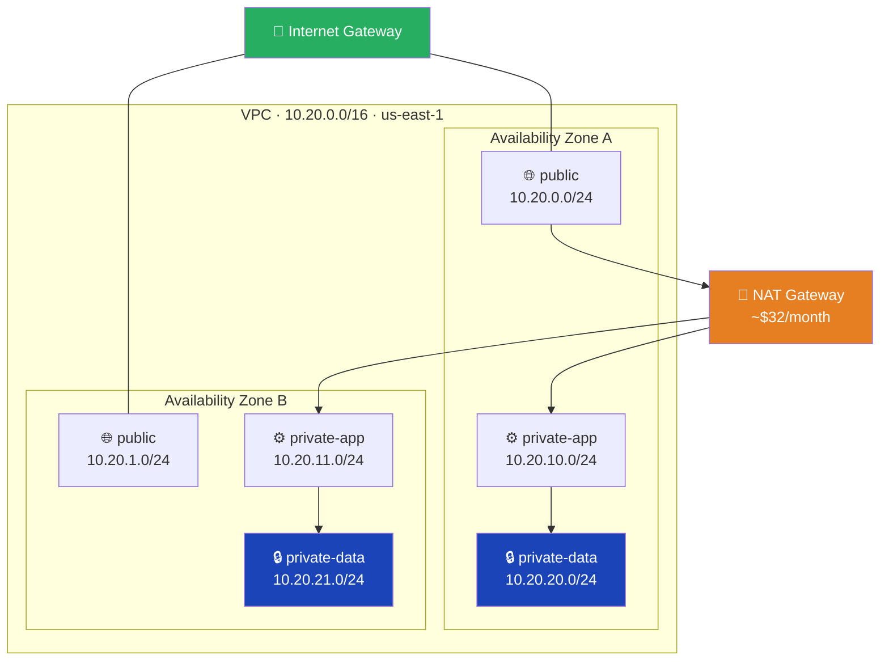

## 2. Route table anatomy

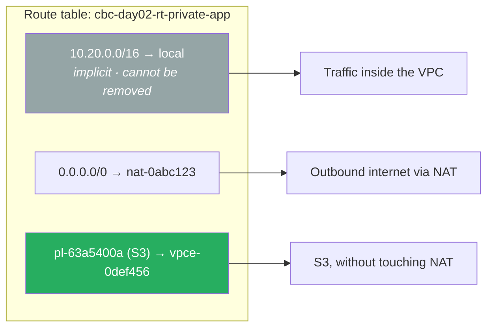

## 3. NAT Gateway traffic flow

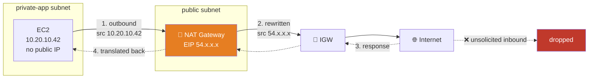

## 4. Stateful vs stateless ⭐

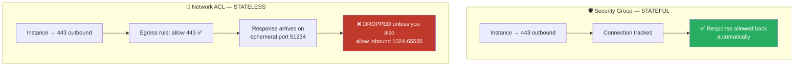

## 5. Security group chaining ⭐

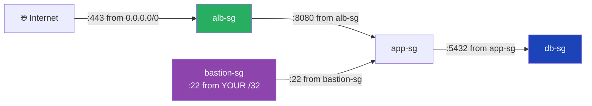

## 6. Defense in depth — the packet's journey ⭐

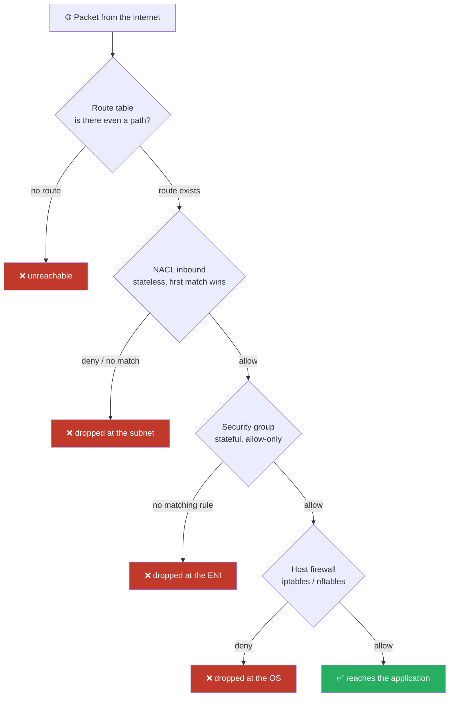

## 7. VPC endpoints — three paths to S3

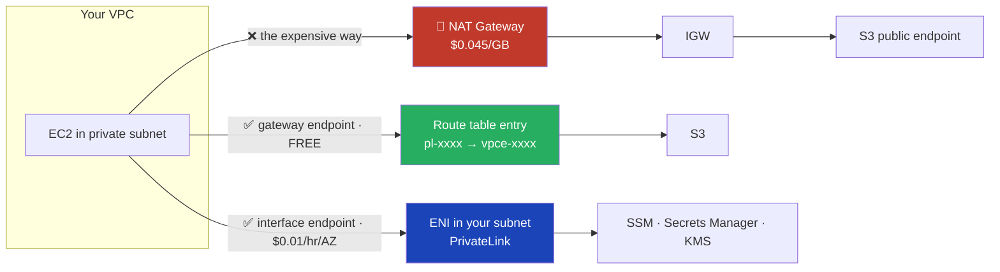

## 8. NACL rule shadowing

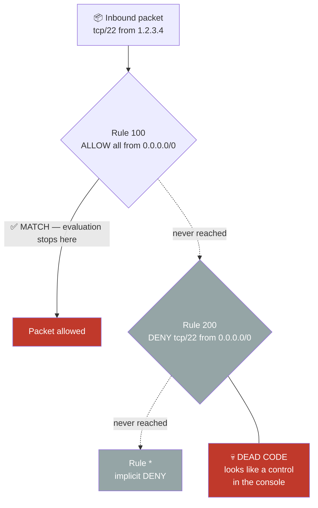

## 9. Lab architecture

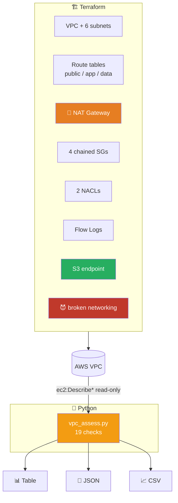

## 10. Connecting VPCs — peering is not transitive

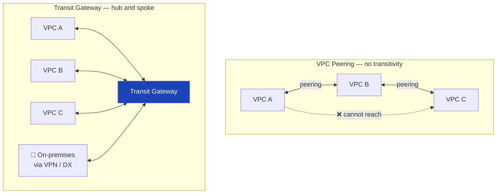

## 11. Bastion host vs Session Manager

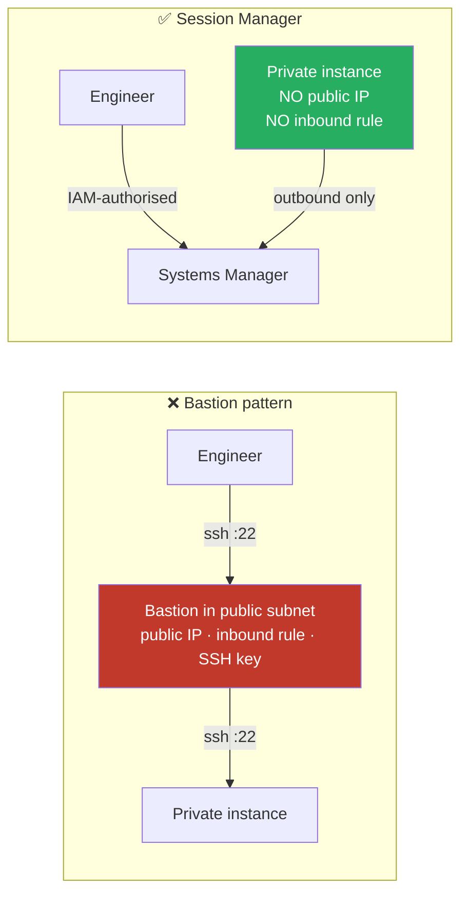
