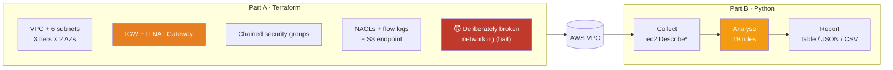

# Lab 02 — VPC Security Assessment Tool

**Time:** 60 minutes · **Difficulty:** Intermediate · **Cost:** 💸 **~$0.05/hour while running**

> ⚠️ **This is the first lab in the bootcamp that costs money.** With `enable_nat_gateway = true`
> you are creating a NAT Gateway at **$0.045/hour (~$32/month)**. Left running for a month by
> accident, that's a $32 bill for nothing. Budget 3 hours for the session, then run
> [`../teardown-checklist.md`](../teardown-checklist.md).
>
> Want the lab for free? Set `enable_nat_gateway = false`. Everything except outbound
> connectivity from the private subnets still works, and the assessment tool runs identically.

---

## What you're building

A command-line tool that connects to an AWS account and answers the question every security
review, every auditor and every AWS interviewer asks:

> *"Prove that nothing sensitive in this VPC is reachable from the internet."*

The tool reads VPCs, subnets, route tables, security groups, NACLs, ENIs, flow logs, endpoints
and NAT gateways; applies 19 rules; and produces a severity-ranked, scored report in three formats.



### Findings the tool detects

| ID | Finding | Severity |
|---|---|---|
| `VPC-001` | Security group allows SSH (22) from `0.0.0.0/0` | 🔴 CRITICAL |
| `VPC-002` | Security group allows RDP (3389) from `0.0.0.0/0` | 🔴 CRITICAL |
| `VPC-003` | Security group allows **all** protocols and ports from `0.0.0.0/0` | 🔴 CRITICAL |
| `VPC-004` | Security group exposes a sensitive service port to the internet | 🟠 HIGH |
| `VPC-005` | Security group allows unrestricted IPv6 (`::/0`) ingress | 🟠 HIGH¹ |
| `VPC-006` | Security group opens a very wide port range to the internet | 🟠 HIGH |
| `VPC-007` | Security group open to the internet on a non-web port | 🟡 MEDIUM² |
| `VPC-008` | Unrestricted egress to `0.0.0.0/0` on all protocols | 🔵 LOW |
| `VPC-009` | Security group attached to no network interface | 🔵 LOW |
| `VPC-010` | Default security group still has rules | 🟡 MEDIUM |
| `VPC-011` | Network ACL allows all traffic from the internet | 🟡 MEDIUM³ |
| `VPC-012` | Network ACL permits a sensitive port from the internet | 🟠 HIGH³ |
| `VPC-013` | Network ACL rule is unreachable (shadowed by a lower-numbered rule) | 🟡 MEDIUM |
| `VPC-014` | VPC Flow Logs not enabled | 🟠 HIGH |
| `VPC-015` | Subnet auto-assigns public IPv4 addresses | 🟡 MEDIUM⁴ |
| `VPC-016` | Subnet named/tagged private but routes to an Internet Gateway | 🟠 HIGH |
| `VPC-017` | No S3 gateway VPC endpoint | 🔵 LOW |
| `VPC-018` | Private subnets have no egress path and no VPC endpoints | 🔵 LOW |
| `VPC-019` | All private subnets depend on a single NAT Gateway | 🔵 LOW |

¹ escalates to CRITICAL when an admin port is in range · ² INFO on ports 80/443 ·
³ downgraded one level when the NACL is associated with no subnet ·
⁴ LOW when the subnet is genuinely a public tier

---

## Prerequisites

```bash
export AWS_PROFILE=bootcamp
export AWS_REGION=us-east-1
aws sts get-caller-identity          # must return YOUR account
terraform version                    # 1.5+
python3 --version                    # 3.9+

# You will need your own public IP for the bastion security group:
curl -s https://checkip.amazonaws.com
```

**Confirm you still have a budget in place from Day 01.** Today creates billable resources:

```bash
ACCOUNT_ID=$(aws sts get-caller-identity --query Account --output text)
aws budgets describe-budgets --account-id "$ACCOUNT_ID" \
  --query 'Budgets[].[BudgetName,BudgetLimit.Amount]' --output table
```

If that returns nothing, go back and re-create one before continuing. Do not run a NAT Gateway
without a budget alert.

---

# Part A — Terraform: build the network

### Step A1 · Move into the Terraform folder

```bash
cd day-02-networking-security/lab/terraform
cp terraform.tfvars.example terraform.tfvars
```

Edit `terraform.tfvars`. The two lines that matter most:

```hcl
trusted_admin_cidr = "198.51.100.24/32"   # ← YOUR IP from checkip.amazonaws.com
enable_nat_gateway = true                 # ← 💸 set false to do this lab for free
```

Terraform will **reject** `trusted_admin_cidr = "0.0.0.0/0"` on purpose. That's a validation
block doing its job — the whole point of a bastion security group is that it's narrow.

### Step A2 · Initialise

```bash
terraform init
```

**Expected output:**

```
Initializing the backend...
Initializing provider plugins...
- Installing hashicorp/aws v5.x.x...
Terraform has been successfully initialized!
```

### Step A3 · Review the plan — properly, this time

```bash
terraform plan
```

You should see roughly **45–55 resources to add**, `0 to change`, `0 to destroy`.

**Before you type yes, find these three things in the plan:**

1. `aws_nat_gateway.main[0]` — this is the $32/month line item. Confirm you meant it.
2. `aws_subnet.public[0]` — check `map_public_ip_on_launch = true`, and that
   `aws_subnet.private_data[0]` has it set to `false`.
3. `aws_route_table.private_data` — confirm it has **no** `route` block at all. That absence
   is the strongest security control in this whole configuration.

> 💡 Reading plans is a professional habit, not a formality. On Day 05 you'll add drift
> detection and this habit becomes muscle memory.

### Step A4 · Apply

```bash
terraform apply
# type: yes
```

The NAT Gateway takes ~2 minutes to reach `available`. Total apply is usually 3–4 minutes.

**Expected tail:**

```
Apply complete! Resources: 51 added, 0 changed, 0 destroyed.

Outputs:

availability_zones = ["us-east-1a", "us-east-1b"]
estimated_monthly_cost_usd = "~$32.40/month  (NAT Gateways: 1 × $32.40  |  interface endpoints: 0 × $7.30/AZ  |  flow logs: ~$0.50/GB ingest)"
nat_gateway_public_ips = ["54.221.x.x"]
private_data_subnet_ids = ["subnet-0aaa...", "subnet-0bbb..."]
vpc_id = "vpc-0abc123def456"
...
```

⏱️ **Note the time.** From this moment you are paying $0.045/hour.

### Step A5 · Verify the topology from the CLI

Don't trust the plan output — read it back from AWS.

```bash
VPC_ID=$(terraform output -raw vpc_id)

# Subnets: name, CIDR, AZ, and whether they auto-assign public IPs
aws ec2 describe-subnets --filters Name=vpc-id,Values=$VPC_ID \
  --query 'Subnets[].[Tags[?Key==`Name`]|[0].Value,CidrBlock,AvailabilityZone,MapPublicIpOnLaunch]' \
  --output table
```

```
------------------------------------------------------------------------------------
|                                  DescribeSubnets                                  |
+---------------------------------------+---------------+---------------+-----------+
|  cbc-day02-public-us-east-1a          |  10.20.0.0/24 |  us-east-1a   |  True     |
|  cbc-day02-public-us-east-1b          |  10.20.1.0/24 |  us-east-1b   |  True     |
|  cbc-day02-private-app-us-east-1a     |  10.20.10.0/24|  us-east-1a   |  False    |
|  cbc-day02-private-app-us-east-1b     |  10.20.11.0/24|  us-east-1b   |  False    |
|  cbc-day02-private-data-us-east-1a    |  10.20.20.0/24|  us-east-1a   |  False    |
|  cbc-day02-private-data-us-east-1b    |  10.20.21.0/24|  us-east-1b   |  False    |
|  cbc-day02-BAD-internal-app-subnet    |  10.20.90.0/24|  us-east-1a   |  True     |
+---------------------------------------+---------------+---------------+-----------+
```

**Now the important one — which subnets are actually public?**

```bash
aws ec2 describe-route-tables --filters Name=vpc-id,Values=$VPC_ID \
  --query 'RouteTables[].[Tags[?Key==`Name`]|[0].Value,
             Routes[?DestinationCidrBlock==`0.0.0.0/0`].GatewayId|[0],
             Routes[?DestinationCidrBlock==`0.0.0.0/0`].NatGatewayId|[0]]' \
  --output table
```

```
-----------------------------------------------------------------------------
|  cbc-day02-rt-public                    |  igw-0abc...  |  None           |
|  cbc-day02-rt-private-app-us-east-1a    |  None         |  nat-0def...    |
|  cbc-day02-rt-private-app-us-east-1b    |  None         |  nat-0def...    |
|  cbc-day02-rt-private-data              |  None         |  None           |  ← 🔒
|  cbc-day02-BAD-rt-mislabelled           |  igw-0abc...  |  None           |  ← 😈
+-----------------------------------------+---------------+-----------------+
```

Read those last two rows out loud. `rt-private-data` has **no default route at all** — that
tier cannot reach the internet and the internet cannot reach it. `BAD-rt-mislabelled` sends
traffic straight to the IGW, despite being attached to a subnet named and tagged *private*.

That second one is the finding your tool is about to catch.

### Step A6 · Confirm flow logs are live

```bash
aws ec2 describe-flow-logs --filter Name=resource-id,Values=$VPC_ID \
  --query 'FlowLogs[].[FlowLogId,FlowLogStatus,TrafficType,LogGroupName]' --output table
```

Status should be `ACTIVE`. Records take 5–10 minutes to start appearing — that's normal.

---

# Part B — Python: build the assessment tool

### Step B1 · Install dependencies

```bash
cd ../python
python3 -m venv .venv && source .venv/bin/activate
pip install -r requirements.txt
```

### Step B2 · Understand the boto3 calls you'll need

Every one of these is **read-only**. Nothing in this tool can change your account.

| Goal | boto3 call |
|---|---|
| List VPCs | `ec2.describe_vpcs()` |
| List subnets | `ec2.describe_subnets(Filters=[...])` |
| Route tables (incl. the main one) | `ec2.describe_route_tables()` |
| Security groups + all their rules | `ec2.describe_security_groups()` |
| Network ACLs + entries | `ec2.describe_network_acls()` |
| What is a security group attached to? | `ec2.describe_network_interfaces()` |
| Flow logs | `ec2.describe_flow_logs(Filters=[{'Name':'resource-id',...}])` |
| VPC endpoints | `ec2.describe_vpc_endpoints()` |
| NAT gateways | `ec2.describe_nat_gateways(Filter=[...])` ⚠️ singular `Filter` |

**Four things that will bite you:**

1. **Pagination.** EC2 caps responses and hands back a `NextToken`. Always use a paginator:
   ```python
   for page in ec2.get_paginator("describe_security_groups").paginate():
       for sg in page["SecurityGroups"]:
           ...
   ```

2. **`describe_nat_gateways` uses `Filter`, not `Filters`.** Singular. It's the only one.
   You will lose ten minutes to this at least once.

3. **`IpProtocol: "-1"` omits the ports entirely.** When a rule allows all protocols, AWS
   does not send `FromPort` or `ToPort` at all:
   ```python
   # 💥 TypeError: '<=' not supported between 'NoneType' and 'int'
   if rule["FromPort"] <= 22 <= rule["ToPort"]:
       ...
   # ✅ handle the -1 case first
   if str(rule.get("IpProtocol")) == "-1":
       ports = set(range(0, 65536))
   ```

4. **One permission carries many sources.** A rule with five CIDRs is **one** dict with five
   entries in `IpRanges`, not five dicts. Iterate the ranges, not the permissions.

5. **Subnets without an explicit route table association use the VPC's MAIN route table.**
   If you only read explicit associations, you'll declare subnets private that are not.
   This is the mistake that produces real, public databases.

### Step B3 · Do the challenge first 🎯

```bash
cd challenge
python3 vpc_assess_challenge.py --profile bootcamp
```

It runs, but reports nothing — every analysis function is a `TODO`. Work through them in order:

| # | Function | Time | What to implement |
|---|---|---|---|
| 1 | `analyse_security_group_rule()` | ~20 min | ⭐ The core rule engine — VPC-001 to VPC-008 |
| 2 | `audit_security_groups()` | ~10 min | Loop every SG; default SG; orphan detection |
| 3 | `audit_nacls()` | ~15 min | Blanket allows, sensitive ports, shadowed rules |
| 4 | `audit_subnets()` | ~15 min | Routing truth vs subnet names |
| 5 | `audit_vpc_controls()` | ~10 min | Flow logs, endpoints, NAT resilience |
| 6 | Stretch | ~?? | Add your own check |

Each `TODO` block has hints and a ✅ CHECKPOINT telling you what should light up when you're
done. Give it 20–30 minutes before opening the solution.

### Step B4 · Run the full solution

```bash
cd ..
VPC_ID=$(cd ../terraform && terraform output -raw vpc_id)
python3 vpc_assess.py --profile bootcamp --vpc-id "$VPC_ID"
```

**Expected output (abridged):**

```
🔍 Assessing vpc-0abc123def456 in account 123456789012 ...
   • collecting VPCs, subnets, route tables, security groups, NACLs, ENIs ...
   • analysing security groups ...
   • analysing network ACLs ...
   • analysing subnets and routing ...
   • analysing VPC-level controls ...

╔══════════════════════════════════════════════════════════════════════════╗
║        VPC SECURITY ASSESSMENT  ·  CareerByteCode Bootcamp Day 02        ║
╚══════════════════════════════════════════════════════════════════════════╝
Account : 123456789012
Region  : us-east-1
Identity: arn:aws:iam::123456789012:user/bootcamp-admin
Scanned : 2026-07-22 09:14:03 UTC

  Security Groups: 6 | Network Acls: 3 | Subnets: 7 | Vpcs: 1

──────────────────────────── 🔴 CRITICAL (4) ────────────────────────────

[VPC-003] Security group allows ALL traffic from the entire internet
          Resource : security-group/cbc-day02-BAD-open-ssh-sg (sg-0abc...)
          VPC      : vpc-0abc123def456
          Detail   : Ingress rule permits every protocol on every port from 0.0.0.0/0.
                     This security group provides no protection whatsoever.
          Fix      : Delete this rule. Replace it with the specific ports the workload
                     serves, sourced from a load-balancer security group or a narrow CIDR.

[VPC-001] Security group allows SSH (port 22) from the entire internet
          Resource : security-group/cbc-day02-BAD-open-ssh-sg (sg-0abc...)
          ...

[VPC-002] Security group allows RDP (port 3389) from the entire internet
          ...

[VPC-005] Security group allows unrestricted IPv6 ingress (::/0)
          ...

────────────────────────────── 🟠 HIGH (4) ──────────────────────────────

[VPC-004] Security group exposes a sensitive service port to the internet
          Detail   : Rule tcp/5432 exposes: 5432 (PostgreSQL) to 0.0.0.0/0 ...

[VPC-006] Security group opens a range of 30,001 ports to the internet
[VPC-012] Network ACL permits a sensitive port from the internet
[VPC-016] Subnet is named/tagged private but routes to an Internet Gateway

───────────────────────────── 🟡 MEDIUM (4) ─────────────────────────────

[VPC-011] Network ACL allows all traffic from the internet
[VPC-013] Network ACL rule is unreachable (shadowed by a lower-numbered rule)
[VPC-015] Subnet auto-assigns public IPv4 addresses
...

═══════════════════════════════ SUMMARY ═══════════════════════════════
  🔴 CRITICAL   4
  🟠 HIGH       4
  🟡 MEDIUM     4
  🔵 LOW        7
  ⚪ INFO       1
  ────────────────
  TOTAL        20
  Network security score: 0/100  (grade F)

Reports written:
  reports/vpc_assess_20260722_091403.json
  reports/vpc_assess_20260722_091403.csv
```

> 🎓 **A score of 0 is expected and correct.** You deliberately planted six critical and high
> findings. The score is a *relative* signal for tracking improvement over time, not an absolute
> grade — which is exactly the conversation to have with a manager who asks why the number is bad.

**Expected findings that are NOT bugs:**

| Finding | Why it fires | Is it a problem? |
|---|---|---|
| `VPC-009` on `alb-sg`, `app-sg`, `db-sg`, `bastion-sg` | You built no EC2 instances today, so no ENI uses them | No — correct behaviour |
| `VPC-007` INFO on `alb-sg` port 443 | An internet-facing ALB *is* supposed to be public | No — inventory only |
| `VPC-015` LOW on the two public subnets | They're genuinely a public tier | No — flagged for completeness |
| `VPC-019` single NAT Gateway | You chose `single_nat_gateway = true` | No — you made the trade-off knowingly |

Read the detail text on each of those. A tool that can't distinguish "this is bad" from "this
is expected" gets ignored within a week, which is why so much of the code is spent on severity
nuance rather than detection.

### Step B5 · Explore the options

```bash
# Only the serious stuff
python3 vpc_assess.py --profile bootcamp --min-severity HIGH

# JSON only, for piping into another tool
python3 vpc_assess.py --profile bootcamp --format json --quiet \
  | jq '.findings[] | select(.severity=="CRITICAL") | {check_id, resource_name}'

# Scan the whole region, not just today's VPC — this is where it gets interesting
python3 vpc_assess.py --profile bootcamp

# Include the AWS-created default VPC (spoiler: it will not do well)
python3 vpc_assess.py --profile bootcamp --include-default-vpc --min-severity MEDIUM

# CI mode: exit code 1 if any CRITICAL finding exists
python3 vpc_assess.py --profile bootcamp --fail-on CRITICAL
echo "exit code = $?"
```

That last one is the point of the whole exercise. This tool belongs in a pipeline that blocks
a merge, not in a human's morning routine. On **Day 04** you'll run this same logic on a
schedule inside Lambda; on **Day 06** you'll feed its JSON output to Amazon Bedrock and have
it write the executive summary.

### Step B6 · Fix a finding and re-run

Prove the loop closes. Remove the worst rule and watch the report change:

```bash
BAD_SG=$(cd ../terraform && terraform output -json insecure_security_group_ids | jq -r .open_ssh)

# Delete just the "all traffic from anywhere" rule
aws ec2 revoke-security-group-ingress \
  --group-id "$BAD_SG" \
  --ip-permissions 'IpProtocol=-1,IpRanges=[{CidrIp=0.0.0.0/0}]'

python3 vpc_assess.py --profile bootcamp --vpc-id "$VPC_ID" --min-severity HIGH
```

CRITICAL should drop from 4 to 3. Then put it back so `terraform destroy` stays clean:

```bash
cd ../terraform && terraform apply -auto-approve && cd ../python
```

### Step B7 · The one that matters — run it against the default VPC

Every AWS account ships with a default VPC in every region, created by AWS, configured for
convenience rather than security. Most people have never looked at it.

```bash
python3 vpc_assess.py --profile bootcamp --include-default-vpc --min-severity MEDIUM
```

You will typically find: no flow logs, a default security group with rules, every subnet
auto-assigning public IPs, and a NACL that allows everything. **This is what "we didn't
configure anything" actually looks like** — and it's running in every region of your account
right now.

---

## 🎯 Stretch goals

1. **`VPC-024` — unattached Elastic IPs.** `describe_addresses`, flag anything with no
   `AssociationId`. ~$3.60/month each, for nothing. This check has paid for itself in almost
   every account it has ever been run in.
2. **`VPC-022` — public IPs on ENIs in "private" subnets.** `describe_network_interfaces` →
   `Association.PublicIp`. Cross-reference with the subnet's routing.
3. **`--diagram`:** emit Mermaid source for the topology you just assessed, so the report
   contains a picture of the network as it actually is (not as the wiki claims it is).
4. **`--format html`:** a styled severity table you'd be happy to email to a manager.
5. **Multi-region:** loop `describe_regions` and assess every region. Shadow IT lives in
   `ap-southeast-2`.
6. **Diff mode:** save a baseline, then report only *new* findings on the next run. This is
   how you turn a scanner into a monitoring tool.

---

## Troubleshooting

| Symptom | Cause | Fix |
|---|---|---|
| `NoCredentialsError` | Profile/env not set | `export AWS_PROFILE=bootcamp` |
| `UnauthorizedOperation` on `ec2:Describe*` | Identity lacks read permissions | Attach `SecurityAudit` or `ReadOnlyAccess` |
| Terraform: `InvalidParameterValue: trusted_admin_cidr` | You left it as `0.0.0.0/0` | That's the validation block working. Use your real IP. |
| Terraform: `InvalidSubnet.Conflict` | Your `vpc_cidr` overlaps an existing VPC | Change `vpc_cidr` in tfvars |
| Terraform hangs on `aws_nat_gateway` | Normal — NAT takes ~2 minutes to provision | Wait. If >5 min, check the EIP allocated. |
| `NatGatewayNotFound` on destroy | Deleted manually first; state is stale | `terraform refresh` then `terraform destroy` |
| `TypeError: '<=' not supported ... NoneType` | Read `FromPort` on an `IpProtocol: -1` rule | Handle `-1` before touching ports |
| `ParamValidationError: Unknown parameter "Filters"` on NAT | `describe_nat_gateways` uses `Filter`, singular | Rename the kwarg |
| Tool reports 0 findings | `create_insecure_examples = false` | Set it `true` and re-apply |
| Flow logs show status `ACTIVE` but no records | Records take 5–10 minutes, and an idle VPC has little traffic | Wait, or generate traffic |
| `DependencyViolation` on destroy | An ENI still exists in the subnet | See the teardown checklist — usually a lingering endpoint or NAT |

---

## 🧹 Teardown

**Do not skip this. It costs $32/month if you do.**

→ **[../teardown-checklist.md](../teardown-checklist.md)**

```bash
cd ../terraform
terraform destroy      # type: yes
```

Then verify with your own eyes:

```bash
aws ec2 describe-nat-gateways \
  --query 'NatGateways[?State==`available`].[NatGatewayId,VpcId]' --output table

aws ec2 describe-addresses \
  --query 'Addresses[?AssociationId==null].[PublicIp,AllocationId]' --output table
```

Both should be empty. The second one catches the classic mistake: NAT deleted, Elastic IP
still allocated, quietly billing $3.60/month.

---

## What you should be able to say afterwards

- "I can look at a route table and tell you instantly whether a subnet is public."
- "I can explain stateful vs stateless firewalling and why NACLs need an ephemeral port rule."
- "I chain security groups by reference so the policy survives auto scaling."
- "I've written a boto3 tool that paginates, handles the `-1` protocol edge case, resolves
  implicit main-route-table associations, and produces a severity-ranked report."
- "I know what a NAT Gateway costs, and I know three ways to avoid needing one."
