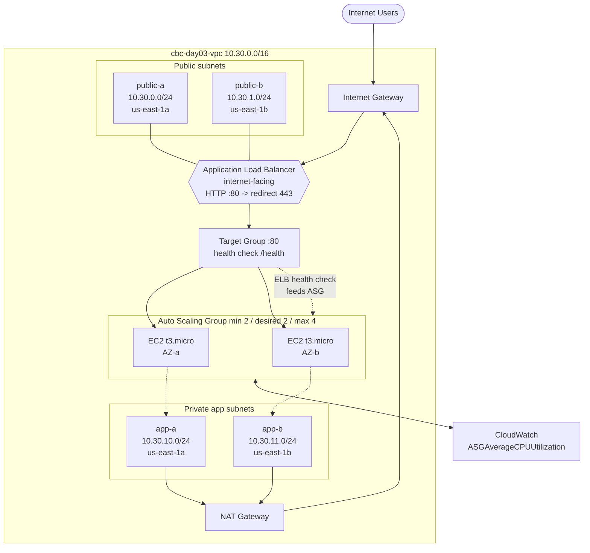
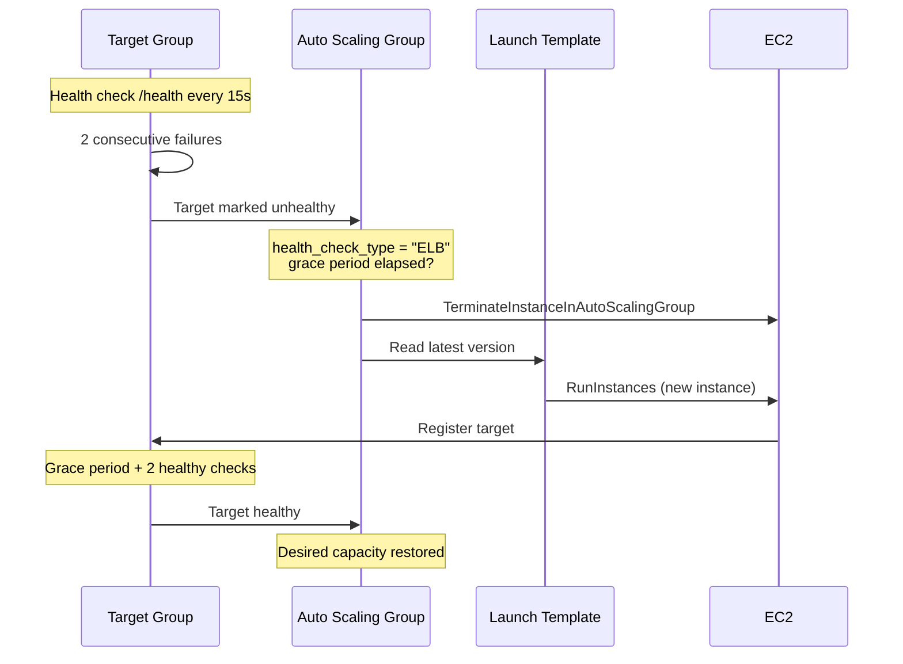
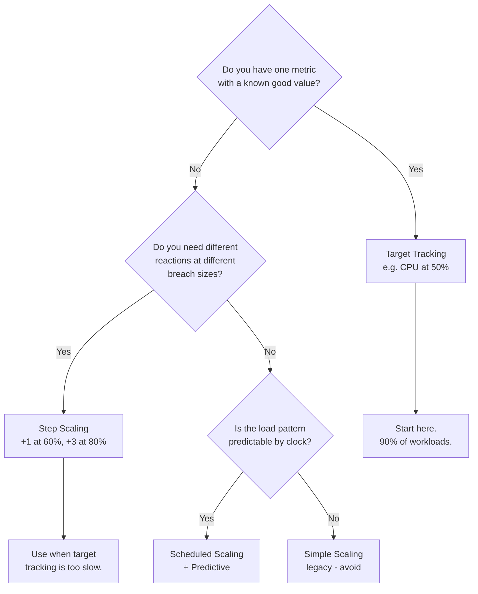
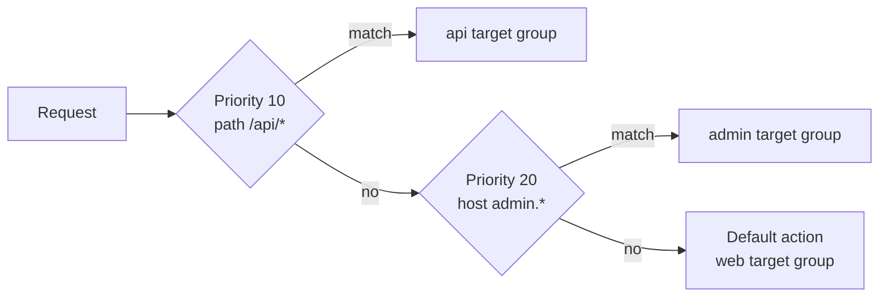

# Day 03 — Compute Architecture & Intelligent Scaling

> **Enterprise scenario**
> Traffic is unpredictable and the business needs compute that stays available and scales
> itself — no 3 a.m. manual interventions.

By the end of today you will have a compute tier that you can kill at random and it will
put itself back together while you watch. That is the entire point of this day: not
"launch an EC2 instance", but **build something that does not need you.**

| | |
|---|---|
| **Level** | Intermediate |
| **Duration** | 3–3.5 hours |
| **Stack** | EC2 · Launch Templates · Auto Scaling · ALB · Terraform · Python (boto3) |
| **Lab** | Deploy Highly Available Infrastructure + `ha_audit.py` resilience auditor |
| **Region** | `us-east-1` |
| **Prefix** | `cbc-day03-` |
| **⚠️ Cost** | **This day costs real money.** ALB ≈ $16.20/mo + NAT GW ≈ $32.40/mo + EC2. See [Cost](#cost-read-this-before-you-apply). |

---

## Table of contents

1. [Learning objectives](#learning-objectives)
2. [Prerequisites](#prerequisites)
3. [Architecture](#architecture)
4. [Part 1 — EC2 and launch templates](#part-1--ec2-and-launch-templates)
5. [Part 2 — Auto Scaling groups and scaling policies](#part-2--auto-scaling-groups-and-scaling-policies)
6. [Part 3 — Elastic Load Balancing and target groups](#part-3--elastic-load-balancing-and-target-groups)
7. [Part 4 — Health checks and self-healing](#part-4--health-checks-and-self-healing)
8. [The mistakes people actually make](#the-mistakes-people-actually-make)
9. [Cost — read this before you apply](#cost-read-this-before-you-apply)
10. [Lab](#lab)
11. [Day 03 checklist](#day-03-checklist)

---

## Learning objectives

By the end of Day 03 you can:

1. Write a **launch template** with versioning, IMDSv2 enforced, and an encrypted root volume — and explain why launch configurations are dead.
2. Choose between **target tracking, step, and simple** scaling policies and defend the choice in a design review.
3. Explain **warm-up vs cooldown** and why getting them wrong causes either flapping or a 12-minute outage.
4. Pick **ALB vs NLB vs GWLB** from the requirements, not from habit.
5. Configure **ELB-type health checks with a correct grace period** so the ASG replaces a hung app, not just a dead kernel.
6. Terminate an instance on purpose and watch the platform heal itself.
7. Audit any AWS account for HA anti-patterns with a Python tool you wrote.

---

## Prerequisites

- Day 01 complete — `bootcamp` CLI profile working, budget alarms live.
- Day 02 complete — you understand VPC tiering, route tables, SGs vs NACLs.
- Terraform ≥ 1.5, Python ≥ 3.9, `boto3` installed.
- **You do not need Day 02's Terraform state.** Day 03 builds its own `cbc-day03-` VPC so the lab is self-contained and tearable in one `destroy`.

```bash
aws sts get-caller-identity --profile bootcamp
terraform version
python3 -c "import boto3; print(boto3.__version__)"
```

---

## Architecture

What you are building today:



### The self-healing loop

This is the loop you are actually building. Memorise it — it is the answer to half the
interview questions on this topic.



More diagrams — including the scaling-policy decision tree and the ALB routing model —
live in [`diagrams/README.md`](diagrams/README.md).

---

## Part 1 — EC2 and launch templates

### Launch configurations are dead. Stop using them.

AWS stopped supporting new launch configuration creation for accounts that never used
them, and they cannot express most modern features. If you see `aws_launch_configuration`
in a codebase, that codebase is old. **Launch templates only.**

| | Launch configuration | Launch template |
|---|---|---|
| Versioning | ❌ None — immutable, recreate to change | ✅ Numbered versions + `$Latest` / `$Default` |
| IMDSv2 enforcement | ❌ | ✅ `metadata_options` |
| Mixed instance types | ❌ | ✅ Via ASG mixed instances policy |
| Spot + On-Demand mix | ❌ | ✅ |
| T3 unlimited mode | ❌ | ✅ `credit_specification` |
| Placement groups, capacity reservations | ❌ | ✅ |
| Tag on launch | Partial | ✅ `tag_specifications` per resource type |
| Status | Legacy, no new features | Current |

### The five things that must be in every launch template

```hcl
resource "aws_launch_template" "app" {
  name_prefix   = "cbc-day03-app-"
  image_id      = data.aws_ami.al2023.id
  instance_type = "t3.micro"

  # 1. IMDSv2 REQUIRED. This is the single highest-value line in the file.
  metadata_options {
    http_tokens                 = "required"   # <- IMDSv2 only
    http_endpoint               = "enabled"
    http_put_response_hop_limit = 1            # <- containers can't reach it
    instance_metadata_tags      = "enabled"
  }

  # 2. Encrypted root volume, gp3 not gp2.
  block_device_mappings {
    device_name = "/dev/xvda"
    ebs {
      volume_size           = 8
      volume_type           = "gp3"
      encrypted             = true
      delete_on_termination = true
    }
  }

  # 3. An instance profile — SSM Session Manager, never SSH keys.
  iam_instance_profile { name = aws_iam_instance_profile.app.name }

  # 4. Detailed monitoring: 1-minute metrics, not 5.
  monitoring { enabled = true }

  # 5. Tags applied at launch, so the ASG's children are taggable/findable.
  tag_specifications {
    resource_type = "instance"
    tags          = { Name = "cbc-day03-app" }
  }
}
```

**Why IMDSv2 matters, concretely.** IMDSv1 answers an unauthenticated `GET` to
`169.254.169.254`. Any SSRF bug in your app — a URL-fetching feature, an image proxy, a
webhook tester — becomes credential theft, because the attacker makes *your server* fetch
the metadata endpoint and hand back the role's temporary keys. IMDSv2 requires a `PUT` to
get a session token first, which SSRF almost never can do. The Capital One breach in 2019
was exactly this shape. **The fix is one line and costs nothing.** Our auditor flags
`HttpTokens != required` as HIGH.

**Why `http_put_response_hop_limit = 1`.** With the default of 2, a container on the host
can reach IMDS through the Docker bridge and steal the *host's* role. Set it to 1 unless
you have a specific reason.

### AMI selection

Never hardcode an AMI ID. It is region-specific and goes stale.

```hcl
data "aws_ami" "al2023" {
  most_recent = true
  owners      = ["amazon"]
  filter {
    name   = "name"
    values = ["al2023-ami-2023.*-x86_64"]
  }
}
```

> ⚠️ `most_recent = true` means a `terraform apply` months later can silently replace your
> launch template version. In production, pin via SSM Parameter Store
> (`/aws/service/ami-amazon-linux-latest/...`) and bump deliberately. For a lab, this is fine.

### Instance sizing for this lab

| Type | vCPU | RAM | ~$/hour | Use |
|---|---|---|---|---|
| `t3.micro` | 2 (burst) | 1 GB | $0.0104 | **Lab default.** Free-tier eligible (750 h/mo, 12 mo) |
| `t3.small` | 2 (burst) | 2 GB | $0.0208 | If you add a real app |
| `t3.medium` | 2 (burst) | 4 GB | $0.0416 | Overkill for today |
| `m5.large` | 2 | 8 GB | $0.096 | Production baseline, **not** for this lab |

Burstable T-instances accumulate CPU credits. Under a sustained load test they exhaust
credits and throttle — which is genuinely useful today, because it makes your CPU-based
scaling policy fire.

---

## Part 2 — Auto Scaling groups and scaling policies

### min / desired / max — the three numbers people get wrong

| Setting | What it means | The mistake |
|---|---|---|
| `min_size` | Floor. ASG will never go below this. | **Setting it to 1.** One instance = one AZ = zero HA. The moment that AZ blips you are down. **Minimum viable HA is `min_size = 2` across 2 AZs.** |
| `desired_capacity` | What ASG is trying to run right now. Scaling policies change this. | Managing it in Terraform *and* with scaling policies, so every `apply` scales you back down. Use `lifecycle { ignore_changes = [desired_capacity] }`. |
| `max_size` | Ceiling. | Setting it equal to `desired`. Your scaling policy is now decorative — it can never scale out. |

```hcl
resource "aws_autoscaling_group" "app" {
  min_size         = 2
  desired_capacity = 2
  max_size         = 4

  # Spread across every private subnet -> every AZ. This is the HA guarantee.
  vpc_zone_identifier = [aws_subnet.app_a.id, aws_subnet.app_b.id]

  health_check_type         = "ELB"   # not "EC2" -- see Part 4
  health_check_grace_period = 300

  lifecycle { ignore_changes = [desired_capacity] }
}
```

### Scaling policy types



| Policy | How it works | Cooldown behaviour | When to use |
|---|---|---|---|
| **Target tracking** | You name a metric and a target value. AWS creates and manages the CloudWatch alarms, and scales to hold the target. | Uses **instance warm-up**, not cooldown. Continuously evaluated. | **Default choice.** CPU 50%, `ALBRequestCountPerTarget`, custom metrics. |
| **Step scaling** | You define breach ranges → each adds/removes N instances. | Respects warm-up; can act on new alarms while scaling. | Traffic that spikes hard. "10% over = +1, 50% over = +4." |
| **Simple scaling** | One alarm → one adjustment → then **freeze for the cooldown period**. | Blocking cooldown. This is the problem. | Legacy. Do not use in new work. |
| **Scheduled** | Cron. Set min/max/desired at a time. | n/a | Known business hours, batch windows, Black Friday pre-warm. |
| **Predictive** | ML forecast on 14 days of history, provisions ahead of the curve. | n/a | Layer *on top of* target tracking for daily/weekly cycles. |

### Target tracking, in Terraform

```hcl
resource "aws_autoscaling_policy" "cpu_target" {
  name                   = "cbc-day03-cpu-target-tracking"
  autoscaling_group_name = aws_autoscaling_group.app.name
  policy_type            = "TargetTrackingScaling"

  # How long a new instance takes to become useful. Metrics from instances
  # younger than this are IGNORED, so a booting instance's 100% CPU doesn't
  # trigger another scale-out.
  estimated_instance_warmup = 180

  target_tracking_configuration {
    predefined_metric_specification {
      predefined_metric_type = "ASGAverageCPUUtilization"
    }
    target_value = 50.0
  }
}
```

### Warm-up vs cooldown — the distinction that gets asked in interviews

| | **Instance warm-up** | **Cooldown** |
|---|---|---|
| Attached to | The scaling policy / ASG default | The ASG or a simple scaling policy |
| What it does | New instances' metrics are **excluded from the aggregate** until warm-up elapses | **Blocks all further scaling activity** for N seconds |
| Failure if too short | Boot-time CPU spike counts → runaway scale-out (a "scaling storm") | Flapping: scale out, scale in, scale out |
| Failure if too long | Slow to respond to genuine load | You cannot respond to a real spike — **this is how a 5-minute incident becomes a 15-minute outage** |
| Modern guidance | Set it to *actual* boot-to-ready time. Measure it. | Prefer target tracking, which mostly makes cooldown irrelevant |

**Rule of thumb:** warm-up = time from `RunInstances` to passing the ELB health check,
plus 30 seconds. If your AMI takes 90 s to boot and your app takes 60 s to warm its cache,
warm-up is 180, not 30.

### Termination policies

When the ASG scales in, which instance dies? Default is
`Default` → oldest launch template version → closest to the next billing hour → random.

**Do this instead:**

```hcl
termination_policies = ["OldestLaunchTemplate", "OldestInstance", "Default"]
```

This makes scale-in double as a slow rolling deploy: as load drops, your oldest instances
retire first. Our auditor flags a single-policy `["Default"]` as LOW/INFO — not a bug, but
a missed opportunity.

---

## Part 3 — Elastic Load Balancing and target groups

### ALB vs NLB vs GWLB

| | **ALB** | **NLB** | **GWLB** |
|---|---|---|---|
| OSI layer | 7 (HTTP/HTTPS/gRPC) | 4 (TCP/UDP/TLS) | 3 (IP) |
| Routing on | Host, path, header, method, query, source IP | Protocol + port only | n/a — transparent bump-in-the-wire |
| Latency added | ~ms | ~µs | low |
| Static IP | ❌ (DNS name only) | ✅ One EIP per AZ | ❌ |
| Preserves source IP | ❌ (use `X-Forwarded-For`) | ✅ | ✅ |
| TLS termination | ✅ | ✅ (TLS listener) | ❌ |
| WAF integration | ✅ | ❌ | ❌ |
| Sticky sessions | ✅ Cookie-based | ✅ Source-IP-based | n/a |
| Cross-zone LB | ✅ Always on, free | ❌ **Off by default, and cross-AZ data is charged when on** | Off by default |
| Base cost | ~$16.20/mo + LCU | ~$16.20/mo + NLCU | ~$0.0125/h + GLCU |
| Pick it when | Web apps, APIs, microservices, anything HTTP | Extreme throughput, non-HTTP, static IP required, mTLS passthrough | Inserting third-party firewalls/IDS inline |

**Today we use an ALB.** It is the right answer for an HTTP tier and it gives us listener
rules and HTTP→HTTPS redirect to talk about.

### Cross-zone load balancing — the NLB trap

ALB: cross-zone is **always on and free**. Nothing to think about.

NLB: cross-zone is **off by default**. Each AZ's node only sends to targets in its own AZ.
If AZ-a has 4 targets and AZ-b has 1, that one instance in AZ-b receives 50% of traffic
and falls over while four instances idle. People discover this during an incident.

```hcl
resource "aws_lb" "nlb" {
  load_balancer_type               = "network"
  enable_cross_zone_load_balancing = true   # <- costs cross-AZ data transfer, worth it
}
```

Our auditor flags NLBs with cross-zone disabled as MEDIUM.

### Listener rules and the HTTPS redirect

The single most common ALB misconfiguration: an HTTP:80 listener that **serves the app**
instead of redirecting to 443.

```hcl
# WRONG - serves plaintext forever
resource "aws_lb_listener" "http_bad" {
  port     = 80
  protocol = "HTTP"
  default_action {
    type             = "forward"
    target_group_arn = aws_lb_target_group.app.arn
  }
}

# RIGHT - 301 to HTTPS
resource "aws_lb_listener" "http" {
  port     = 80
  protocol = "HTTP"
  default_action {
    type = "redirect"
    redirect {
      port        = "443"
      protocol    = "HTTPS"
      status_code = "HTTP_301"
    }
  }
}
```

> **Lab note:** a real HTTPS listener needs an ACM certificate, which needs a domain you
> control. The lab therefore defaults to HTTP only and **deliberately leaves this finding
> in place** so `ha_audit.py` has something to catch (`ASG-008`). If you own a domain, set
> `acm_certificate_arn` in `terraform.tfvars` and the HTTPS listener + redirect appear.

Listener rule evaluation is by **priority, lowest number first**, and the first match
wins. The default action is the fallback.



### Target groups and health checks

```hcl
resource "aws_lb_target_group" "app" {
  port     = 80
  protocol = "HTTP"
  vpc_id   = aws_vpc.main.id

  health_check {
    path                = "/health"   # a real endpoint, NOT "/"
    interval            = 15
    timeout             = 5           # must be < interval
    healthy_threshold   = 2
    unhealthy_threshold = 2
    matcher             = "200"
  }

  # Time to finish in-flight requests before the target is killed.
  deregistration_delay = 30
}
```

**Health-check the app, not the web server.** `/` returns 200 from nginx even when your
database connection pool is exhausted and every real request 500s. A `/health` endpoint
that checks downstream dependencies is the difference between self-healing and
self-deceiving.

**Stickiness.** ALB uses a cookie (`AWSALB`, or `AWSALBAPP` for app-based). Enable it only
if your app holds session state locally — and if it does, that is technical debt, because
stickiness breaks even load distribution and makes scale-in drop sessions.

```hcl
stickiness {
  type            = "lb_cookie"
  cookie_duration = 3600
  enabled         = false   # default off; turn on only when you must
}
```

---

## Part 4 — Health checks and self-healing

### The single most important setting on this page

```hcl
health_check_type = "ELB"   # NOT "EC2"
```

| | `health_check_type = "EC2"` (default) | `health_check_type = "ELB"` |
|---|---|---|
| What it checks | EC2 system + instance status checks | The **target group's** health check, i.e. your app |
| Catches a crashed kernel | ✅ | ✅ |
| Catches a hung JVM / OOM'd process / deadlocked app | ❌ | ✅ |
| Catches nginx running but returning 502 | ❌ | ✅ |
| Real-world result | Instance sits there "healthy" and broken, serving errors, indefinitely | Replaced in ~1 minute |

**This is the default, and the default is wrong for any load-balanced tier.** An
application that has stopped responding but whose EC2 instance is fine will never be
replaced. Our auditor flags this as HIGH (`ASG-003`) and it is the finding that most often
surprises people in a real account.

### Health check grace period

`health_check_grace_period` is how long after launch the ASG ignores health checks.

- **Too short** (e.g. 60 s while your app takes 150 s to start): the instance is killed
  mid-boot, a replacement launches, is killed mid-boot... **an infinite launch loop that
  costs money and never converges.** People have burned thousands of dollars overnight
  this way.
- **Too long** (e.g. 900 s): a genuinely broken instance serves errors for 15 minutes
  before anyone replaces it.
- **Right:** measured boot-to-healthy time × 1.5. For our AL2023 + httpd userdata, ~300 s
  is generous and safe.

Our auditor flags grace period `< 60` or unset as MEDIUM (`ASG-004`).

### Putting it together — what happens when you kill an instance

That is the chaos test in the lab. Read the sequence diagram at the top again, then go do
it for real.

| Phase | Time | What you see |
|---|---|---|
| Terminate | t+0 s | `aws ec2 terminate-instances` returns |
| TG detects | t+15–30 s | Target state `unhealthy` → `draining` |
| ASG reacts | t+30–60 s | Activity: "Terminating EC2 instance ..." then "Launching a new EC2 instance" |
| New instance boots | t+60–150 s | State `pending` → `running`, TG state `initial` |
| Grace period | t+150–300 s | Health checks ignored |
| Healthy | t+180–330 s | TG state `healthy`, back to desired capacity |
| **User impact** | | **Zero.** The ALB stopped routing at t+30 s. |

---

## The mistakes people actually make

| # | Mistake | What it actually costs |
|---|---|---|
| 1 | `min_size = 1` on a "highly available" ASG | Full outage on any AZ event. There is no HA. This is the most common gap in "HA" architectures I have reviewed. |
| 2 | `health_check_type = "EC2"` on a load-balanced tier | Hung app serves 502s forever. MTTR goes from 60 seconds to "until a human notices." |
| 3 | Grace period shorter than boot time | Infinite launch/terminate loop. Real bill: ~$500–$3,000 overnight before anyone notices, plus the outage. |
| 4 | ASG in a single subnet | You built one AZ and drew two on the diagram. |
| 5 | `desired_capacity` managed in Terraform without `ignore_changes` | Every CI/CD run scales you back to 2 in the middle of peak traffic. |
| 6 | No scaling policy attached at all | A fixed-size fleet with extra steps. You pay for ASG complexity and get none of the elasticity. |
| 7 | NLB with cross-zone off and uneven AZ distribution | One instance takes 50% of traffic. Cascading failure under load. |
| 8 | HTTP listener forwarding instead of redirecting | Credentials in plaintext. Compliance finding. |
| 9 | IMDSv1 allowed | One SSRF bug = stolen IAM credentials. See Capital One, 2019. |
| 10 | Unencrypted root volumes | Automatic fail on almost every compliance framework. Costs nothing to fix, so there is no excuse. |
| 11 | Health check on `/` | Health check passes while the app is broken. Self-healing that never heals. |
| 12 | Forgetting `deregistration_delay` | In-flight requests killed on every scale-in and deploy. Users see random 502s. |
| 13 | `max_size == desired_capacity` | Scaling policy exists but can never act. |
| 14 | Leaving the lab running | ALB + NAT + 2× t3.micro ≈ **$1.70/day**. A forgotten weekend is ~$12. A forgotten month is ~$53. |

---

## Cost — read this before you apply

> ### ⚠️ Day 03 is the first day that costs real money every hour it runs.
> Day 02 introduced the NAT Gateway (~$32.40/mo). Day 03 adds an **Application Load
> Balancer (~$16.20/mo + $0.008/LCU-hour)** and **running EC2 instances** on top.

| Resource | Unit price (us-east-1) | Lab default | Per hour | Per 30-day month |
|---|---|---|---|---|
| Application Load Balancer | $0.0225/h + $0.008/LCU-h | 1 ALB, ~1 LCU | $0.0305 | **$22.28** |
| NAT Gateway | $0.045/h + $0.045/GB | 1 NAT (toggleable) | $0.045 | **$32.40** |
| EC2 `t3.micro` | $0.0104/h | 2 instances | $0.0208 | $14.98 (**$0 if free tier**) |
| EBS gp3 root | $0.08/GB-month | 2 × 8 GB | $0.0018 | $1.28 |
| Elastic IP (NAT) | included while attached | 1 | — | — |
| CloudWatch detailed monitoring | $0.30/metric/mo | ~7 metrics | — | ~$2.10 |
| **Total, defaults** | | | **≈ $0.098/h** | **≈ $73/month** |
| **Total, cheap mode** (`enable_nat_gateway=false`) | | | **≈ $0.053/h** | **≈ $40/month** |

`estimated_monthly_cost_usd` and `estimated_hourly_cost_usd` are Terraform **outputs** —
they print after every apply so the number is in your face.

### Running this lab cheaply

```hcl
# terraform.tfvars
instance_count      = 2      # min viable HA; 1 is cheaper but proves nothing
instance_type       = "t3.micro"
enable_nat_gateway  = false  # saves $32.40/mo -- see caveat below
enable_detailed_monitoring = false
```

> **NAT caveat.** With `enable_nat_gateway = false`, private instances have no outbound
> internet, so the userdata cannot `dnf install httpd`. The lab handles this by baking the
> web server into userdata using only what AL2023 ships, and by placing instances in
> public subnets with `associate_public_ip_address = false`... which then breaks package
> installs anyway. **The honest guidance:** run with NAT on for the ~3 hours of the lab
> (cost: ~$0.30), then destroy. Do not leave it running to save $32/month; just destroy it.

### The one command that matters

```bash
cd lab/terraform && terraform destroy -auto-approve
```

Full verification steps: [`teardown-checklist.md`](teardown-checklist.md).

---

## Lab

**[Deploy Highly Available Infrastructure →](lab/README.md)**

1. Build the VPC, ALB, launch template, and ASG with Terraform (~25 min)
2. Verify the app responds through the ALB (~5 min)
3. **Chaos test** — terminate an instance and watch it heal (~15 min)
4. Trigger a scale-out with a CPU load test (~15 min)
5. Run `ha_audit.py` and read the findings (~10 min)
6. Fix the findings and re-run to watch the score drop (~20 min)
7. Destroy everything (~5 min)

Then: [`lab/python/challenge/ha_audit_challenge.py`](lab/python/challenge/ha_audit_challenge.py)
— rebuild the auditor yourself from the scaffolding.

---

## Day 03 checklist

- [ ] I can explain why launch configurations are dead
- [ ] I set `http_tokens = "required"` and know what SSRF has to do with it
- [ ] I can pick target tracking vs step scaling and defend it
- [ ] I can explain warm-up vs cooldown without hedging
- [ ] I can pick ALB vs NLB from requirements
- [ ] I know why `health_check_type = "EC2"` is the wrong default
- [ ] I terminated an instance and watched the ASG replace it
- [ ] I triggered a scale-out with real load
- [ ] `ha_audit.py` runs and I understand every check
- [ ] **`terraform destroy` completed and I verified $0 residual**

---

| ← Previous | Up | Next → |
|---|---|---|
| [Day 02 — Enterprise Networking & Security](../day-02-networking-security/README.md) | [Repo root](../README.md) | Day 04 — Serverless Automation |

---

*CareerByteCode · Enterprise AWS Cloud Architecture & AIOps Bootcamp · Learning Made Simple*
