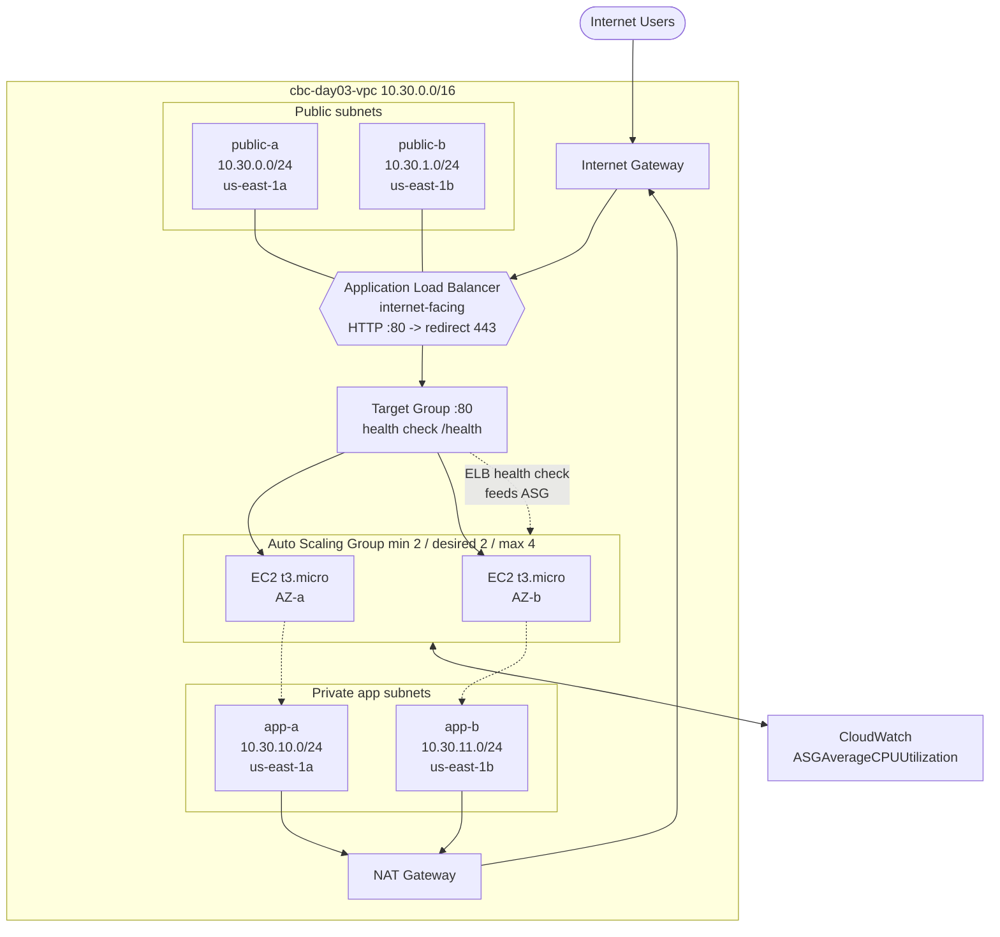
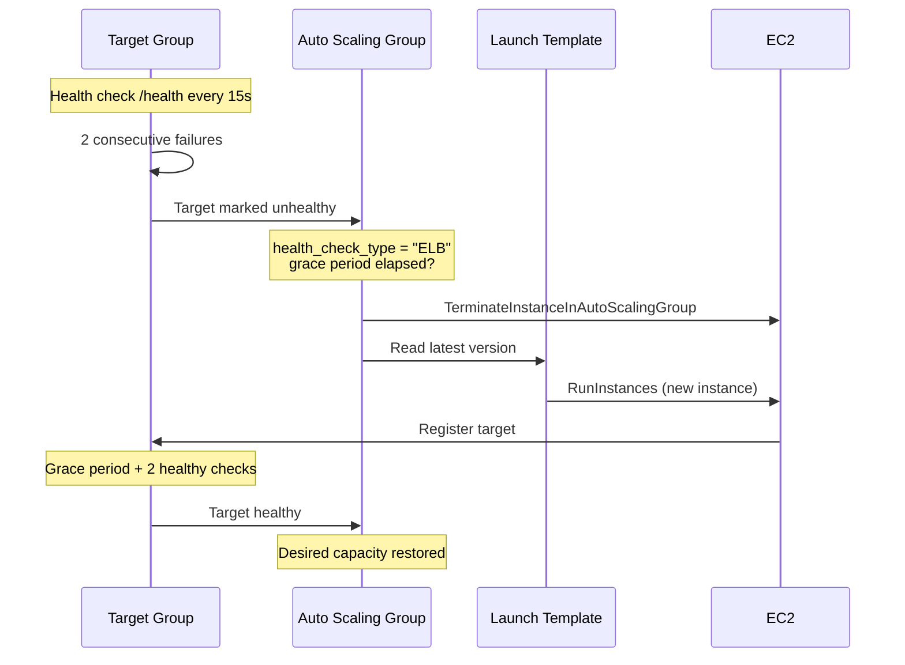
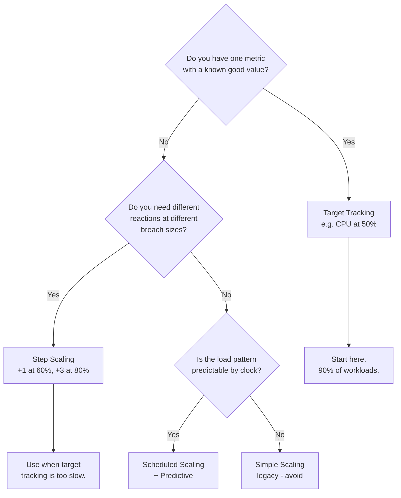
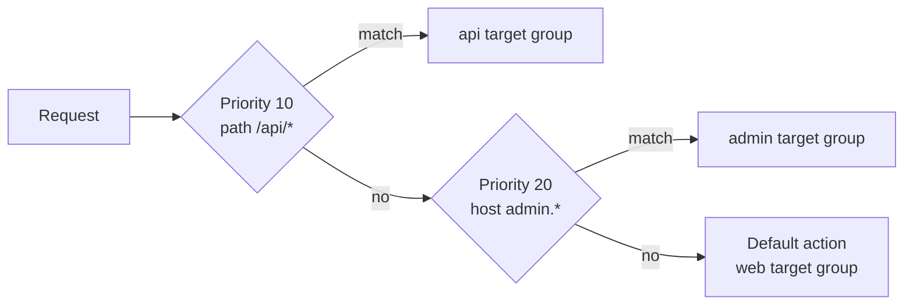
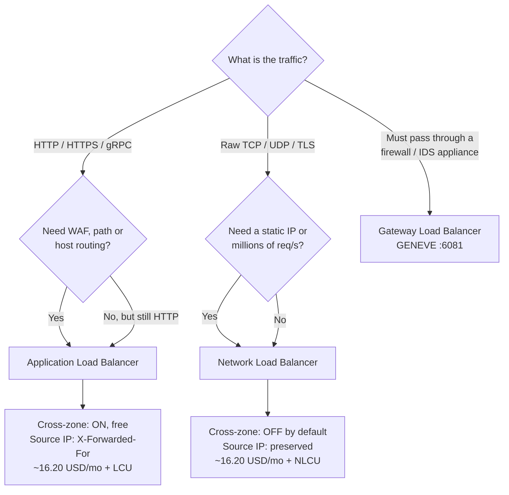
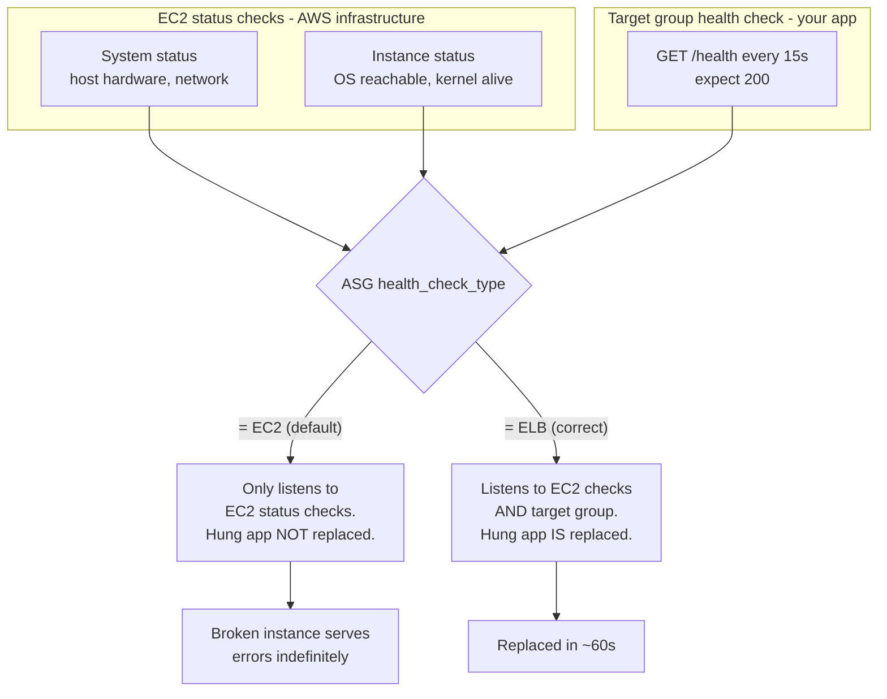
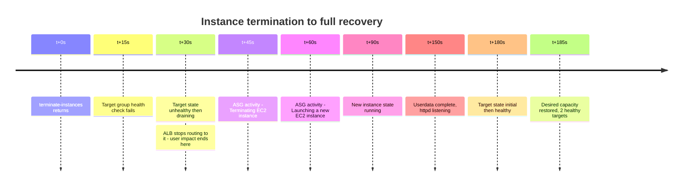
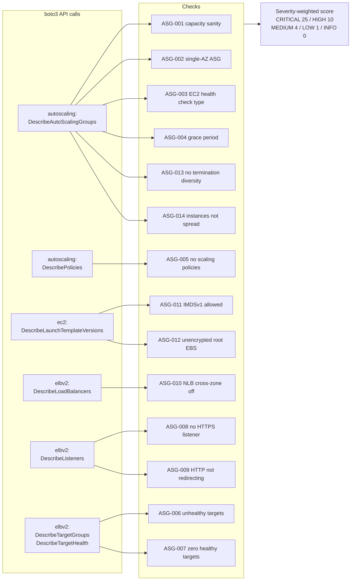

# Day 03 — Architecture Diagrams

All Mermaid sources for Day 03 in one place. These render natively on GitHub. Copy any
block into [mermaid.live](https://mermaid.live) to edit or export a PNG for slides.

| # | Diagram | Use it to explain |
|---|---|---|
| 1 | [Target architecture](#1-target-architecture) | What the lab builds end to end |
| 2 | [Self-healing loop](#2-the-self-healing-loop) | How ELB health checks drive ASG replacement |
| 3 | [Scaling policy decision tree](#3-scaling-policy-decision-tree) | Choosing target tracking vs step vs scheduled |
| 4 | [Warm-up vs cooldown timeline](#4-warm-up-vs-cooldown-timeline) | Why boot-time CPU causes scaling storms |
| 5 | [ALB request routing](#5-alb-request-routing) | Listener rules, priority, default action |
| 6 | [ALB vs NLB vs GWLB](#6-load-balancer-selection) | Picking the right LB in a design review |
| 7 | [Health check chain](#7-health-check-chain) | Where each health signal originates |
| 8 | [Chaos test timeline](#8-chaos-test-timeline) | What learners will actually observe |
| 9 | [Audit findings map](#9-audit-findings-map) | What `ha_audit.py` inspects |

---

## 1. Target architecture

---

## 2. The self-healing loop

---

## 3. Scaling policy decision tree

---

## 4. Warm-up vs cooldown timeline

Two instances launch at t=0. The new instance's CPU spikes to 100% during boot.

```mermaid
gantt
    title Instance warm-up excludes boot-time CPU from the aggregate
    dateFormat  s
    axisFormat %S

    section Instance boots
    RunInstances to running     :a1, 0, 45s
    OS + app startup (CPU 100%) :a2, 45, 105s
    Registered, passing checks  :a3, 150, 30s

    section Warm-up window (180s)
    Metrics IGNORED by policy   :crit, w1, 0, 180s

    section Without warm-up
    False scale-out triggered   :crit, b1, 60, 40s
    Another instance boots      :b2, 100, 150s
    Scaling storm               :crit, b3, 250, 100s
```

**Read it this way:** during the warm-up window the booting instance contributes nothing
to `ASGAverageCPUUtilization`. Remove the warm-up and its 100% boot CPU drags the average
up, which triggers another scale-out, which boots another instance at 100%, and so on.

---

## 5. ALB request routing

Rules evaluate in ascending priority order. **First match wins** — evaluation stops there.
The default action is only reached when no rule matches.

---

## 6. Load balancer selection

---

## 7. Health check chain

Three independent health signals. People confuse them constantly.

---

## 8. Chaos test timeline

What learners observe after `aws ec2 terminate-instances`.

---

## 9. Audit findings map

What `ha_audit.py` reads and what it can conclude.

---

*CareerByteCode · Enterprise AWS Cloud Architecture & AIOps Bootcamp · Learning Made Simple*
