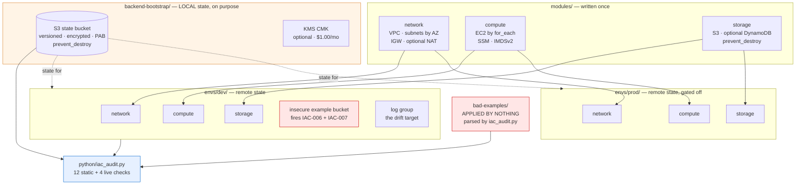
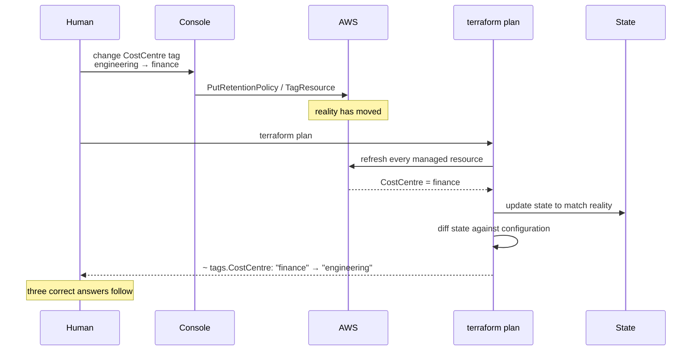
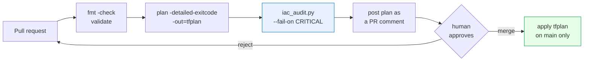

# Day 05 — Infrastructure as Code

**CareerByteCode · Enterprise AWS Cloud Architecture & AIOps Bootcamp**

> **Enterprise scenario**
> Four days of click-ops and half-remembered CLI commands have produced
> infrastructure nobody can describe. Two environments that were supposed to be
> identical are not, and the only person who knows why left in March. Somebody
> changed a security group in the console last Tuesday and there is no record
> of it, no review of it, and no way to tell what else has moved. Everything
> must become versioned, reviewable, repeatable code — and the code must be
> able to tell you when reality has drifted away from it.

Today you build the **same environment twice from the same three modules**,
with the state living somewhere both of you can reach and neither of you can
corrupt. Then you break it on purpose in the console, catch yourself doing it
with `terraform plan`, and fix it three different ways — because there are
three correct answers to drift and picking one accidentally is the only wrong
one.

Then you audit all of it with a Python tool that reads `.tf` files with no AWS
credentials at all.

| | |
|---|---|
| **Level** | Intermediate |
| **Stack** | Terraform / OpenTofu + Python (boto3) + AI |
| **Cost** | **~$0.05/month** — and the dollars are not the expensive part |
| **Time** | 3h 30m taught · ~2h 25m self-paced |
| **Region** | `us-east-1` · profile `bootcamp` · prefix `cbc-day05-` |
| **Audit** | **13 findings** static, **15** live, **16** after Step 6 · score **0/100** |

Day 05 is self-contained. It does not read Day 02, 03 or 04 state, and nothing
you built on those days needs to still exist.

---

## Table of contents

1. [Learning objectives](#learning-objectives)
2. [Prerequisites](#prerequisites)
3. [Architecture](#architecture)
4. [Part 1 — The core workflow](#part-1--the-core-workflow)
5. [Part 2 — State, and why it is the whole subject](#part-2--state-and-why-it-is-the-whole-subject)
6. [Part 3 — The chicken-and-egg problem](#part-3--the-chicken-and-egg-problem)
7. [Part 4 — Modules](#part-4--modules)
8. [Part 5 — Variables, outputs and where values come from](#part-5--variables-outputs-and-where-values-come-from)
9. [Part 6 — Environments: workspaces vs directories](#part-6--environments-workspaces-vs-directories)
10. [Part 7 — Pinning, locking and reproducibility](#part-7--pinning-locking-and-reproducibility)
11. [Part 8 — `count`, `for_each`, `lifecycle` and `moved`](#part-8--count-for_each-lifecycle-and-moved)
12. [Part 9 — Drift](#part-9--drift)
13. [Part 10 — CI/CD for Terraform](#part-10--cicd-for-terraform)
14. [Part 11 — Auditing IaC as code](#part-11--auditing-iac-as-code)
15. [The mistakes people actually make](#the-mistakes-people-actually-make)
16. [Cost — read this before you apply](#cost--read-this-before-you-apply)
17. [Lab](#lab)
18. [Day 05 checklist](#day-05-checklist)

---

## Learning objectives

By the end of today you can:

1. Explain what Terraform state is, why it exists, and why read access to it is
   a production credential.
2. Stand up an S3 backend with **native S3 locking**, and say what the
   DynamoDB lock table used to be for and why you will not build one.
3. Resolve the bootstrap chicken-and-egg — the backend cannot create itself —
   and annotate the exception in code rather than in a wiki page.
4. Write reusable modules with inputs, outputs and no provider blocks, and say
   when **not** to write one.
5. Compose two environments from one set of modules, differing only in tfvars.
6. Argue directory-per-environment against workspaces and mean it.
7. Detect drift, and fix it three ways — reconcile, accept, ignore — knowing
   which is correct when.
8. Pin providers, commit the lock file, and explain what each one protects
   against.
9. Choose `for_each` over `count` for the right reason, and refactor an
   existing `count` without destroying anything.
10. Audit Terraform statically, from a laptop with no AWS credentials.

---

## Prerequisites

- Days 01–04 finished, or equivalent AWS fluency. **Day 05 does not depend on
  their infrastructure still existing** — only on you knowing what a VPC is.
- Terraform ≥ 1.10 or OpenTofu ≥ 1.8. **The 1.10 floor is not arbitrary**:
  `use_lockfile` — S3-native state locking — landed there, and every backend
  in this lab uses it.
- AWS provider ≥ 5.80, for the same reason. This is pinned for you.
- AWS CLI v2 with the `bootcamp` profile from Day 01.
- Python 3.9+ and `pip install -r lab/python/requirements.txt` (boto3 only).
- Git. You will be told to commit things, and the reasons are real.

```bash
terraform version      # or: tofu version
aws sts get-caller-identity --profile bootcamp
```

---

## Architecture

Three modules, two environments, one backend, and a directory of deliberate
mistakes that is never applied.



Read the arrows carefully. `backend-bootstrap/` points at both environments
because it holds their state, not because it creates anything in them. And
`bad-examples/` has no arrow into AWS at all — it is parsed, never applied.

More diagrams, including the drift sequence and the state-locking mechanism:
[`diagrams/README.md`](diagrams/README.md).

---

## Part 1 — The core workflow

Four commands, and the interesting parts are what happens between them.

```bash
terraform init      # download providers, configure the backend, write the lock file
terraform plan      # refresh state against reality, diff against config, propose
terraform apply     # execute the proposal
terraform destroy   # execute the inverse
```

### `init` does three separate jobs

People treat `init` as "the thing you run when it complains", and then are
surprised when it does something significant.

| Job | What it writes | When you must re-run |
|---|---|---|
| Resolve and download providers | `.terraform/providers/` | new provider, changed constraint |
| Record what was selected | `.terraform.lock.hcl` | **commit this file** |
| Configure the backend | `.terraform/terraform.tfstate` (a pointer, not your state) | backend block changed |
| Fetch modules | `.terraform/modules/` | new or changed module source |

`terraform init -migrate-state` is the one that moves an existing local state
file into a newly configured backend. `-reconfigure` is the one that throws
the old backend association away without migrating. Choosing the wrong one
under pressure is how people lose a state file, so read the prompt.

### `plan` is a refresh and a diff, in that order

```
config (what you wrote)  ─┐
                          ├─→ diff → plan
state, refreshed from AWS ┘
```

That refresh step is the whole of drift detection. Terraform reads every
managed resource back from the AWS API, updates state to match what is really
there, then compares that to your configuration. Anything AWS reports that
your code does not ask for shows up as a proposed change back.

**Drift detection is not a background service.** Nothing watches your account.
It is a plan, and it only happens when somebody runs one — which is the
argument for running `plan` on a schedule in CI and alerting on a non-empty
diff. That is three lines of YAML and it catches the console edits nobody
mentioned.

### The dependency graph is built from references, not from `depends_on`

```hcl
module "compute" {
  source     = "../../modules/compute"
  subnet_ids = module.network.public_subnet_ids   # ← this is the edge
}
```

Reading `module.network.public_subnet_ids` is what tells Terraform that the
network must exist first. There is no `depends_on` anywhere in `envs/dev/`
and there does not need to be.

`depends_on` between things that already share data is noise. `depends_on`
between things that do **not** share data usually means you have hidden a real
dependency somewhere it cannot be seen — an IAM policy that must exist before
a service can assume a role, for instance. Use it there, with a comment saying
why, and nowhere else.

### Resource addressing

```
aws_s3_bucket.data                          a resource
aws_s3_bucket.data["reports"]               one instance from for_each
aws_s3_bucket.data[0]                       one instance from count
module.network.aws_subnet.public["us-east-1a"]   inside a module
```

These strings are the interface to `state mv`, `state rm`, `import`, `taint`
and `-target`. Learning to read them is not optional; they are the only way to
talk to Terraform about one specific object.

### `-target` and why it is a smell

```bash
terraform apply -target=aws_s3_bucket.data     # works. and yet.
```

HashiCorp's own documentation describes `-target` as intended for
exceptional situations, and that framing is correct. What it actually does is
apply *part* of your configuration, which leaves state internally consistent
but no longer a description of a complete apply. The next unqualified plan
often proposes changes that look mysterious, because they are the rest of the
work you skipped.

Legitimate uses, both rare:

- Recovering from a partially failed apply where one resource is wedged.
- Working around a genuine provider bug, with a ticket number in the commit.

Illegitimate use, extremely common: *"the full plan proposes something scary,
so I will target the bit I understand."* The scary part does not go away. It
waits, and it gets applied later by somebody who was not in this conversation.

If you find yourself reaching for `-target` regularly, the real problem is
that your root module is too big. Split it.

---

## Part 2 — State, and why it is the whole subject

Everything else today is a consequence of this section.

### What state is

State is the map between the names in your code and the objects in your
account:

```
aws_vpc.this   ←→   vpc-0a1b2c3d4e5f
```

Without it, Terraform cannot know that the VPC in your configuration is the
VPC in your account, and would propose to create a second one on every apply.

It is a plaintext JSON file. It records **every attribute of every managed
resource**, whether or not you referenced it, whether or not you marked it
sensitive.

### Local state, and the three ways it fails

| Failure | How it presents |
|---|---|
| Nobody else has it | Colleague applies, sees no state, creates a duplicate stack |
| No locking | Two applies interleave writes into the same resources; AWS obliges |
| One machine holds it | Laptop dies; recovery is `terraform import`, one resource at a time |

Remote state fixes the sharing problem. **Locking fixes the concurrency
problem, and they are separate problems.** A shared bucket with no locking is
arguably worse than local state, because now two people can corrupt one file
instead of each corrupting their own.

### The S3 backend, as this lab configures it

```hcl
terraform {
  backend "s3" {
    bucket       = "cbc-day05-tfstate-abc123"
    key          = "day-05/dev/terraform.tfstate"
    region       = "us-east-1"
    profile      = "bootcamp"
    encrypt      = true
    use_lockfile = true          # S3-native locking
  }
}
```

`use_lockfile = true` makes Terraform write a `<key>.tflock` object with a
conditional put before it mutates state, and delete it afterwards. That is the
entire mechanism. It needs **AWS provider ≥ 5.80 and Terraform ≥ 1.10**.

For about a decade the answer was a DynamoDB table with a `LockID` hash key.
It worked. It is now legacy: the `dynamodb_table` argument is deprecated, and
every repository that used it carries a ~$0.25/month table that outlives the
project by years. **You will meet these. Do not build new ones.** Know what
they were for, because it is an interview question, and because if you are
stuck below provider 5.80 you have no alternative.

### The backend block cannot use variables

Not "should not" — **cannot**.

```hcl
backend "s3" {
  bucket = var.state_bucket    # hard error. everyone tries this once.
}
```

Terraform reads the backend block before it has evaluated anything else in the
configuration, so there are no variables yet. Your two legal options:

```bash
# 1. Hardcode it (what envs/dev/backend.tf does)

# 2. Partial configuration at init time — how CI does it, and how one repo
#    serves several accounts
terraform init \
  -backend-config="bucket=cbc-day05-tfstate-abc123" \
  -backend-config="key=day-05/dev/terraform.tfstate"
```

### State is a secrets liability

This is the part of Day 05 that changes how people work.

Everything Terraform knows about a resource is in state, in plaintext JSON.
RDS master passwords. Generated private keys. Every variable you passed in.
`sensitive = true` hides a value from **CLI output** — it does not encrypt it,
does not redact it, and does not keep it out of the state file.

Prove it to yourself, in Step 2 of the lab:

```bash
aws s3 cp s3://<your-state-bucket>/day-05/dev/terraform.tfstate - \
  --profile bootcamp --region us-east-1 | head -60
```

**Anyone with `s3:GetObject` on that bucket has read every secret in your
estate without touching a single resource.** Encrypt the bucket, block public
access, and treat the read permission as a production credential, because it
is one. The audit's IAC-004, IAC-006 and IAC-007 exist entirely because of
this paragraph.

### The state subcommands, and when each is right

| Command | What it does | When |
|---|---|---|
| `terraform state list` | Every address Terraform manages | Always, first |
| `terraform state show ADDR` | Every attribute of one resource | Debugging a diff |
| `terraform state mv A B` | Rename in state without touching AWS | Refactors, `count`→`for_each` |
| `terraform state rm ADDR` | **Forget** a resource — AWS keeps it | Handing ownership away, teardown escapes |
| `terraform import ADDR ID` | Adopt an existing AWS object into state | Bringing click-ops under management |
| `terraform plan -refresh-only` | Update state to match reality, propose no changes | Accepting drift |

Two warnings worth internalising:

- **`state rm` does not delete anything in AWS.** It makes Terraform forget.
  The resource keeps running and keeps billing, now with nobody managing it.
  That is sometimes exactly what you want (see the teardown checklist) and
  sometimes an accidental way to create an orphan.
- **`import` requires the configuration to exist first.** Import populates
  state; it does not write HCL for you. Terraform ≥ 1.5 has `import` *blocks*,
  which are reviewable in a pull request and can generate a configuration
  skeleton with `terraform plan -generate-config-out=generated.tf`. Prefer
  those to the CLI command — same reason as `moved` blocks.

---

## Part 3 — The chicken-and-egg problem

The backend cannot create itself. The bucket that holds state must exist
before any configuration can write state into it.

So `backend-bootstrap/` runs on **local state**, deliberately, and says so in
code:

```hcl
terraform {
  required_version = ">= 1.10.0"

  # NO backend block here. See the essay above.
  #
  # iac-audit: allow-local-state
```

That marker is not decoration. `iac_audit.py` reads it and suppresses IAC-005
for this directory. Every audit tool needs a way to say *"I know, and here is
why"* — and the only good place for that is **in code, greppable, next to the
thing being suppressed**, where the reviewer of the next change to that file
will see it. A `suppressions.yaml` in the repository root is a file nobody
reads that quietly grows.

The marker has to be a comment line of its own, which is why
`bad-examples/providers.tf` can discuss it at length in prose without
suppressing anything. A suppression you can trigger by writing documentation
is not a suppression.

### What to do with the bootstrap state file

Three options, in descending order of how much you will like yourself later:

1. **Commit it, encrypted** (git-crypt, SOPS). It describes one bucket and no
   secrets. Small, auditable, recoverable.
2. **Migrate it into the bucket it just created.** Elegant, and every guide
   suggests it. It also means the bucket now holds its own state, so the
   destroy sequence has a genuine circular dependency in it. Understand that
   before you do it.
3. **Leave it on one laptop.** What most teams actually do, and the reason the
   bootstrap directory is the one nobody dares touch three years later.

Not an option: leaving it on a laptop *and* not knowing that is what you did.

---

## Part 4 — Modules

A module is a directory of `.tf` files. That is the entire definition. The
directory you run `apply` in is the **root module**; anything it calls is a
**child module**.

### Structure this lab uses

```
modules/network/
├── main.tf        the resources
├── variables.tf   the inputs, every one with a type and a description
├── outputs.tf     the interface other people consume
├── versions.tf    required_version + required_providers, NO provider block
└── README.md      inputs, outputs, and why it is built this way
```

### Three module sources, three sets of rules

```hcl
source = "../../modules/network"                                  # local path
source = "terraform-aws-modules/vpc/aws"                          # registry
source = "git::https://github.com/org/repo.git//vpc?ref=v1.4.0"   # git
```

| Source | Versioning | Use when |
|---|---|---|
| Local path | **No `version` argument** — the version is your commit | The module changes with the code that calls it |
| Registry | `version = "~> 5.0"`, required and honoured | Well-maintained public modules |
| Git | Pin with `?ref=` to a **tag** | Private shared modules across repos |

`?ref=main` means your infrastructure changes when somebody else merges a pull
request in another repository, and you will discover this during an unrelated
apply. Pin to tags.

This lab uses local paths so the whole thing works with the registry
unreachable, and so you can read every line of what you are running.

### No provider blocks in child modules

The single most important rule about writing modules, and the one most often
broken. A child module declares which providers it **requires**. The root
module declares how they are **configured**.

Put a configured `provider "aws" { region = "us-east-1" }` inside a child
module and you get, in order:

1. A module nobody can reuse in another region.
2. A module that cannot be used with `count` or `for_each`, because Terraform
   forbids that on modules with their own provider blocks.
3. A deprecation warning today and a hard error on the day you try to **remove**
   the module — because Terraform must still be able to configure the provider
   in order to destroy what it created, and the configuration just disappeared
   along with the module block.

Number 3 is the one that ruins an afternoon. The escape hatch exists
(`removed` blocks, or temporarily re-adding the module) and you do not want to
need it.

The correct pattern for "this module needs a second region" is an aliased
provider passed **in** by the caller, with `configuration_aliases` declared in
the module's `required_providers`.

### When NOT to write a module

Module-writing is the most over-applied skill in Terraform. Do not write one
when:

- **It is used once.** A module with a single caller is a directory boundary
  and an indirection with no reuse to justify it. Inline it until there is a
  second caller.
- **It is a thin wrapper over one resource.** `module "bucket"` that creates
  one `aws_s3_bucket` and passes fourteen variables straight through has added
  fourteen variables and removed nothing. The resource was already the
  abstraction.
- **The two callers are not actually the same thing.** If half the module's
  body is `count = var.is_prod ? 1 : 0`, you have two things wearing one name.
  Write two modules, or accept some duplication. Duplication is cheaper to
  read than a conditional you have to mentally evaluate.
- **You are wrapping a good registry module to change one default.** Call it
  directly and set the input.

A useful test: *can you write the README before the code?* If you cannot
describe the module's interface without describing its internals, it does not
have an interface yet.

---

## Part 5 — Variables, outputs and where values come from

### Precedence, lowest to highest

Later sources override earlier ones:

| # | Source | Notes |
|---|---|---|
| 0 | `default` in the `variable` block | Only used if nothing below sets it |
| 1 | `TF_VAR_name` environment variables | How CI usually injects secrets |
| 2 | `terraform.tfvars` | Gitignored in this repo. The `.example` is committed |
| 3 | `terraform.tfvars.json` | |
| 4 | `*.auto.tfvars` / `*.auto.tfvars.json` | **Lexical order**, so `10-a.auto.tfvars` loses to `20-b.auto.tfvars` |
| 5 | `-var` and `-var-file` on the command line | In the order given, last wins |

The one that surprises people: `-var` beats everything, including a
`terraform.tfvars` sitting right there. That is how a CI pipeline overrides a
developer's file, and how somebody applies dev's values to prod with a
copy-pasted command.

### Validation blocks turn apply-time failures into plan-time errors

```hcl
variable "vpc_cidr" {
  description = "CIDR for the VPC. /16 gives 65,536 addresses; /24 gives 256."
  type        = string
  default     = "10.20.0.0/16"

  validation {
    condition     = can(cidrhost(var.vpc_cidr, 0))
    error_message = "vpc_cidr must be valid CIDR notation, for example 10.20.0.0/16."
  }
}
```

Every cost-bearing toggle in this lab is priced in its `description`, because
the description is what `terraform plan` shows a human when it prompts, and
because a variable called `enable_nat_gateway` that does not say *$32.40/month*
is a variable somebody will flip without thinking.

### `sensitive = true`, precisely

It hides the value from CLI output. That is all it does.

It does **not**: encrypt it, remove it from state, stop
`terraform output -raw db_password` returning it, or prevent it appearing in a
plan file. It is a display setting with a security-sounding name, and it is
the single most misunderstood feature in Terraform.

Marking a secret sensitive and considering the problem solved is exactly the
mistake IAC-008 exists to catch.

### Locals vs variables

Variables are the **interface**: things a caller sets. Locals are
**intermediate values**: things you compute from variables to avoid repeating
an expression. If a local is only used once, it is usually a comment wearing a
name.

### Outputs are for wiring, not for data

Outputs exist so other configurations and humans can wire things up — IDs,
ARNs, endpoints, names. A password is not a wiring value. If a consumer needs
a secret it should read it from Secrets Manager with its own IAM identity, so
that access is granted, revocable and logged. Passing it through an output
makes it none of those things.

---

## Part 6 — Environments: workspaces vs directories

Two ways to run the same code against two environments:

```bash
terraform workspace new prod          # one directory, N state files
envs/dev/ and envs/prod/              # N directories, N state files
```

Workspaces look tidier and are almost always the wrong choice for
environments. Three reasons, in order of how much they hurt:

1. **One backend, one set of credentials.** Every workspace shares the same
   backend block, so dev state and prod state live in the same bucket under
   the same permissions. Anyone who can plan dev can read prod's state — which
   contains prod's secrets. See Part 2.
2. **The differences hide in conditionals.** Environments genuinely differ, so
   the code fills with
   `instance_type = terraform.workspace == "prod" ? "m5.large" : "t3.micro"`.
   Now the only way to know what prod looks like is to mentally evaluate every
   ternary in the repository.
3. **`terraform workspace select` is one word from a disaster.** Forget it and
   you apply dev's plan to prod. There is no directory in your prompt to tell
   you which you are in. Whole postmortems have been written about that single
   missing word.

Directory-per-environment costs some duplication — `envs/dev/providers.tf` is
nearly identical to `envs/prod/providers.tf` — and buys a separate backend, a
separate state file, separate IAM, a separate review, and a path on screen that
says which environment you are about to change. That trade is not close.

**Workspaces are genuinely good for** short-lived per-developer or per-PR
copies of the *same* environment. Same configuration, same risk profile,
different name. That is what they were built for.

Look at what `envs/prod/` turns on that `envs/dev/` does not: point-in-time
recovery, 90-day version retention, 30-day log retention, `force_destroy =
false`. That asymmetry living in two tfvars files instead of in ternaries
scattered through shared code **is** the argument.

---

## Part 7 — Pinning, locking and reproducibility

Two mechanisms, two different questions. You need both.

| | Question it answers | Where it lives |
|---|---|---|
| Version constraint | What is **acceptable**? | `required_providers` |
| `.terraform.lock.hcl` | What was **selected**? | Committed, in the repo |

### Constraints

```hcl
aws = { source = "hashicorp/aws", version = "~> 5.80" }
```

| Constraint | Allows | Verdict |
|---|---|---|
| *(none)* | Anything, including 6.x tomorrow | IAC-011 fires |
| `>= 5.80` | Including 6.0 | Not a pin |
| `~> 5.80` | 5.80.x through 5.x, refuses 6.0 | **What you want** |
| `= 5.80.1` | Exactly one build | Defensible in regulated environments, annoying elsewhere |

A 6.x provider against configuration written for 5.x is an error at best and a
silent behavioural change at worst, and it arrives on a Tuesday because
somebody re-ran `init` in CI.

### The lock file

`.terraform.lock.hcl` records the exact provider versions Terraform selected
and their **checksums for every platform**. Committing it is what makes `init`
reproducible: your laptop, your colleague's laptop and CI all get the same
provider binary, verified against the same hashes.

Gitignore it — as `bad-examples/.gitignore` does on purpose, and as Day 04's
`terraform/.gitignore` did by accident — and every `init` re-resolves against
the registry. The pipeline picks up a provider released three hours ago, the
plan shows changes nobody wrote, and you spend the morning proving it was not
your commit. It also removes the supply-chain check, because those hashes are
how Terraform verifies the provider it downloaded is the provider it
downloaded last time.

```bash
terraform init -upgrade      # the ONLY thing that should change this file
```

That change belongs in its own reviewed pull request, where a human can read
`aws 5.80.0 -> 5.82.2` and think about it.

If CI runs on Linux and people develop on macOS, generate hashes for both or
CI will reject the file:

```bash
terraform providers lock \
  -platform=linux_amd64 \
  -platform=darwin_arm64 \
  -platform=darwin_amd64
```

---

## Part 8 — `count`, `for_each`, `lifecycle` and `moved`

### `count` addresses by position, and that is the problem

```
aws_s3_bucket.reports[0]   reports-alpha
aws_s3_bucket.reports[1]   reports-beta
aws_s3_bucket.reports[2]   reports-gamma
```

Remove `reports-alpha` from the middle of the list. Terraform does not see
"one bucket removed". It sees `[0]` changed name, `[1]` changed name, and `[2]`
gone — so it plans to **destroy and recreate all three**, including the two
you never touched. For an S3 bucket, "recreate" means the data is gone.

`for_each` addresses by key:

```hcl
for_each = toset(var.report_bucket_names)
bucket   = each.value
```

```
aws_s3_bucket.reports["reports-alpha"]
aws_s3_bucket.reports["reports-beta"]
```

Remove one key and exactly one bucket is destroyed. Nothing else in the plan
moves.

**`count` is correct for exactly one shape:** `count = var.enabled ? 1 : 0`.
The moment the number can exceed one, you want `for_each`. The auditor finds
sixteen `count` expressions in this lab; fifteen are that shape, and the
sixteenth is in `bad-examples/` and fires IAC-016.

One gotcha: `for_each` keys must be known at **plan** time. Keying off an
attribute that does not exist until apply — an ARN of something being created
in the same run — produces the *"Invalid for_each argument"* error. Key off
the input that generated it instead.

### `lifecycle`

```hcl
lifecycle {
  create_before_destroy = true
  prevent_destroy       = true
  ignore_changes        = [ami, tags["CostCentre"]]
}
```

| Meta-argument | What it does | Where this lab uses it |
|---|---|---|
| `create_before_destroy` | Build the replacement, move references, then remove the old | `modules/network` security group — SGs cannot be deleted while an ENI references them, so replacement deadlocks against its own dependents without this |
| `prevent_destroy` | Makes destroy **fail at plan time** | Every stateful resource: 4 of them across the lab |
| `ignore_changes` | Stop diffing an attribute something else owns | `modules/compute` ignores `ami`, so a new Amazon Linux release does not silently replace running instances |

**`prevent_destroy` takes a literal.** `prevent_destroy = var.protect` is a
hard error, not a warning, because `lifecycle` is evaluated before variables
resolve — Terraform needs to know whether destroy is permitted before it has a
value for anything. There is no per-environment toggle. If dev must be
destroyable and prod must not, that is two code paths, or accepting the
seatbelt in both.

### `moved` blocks — refactor without destroy/recreate

Renaming a resource, or moving it into a module, changes its **address**.
Terraform sees the old address gone and a new one appearing: destroy and
create. For anything stateful, that is data loss caused by tidying up.

```hcl
moved {
  from = aws_s3_bucket.reports
  to   = module.storage.aws_s3_bucket.data
}
```

`terraform state mv` does the same job at the CLI. Prefer the block: it is in
code, it appears in the pull request, a reviewer sees it, and every environment
picks it up automatically. The CLI version happens on one machine, once, and
is remembered by nobody.

Leave `moved` blocks in for a release or two, then delete them once every
environment has applied.

---

## Part 9 — Drift

Drift is when reality no longer matches your configuration. Somebody changed
something outside Terraform — usually in the console, usually for a good
reason, usually at 4pm on a Friday.



### The three fixes, and when each is right

| Fix | Effect | Correct when |
|---|---|---|
| `terraform apply` | Code wins; AWS is reconciled | The change was unauthorised, or a mistake. **The default answer.** |
| `terraform plan -refresh-only` then apply | Reality wins; state is updated, code then changed to agree | The change was correct and the code is now wrong. Follow it with a commit, or the next apply reverts you. |
| `lifecycle { ignore_changes = [...] }` | Stop diffing that attribute | Something else legitimately owns it — an autoscaler, a deployment pipeline, a tagging Lambda. |

Choosing accidentally is the only wrong answer. Note that `-refresh-only` is
**not** a fix on its own — it makes Terraform stop complaining without making
the code true, and the next person to run `apply` gets the surprise you
deferred.

If the same drift keeps recurring, the console access that allows it is the
actual finding.

---

## Part 10 — CI/CD for Terraform

The shape everybody converges on:



### `plan -detailed-exitcode`

```
0   succeeded, empty diff — nothing to do
1   errored
2   succeeded, non-empty diff — there are changes
```

This is what makes Terraform scriptable. A nightly drift-detection job is:
run plan, and if the exit code is 2, alert. Note the trap — `2` means success
*with changes*, so a naive `if [ $? -ne 0 ]` treats every pending change as a
pipeline failure.

### Apply the plan file, not the configuration

```bash
terraform plan -out=tfplan          # on the PR
terraform apply tfplan              # on merge — applies exactly what was reviewed
```

`terraform apply` with no plan file re-plans, and what it applies is whatever
is true *now*, not what the reviewer approved. Between review and merge,
somebody else's change landed. Pass the plan file.

Plan files contain **every value in the diff, including sensitive ones**, in
the clear. Treat a stored plan artifact as you would the state file: encrypted,
short-retention, access-controlled.

### OIDC, not long-lived keys

Do not put `AWS_ACCESS_KEY_ID` in your CI secrets. Federate:

```yaml
permissions:
  id-token: write
  contents: read

steps:
  - uses: aws-actions/configure-aws-credentials@v4
    with:
      role-to-assume: arn:aws:iam::111122223333:role/github-actions-terraform
      aws-region: us-east-1
```

The runner exchanges a short-lived OIDC token for temporary credentials. **No
long-lived key exists to leak**, which means IAC-002 cannot fire, the key
cannot appear in a log, and there is nothing to rotate on a schedule.

Scope the trust policy to your repository *and* your branch. A trust policy
that accepts `repo:org/*:*` accepts a pull request from a fork.

Two more that are worth the small effort: run `plan` with a **read-only** role
and `apply` with a write role, and require an environment approval on the
apply job.

---

## Part 11 — Auditing IaC as code

`lab/python/iac_audit.py` — sixteen checks, twelve of which need **no AWS
credentials at all**. That is the point: every finding a static check produces
is one you can fix before `terraform apply` runs, which is the only time
fixing it is cheap. By the time IAM or GuardDuty can see the problem, the
resource exists, something depends on it, and the fix needs a change window.

| Check | Sev | What it finds |
|---|---|---|
| IAC-001 | CRITICAL | Hardcoded secret in a `.tf` file |
| IAC-002 | CRITICAL | `access_key` / `secret_key` in a provider block |
| IAC-003 | CRITICAL | `.tfstate` present and not gitignored |
| IAC-004 | CRITICAL | State bucket publicly accessible *(live)* |
| IAC-005 | HIGH | Root module with no backend — local state |
| IAC-006 | HIGH | State bucket has no versioning *(live)* |
| IAC-007 | HIGH | State bucket has no default encryption *(live)* |
| IAC-008 | HIGH | Output exposing a credential without `sensitive` |
| IAC-009 | HIGH | `0.0.0.0/0` on an **ingress** rule |
| IAC-010 | MEDIUM | No `required_version` |
| IAC-011 | MEDIUM | Provider version unpinned |
| IAC-012 | MEDIUM | Lock file gitignored, or missing after an init |
| IAC-013 | MEDIUM | Stateful resource with no `prevent_destroy` |
| IAC-014 | MEDIUM | Resource missing required tags |
| IAC-015 | MEDIUM | Deployed tags have drifted *(live)* |
| IAC-016 | LOW | `count` misuse, or a variable with no type/description |

```bash
cd lab/python
python3 iac_audit.py --path ../terraform                      # 13 findings, no credentials
python3 iac_audit.py --path ../terraform --profile bootcamp \
  --state-bucket cbc-day05-dev-tfstate-insecure-abc123        # 15 findings
```

**Expect 13 findings and a score of 0/100 with no credentials, 15 with them,
and 16 after Step 6 introduces drift.** The score floors at zero — the weights
total 106, 126 and 130 respectively. Point the same tool at `envs/dev/` alone
and it scores 100/100, which is the more useful demonstration: same tool, same
checks, a directory somebody wrote carefully.

### Two checks are silent by design

**IAC-003** finds nothing because there is no committed `.tfstate` anywhere in
the lab and every `.gitignore` in the tree covers the pattern.

**IAC-004** finds nothing because this repository does not ship a publicly
readable S3 bucket, **not even as a teaching example**. Being one
`terraform apply` away from leaking somebody's data is not a lesson worth the
demonstration. The deliberately insecure example bucket in `envs/dev` has a
real public access block for exactly this reason — it exists to fire IAC-006
and IAC-007 and nothing else.

Both are fully implemented and fully tested. "We did not write it" and "it
finds nothing" have to be distinguishable, and the 47 unit tests make them so:
each has a test proving it fires on synthetic input and a test proving zero
false positives against the whole lab.

A check set where everything fires teaches you that findings are normal. A
check set with two deliberate zeroes teaches you that a quiet check is
evidence.

### IAC-015 is silent for a different reason

Say this plainly rather than pretending it is a third silent-by-design check:
**drift does not exist on a fresh apply, by definition.** IAC-015 is silent by
*situation*, not by design. Step 6 of the lab changes the `CostCentre` tag on
`aws_cloudwatch_log_group.drift_target` in the console, and then it fires —
taking the total to 16.

### Why regex and not a real HCL parser

`boto3` is the only dependency. There is no `python-hcl2`, and that is a
choice: **a linter you can run on a locked-down bastion beats a perfect parser
you cannot install.** The machines where this matters most — the jump host with
no egress, the CI runner with a locked requirements file — are exactly the
machines where `pip install python-hcl2` fails.

That decision costs real coverage, and the module docstring lists it: nested
heredocs, interpolated attribute names, `dynamic` blocks and expression-valued
arguments are all invisible. Every one of those is a **false negative** — the
tool stays quiet about a real problem. That is the correct direction to fail
in for something that runs in CI, because a false positive gets the whole tool
disabled and a false negative gets it supplemented. But do not read a clean run
as proof of anything.

---

## The mistakes people actually make

**Editing state by hand.** It is JSON, it has a serial number, and it is
guarded by a lock. Editing it directly desynchronises the serial, breaks the
next lock acquisition, or quietly makes Terraform believe in resources that do
not exist. Use `state mv` / `state rm` / `import`, which take the lock and
bump the serial for you.

**Committing `terraform.tfvars`.** The `.example` is committed; the real one is
gitignored in every directory here. People invert this on day one and push
account IDs, then discover git history is forever.

**Assuming `sensitive = true` protects something.** It hides CLI output. See
Part 5, twice, because this one does not stick the first time.

**Deleting a `prevent_destroy` block because destroy is failing.** The block is
doing its job. Removing it mid-incident, at speed, without a review, is how
production buckets go missing. Remove it, apply, then destroy — three steps,
in daylight. See [`teardown-checklist.md`](teardown-checklist.md).

**Using `count` for anything that can exceed one.** Then removing an element
from the middle and reading the plan too fast.

**Running `terraform apply` with no plan file in CI.** What gets applied is
whatever is true now, not what the reviewer approved.

**Believing drift detection is automatic.** Nothing watches your account. It
is a plan somebody has to run.

**Putting a provider block in a child module.** Fine today, deprecation warning
tomorrow, hard error on the day you remove the module.

**Not committing `.terraform.lock.hcl`.** Then debugging a plan diff nobody
wrote, on a Tuesday, for two hours.

**One enormous root module.** Two hundred resources in one state file, one
lock, one blast radius, and a plan that takes six minutes and is never read
properly. Split by lifecycle and by ownership: things that change together
belong together.

---

## Cost — read this before you apply

**~$0.05/month.** Day 05 is cheap in dollars and expensive in commitments.

| Item | Cost | Notes |
|---|---|---|
| `backend-bootstrap` — S3 state storage | ~$0.01 | a few hundred KB at $0.023/GB-month |
| `backend-bootstrap` — S3 requests | ~$0.01 | PUT/GET per plan and apply |
| S3-native locking (`use_lockfile`) | **$0.00** | a `.tflock` object written and deleted |
| `envs/dev` — VPC, subnets, IGW, SGs | $0.00 | always free |
| `envs/dev` — S3 data bucket + log group | ~$0.02 | at lab volumes |
| `envs/dev` — insecure example bucket | ~$0.00 | empty |
| `envs/prod` | **$0.00** | `enable_prod_environment = false` by default |
| **Total** | **~$0.05** | |

Everything expensive is **off** by default and priced in its own variable
description: `enable_nat_gateway` (+$32.40/month), `instances` (+$7.59/month
each), `enable_flow_logs` (+$0.50/month at lab traffic), `enable_kms_encryption`
(+$1.00/month), `create_data_table`, `enable_prod_environment`.

Verify rather than trust:

```bash
terraform output estimated_monthly_cost_usd
terraform output cost_breakdown
```

### The costly part of IaC is not the infrastructure

Three commitments, none of which appear on this month's bill:

**1. A state bucket you can never safely delete.** It carries `prevent_destroy`
because losing it means losing the map between your code and your account. It
will outlive this project. Somebody will inherit it and be afraid of it.

**2. Versioning quietly retaining every state file version forever.** You want
versioning on — it is the rollback path when an apply writes a corrupt state.
The consequence is that **every apply writes a new version and keeps the old
one**, forever, on a bucket nobody looks at. The
`noncurrent_version_expiration` rule in `backend-bootstrap` is the only thing
standing between you and a bucket that grows for five years. A busy team runs
hundreds of applies a month.

**3. A multi-environment build that doubles every resource.** `envs/prod` is
gated off and creates nothing. Flip `enable_prod_environment = true` and the
whole stack exists a second time. As configured that costs about $0.02/month,
because the default footprint is free — but the moment prod is *real*, prod
also wants a NAT gateway, instances, and flow logs. **Multi-environment is not
expensive because a VPC costs money. It is expensive because every toggle you
flip, you now flip twice, and the second one is the one nobody reviews.**

### The two silent-growth traps for this day

**Unbounded state file versions**, above. Check yours:

```bash
aws s3api list-object-versions \
  --bucket <your-state-bucket> \
  --prefix day-05/ \
  --query 'length(Versions)' --profile bootcamp
```

**Orphaned `.terraform/` provider caches.** Every directory you have ever run
`terraform init` in holds a few hundred megabytes of provider binaries on your
disk. **There are four such directories in this lab.** Nothing ever cleans them
up — not `destroy`, not `git clean` if they are gitignored, which they are.

```bash
find . -type d -name ".terraform" -exec du -sh {} +
```

Most people running this command for the first time find several gigabytes
from projects that ended years ago.

---

## Lab

Full walkthrough with timings: [`lab/README.md`](lab/README.md). In short:

```bash
cd lab/terraform/backend-bootstrap
cp terraform.tfvars.example terraform.tfvars      # set owner
terraform init && terraform apply
terraform output -raw state_bucket_name           # ← you need this next

cd ../envs/dev
# EDIT backend.tf: paste the bucket name into the `bucket` line
cp terraform.tfvars.example terraform.tfvars
terraform init && terraform apply

cd ../../python
pip install -r requirements.txt
python3 -m unittest discover -s tests              # 47 tests, no AWS needed
python3 iac_audit.py --path ../terraform           # 13 findings, score 0/100
```

Then the part that is actually the lab: **stand up prod from the same
modules**, and **break the CostCentre tag in the console** and catch yourself
doing it.

Then work `challenge/iac_audit_challenge.py` — 16 TODOs, about two hours — with
the unit tests as your offline feedback loop:

```bash
IAC_AUDIT_MODULE=iac_audit_challenge python3 -m unittest discover -s tests
```

Compare against the reference only when you are done.

Teardown is **not optional**, and on this day it will not just work — four
resources carry `prevent_destroy` and that is the seatbelt functioning:
[`teardown-checklist.md`](teardown-checklist.md). Read it **before** you reach
for a lifecycle block in anger.

---

## Day 05 checklist

- [ ] `backend-bootstrap` applied; state bucket versioned, encrypted, PAB on
- [ ] You found `terraform.tfstate` sitting on your disk in that directory and
      can say why it is correct there and nowhere else
- [ ] `envs/dev` applied against the remote backend, and `ls terraform.tfstate`
      shows **nothing** in that directory
- [ ] You read your own state file out of S3 and saw plaintext JSON
- [ ] You watched a `.tflock` object appear and disappear during an apply
- [ ] `envs/prod` applied from the **same three modules**, differing only in
      tfvars
- [ ] You changed the `CostCentre` tag in the console and `terraform plan`
      caught it
- [ ] You fixed that drift three ways and can say when each is correct
- [ ] `iac_audit.py --path ../terraform` reports **13 findings, score 0/100**
- [ ] With credentials and the insecure example applied: **15 findings**
- [ ] After Step 6: **16 findings**
- [ ] `python3 -m unittest discover -s tests` → **47 passed**
- [ ] You can explain why IAC-003 and IAC-004 report nothing, and why IAC-015
      reporting nothing is a different kind of nothing
- [ ] `tofu fmt -check -recursive` clean across every Terraform directory
- [ ] Teardown complete in the right order — **envs first, bootstrap last** —
      and you handled `prevent_destroy` deliberately rather than by deleting it
- [ ] Interview questions reviewed: [`interview-qa.md`](interview-qa.md)

---

**Next:** Day 06 — Monitoring & AI-Powered Incident Analysis. The
infrastructure is now code; next it learns to explain its own failures.
