# Day 05 — Architecture Diagrams

**CareerByteCode · Enterprise AWS Cloud Architecture & AIOps Bootcamp**

Every diagram for Day 05 in one place. Mermaid renders natively on GitHub and
GitLab, and in VS Code with the Markdown Preview Mermaid extension.

The ones you will actually be asked to draw at a whiteboard are **2** (state
and locking), **5** (the bootstrap chicken-and-egg) and **7** (drift, and the
three fixes). Practise those three until you can do them from memory.

---

## Contents

1. [Target architecture](#1-target-architecture)
2. [State, locking and the .tflock object](#2-state-locking-and-the-tflock-object)
3. [What a plan actually compares](#3-what-a-plan-actually-compares)
4. [Module composition — one set of modules, two environments](#4-module-composition--one-set-of-modules-two-environments)
5. [The bootstrap chicken-and-egg](#5-the-bootstrap-chicken-and-egg)
6. [count vs for_each addressing](#6-count-vs-for_each-addressing)
7. [Drift, and the three fixes](#7-drift-and-the-three-fixes)
8. [Variable precedence](#8-variable-precedence)
9. [CI/CD pipeline with OIDC](#9-cicd-pipeline-with-oidc)
10. [Audit findings map](#10-audit-findings-map)
11. [Teardown order and the prevent_destroy wall](#11-teardown-order-and-the-prevent_destroy-wall)

---

## 1. Target architecture

Three modules written once, two environments composed from them, one backend
holding both state files, and a directory of deliberate faults that is never
applied to anything.

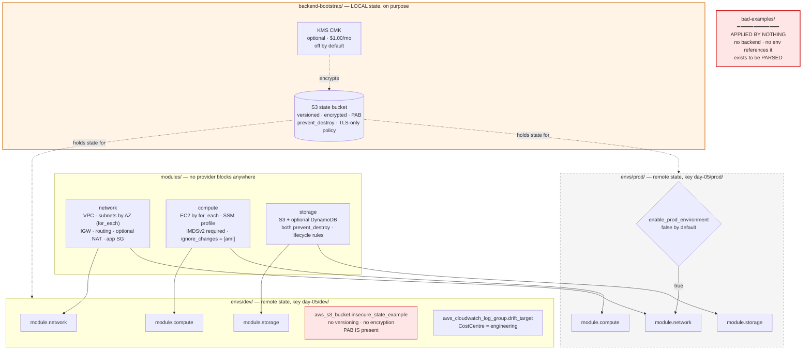

The dotted arrows from the state bucket are the ones people draw wrong. The
bootstrap does not *create* anything in dev or prod — it holds the file that
records what dev and prod are.

---

## 2. State, locking and the `.tflock` object

State solves sharing. Locking solves concurrency. **They are separate
problems**, and a shared bucket with no locking is arguably worse than local
state, because now two people can corrupt one file instead of each corrupting
their own.

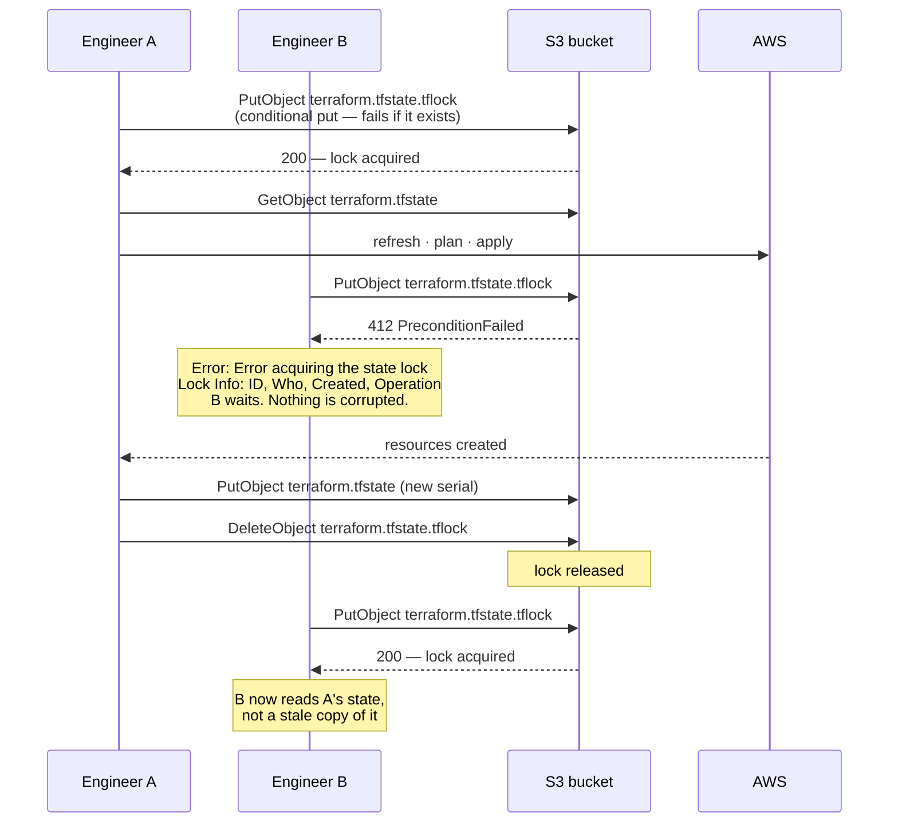

**`use_lockfile = true`. Requires AWS provider ≥ 5.80 and Terraform ≥ 1.10.**

For about a decade this was a DynamoDB table with a `LockID` hash key. That
argument (`dynamodb_table`) is now deprecated. Every repository that used it
carries a ~$0.25/month table that outlives the project by years. You will meet
these — do not build new ones.

If a run is killed mid-apply the lock object survives, and the next run reports
it with the ID, the user and the timestamp. `terraform force-unlock <ID>` is
the escape hatch. Read the lock info first: if the operation is still running
somewhere, force-unlocking it is how two applies end up interleaved.

---

## 3. What a plan actually compares

Three inputs, not two. The refresh is the step people forget, and it is the
one that makes drift visible.

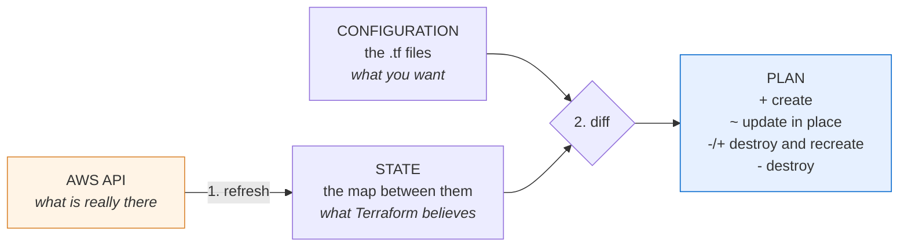

Read the symbols carefully. **`-/+` is destroy-and-recreate**, and on a
stateful resource it means data loss. It is the one that gets skimmed past at
the bottom of a 400-line plan at 5pm.

`terraform plan -refresh-only` performs step 1 and stops. `terraform plan
-refresh=false` skips step 1 entirely — faster, and blind to drift.

---

## 4. Module composition — one set of modules, two environments

The whole point of the day: dev and prod differ in **tfvars**, not in code.

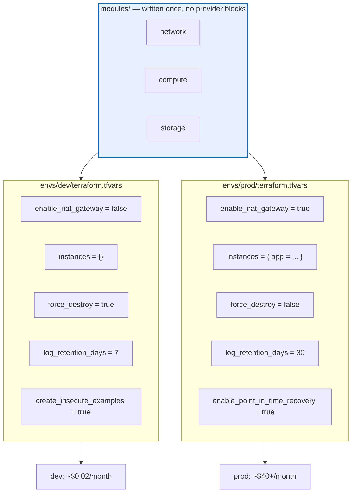

The asymmetry between those two columns living in **two tfvars files** rather
than in ternaries scattered through shared code is the entire argument for
directory-per-environment over workspaces.

The dependency graph inside one environment is built from references, not from
`depends_on`:

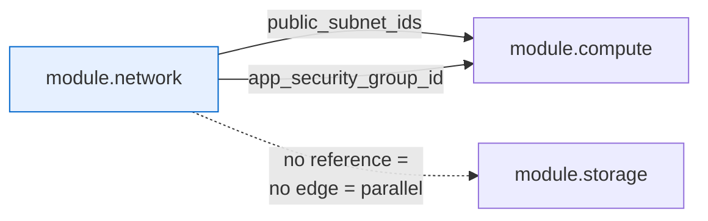

`module.storage` has no dependency on the network, so Terraform builds them at
the same time. Adding `depends_on` there would serialise the apply for nothing.

---

## 5. The bootstrap chicken-and-egg

The backend cannot create itself. This is the diagram to draw when somebody
asks how you set up remote state in the first place.

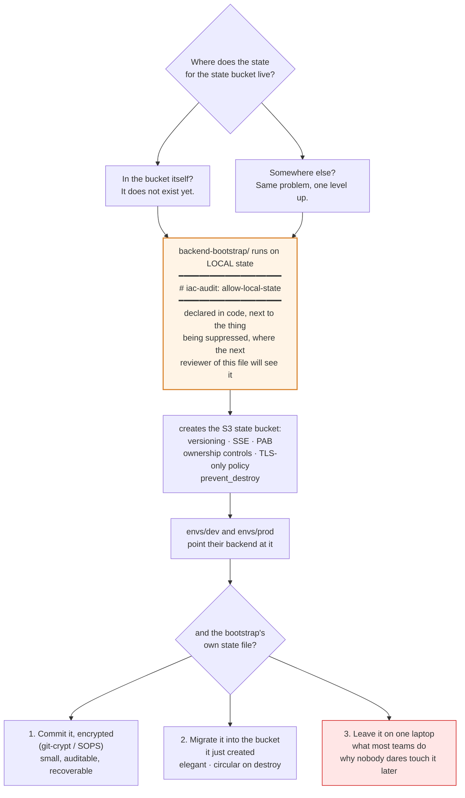

Option 3 is not wrong because it is option 3. It is wrong when it happens
without anybody deciding it.

---

## 6. `count` vs `for_each` addressing

The diagram that explains why `for_each` is almost always correct.

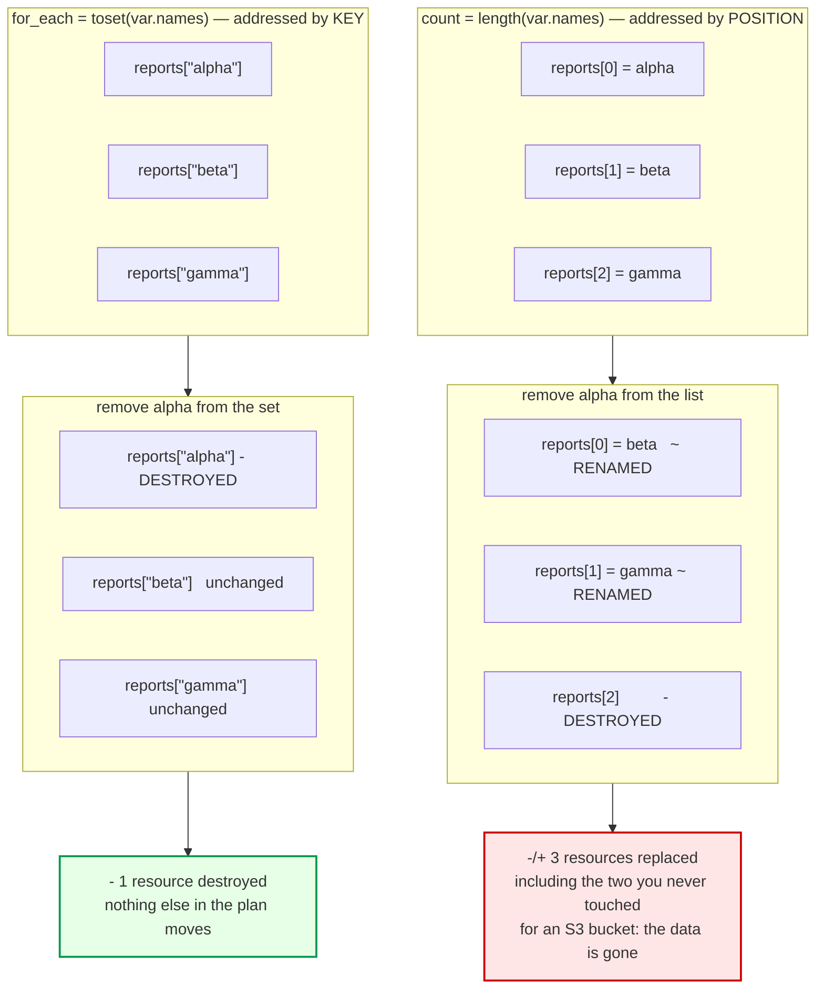

**`count` is correct for exactly one shape:** `count = var.enabled ? 1 : 0`.
Sixteen `count` expressions in this lab; fifteen are that shape; the sixteenth
is in `bad-examples/` and fires IAC-016.

Migrating an existing `count` to `for_each` without destroying anything:

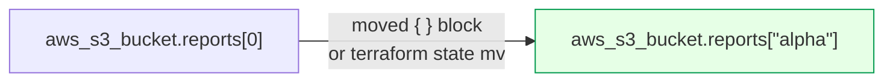

Prefer the `moved` block. It lives in code, appears in the pull request, and
every environment picks it up. `state mv` happens on one machine, once, and is
remembered by nobody.

---

## 7. Drift, and the three fixes

**The diagram to be able to draw from memory.**

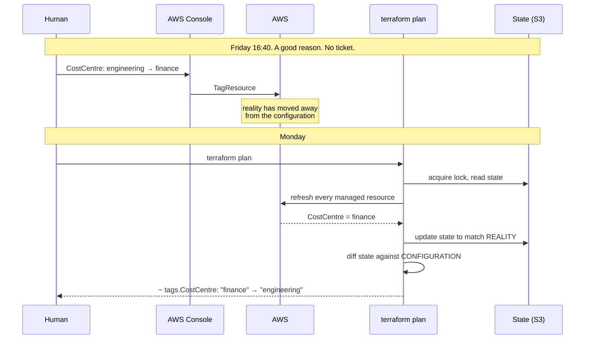

Three correct answers follow, and picking one accidentally is the only wrong
one:

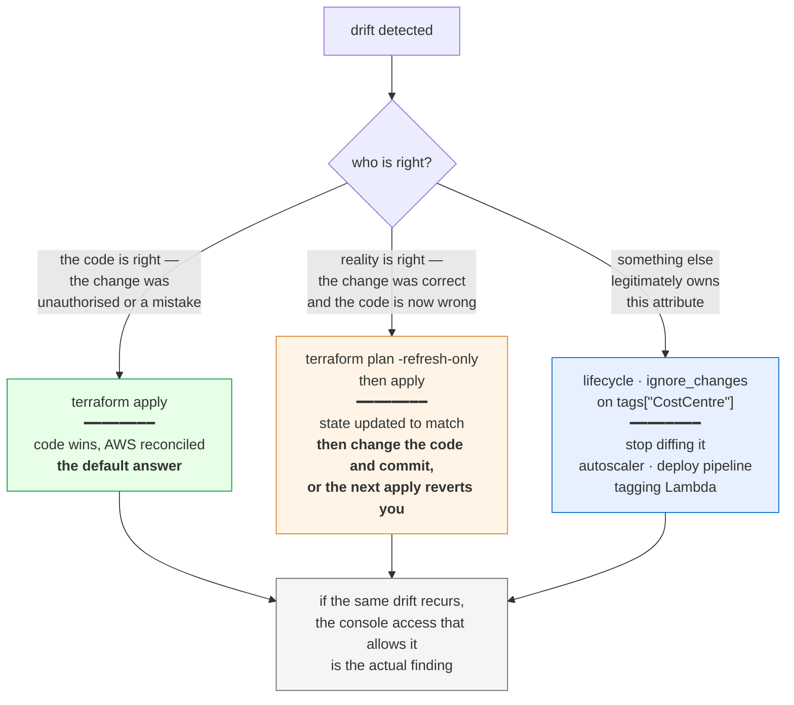

`-refresh-only` is **not** a fix on its own. It stops Terraform complaining
without making the code true, and the next person to run `apply` gets the
surprise you deferred.

Drift detection is **not a background service**. Nothing watches your account.
It is a plan, and it only happens when somebody runs one — which is the
argument for a scheduled `plan -detailed-exitcode` in CI, alerting on exit
code 2.

---

## 8. Variable precedence

Later beats earlier. The one that surprises people is that `-var` beats a
`terraform.tfvars` sitting right there.

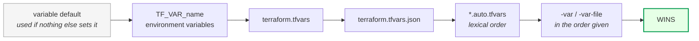

That last hop is how CI overrides a developer's file — and how somebody
applies dev's values to prod with a copy-pasted command.

Note what the backend block does **not** take part in: it is read before any
variable exists, so `bucket = var.state_bucket` is a hard error. Use
`-backend-config` instead.

---

## 9. CI/CD pipeline with OIDC

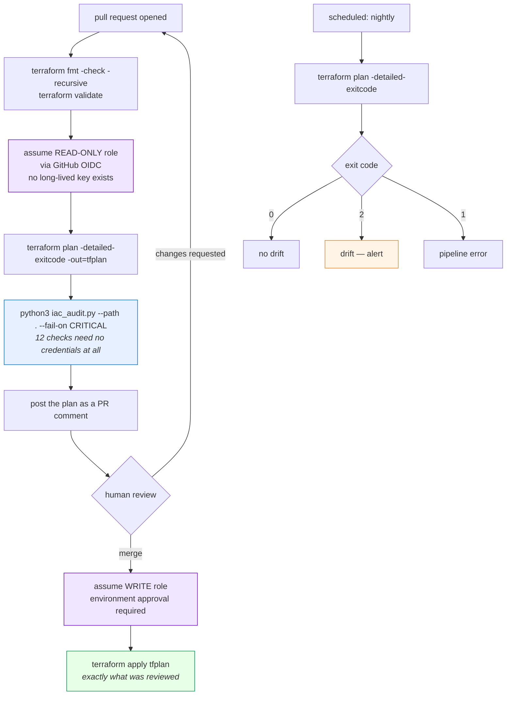

Three things this diagram is arguing for:

- **`apply tfplan`, not `apply`.** Bare `apply` re-plans and applies whatever
  is true *now*, not what the reviewer approved. Between review and merge,
  somebody else's change landed.
- **Two roles, not one.** Plan reads; apply writes. There is no reason a pull
  request from a fork should be able to assume a role that can write.
- **`-detailed-exitcode` returns 2 for "changes pending".** A naive
  `if [ $? -ne 0 ]` treats every pending change as a pipeline failure.

Plan files contain **every value in the diff, including sensitive ones**, in
the clear. Treat a stored plan artifact like the state file: encrypted,
short-retention, access-controlled.

---

## 10. Audit findings map

Where each of the 16 checks finds its evidence — and where two of them
deliberately find nothing.

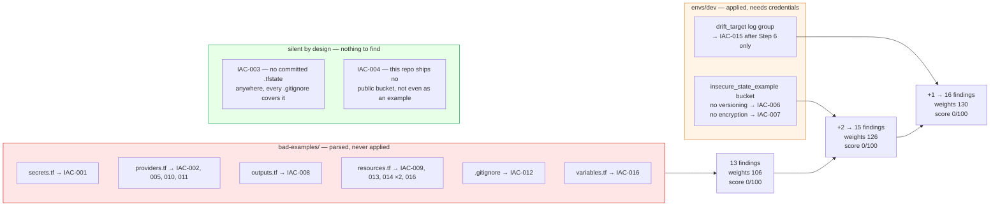

**IAC-015 is silent for a different reason from IAC-003 and IAC-004.** Those
two are silent *by design* — the fault is not present because shipping it
would be irresponsible. IAC-015 is silent *by situation*: drift does not exist
on a fresh apply, by definition, and Step 6 makes it fire on purpose.

Point the same tool at `envs/dev/` on its own and it scores **100/100**. Same
tool, same checks, a directory somebody wrote carefully. That contrast is the
demonstration.

---

## 11. Teardown order and the `prevent_destroy` wall

`terraform destroy` **will fail** on this day. That is the seatbelt working.

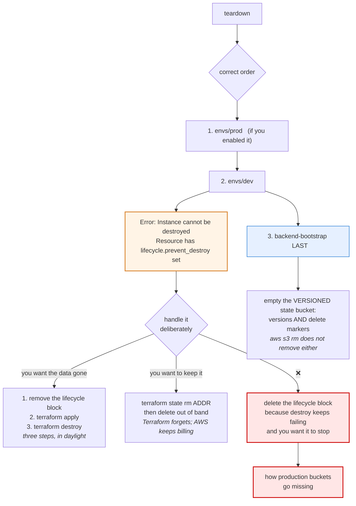

**Order matters and it is not arbitrary.** Destroy the bootstrap first and you
have deleted the bucket holding dev's and prod's state — those environments
still exist in AWS and Terraform can no longer see them. Recovery is
`terraform import`, one resource at a time.

**Four resources carry `prevent_destroy`** across this lab: the bootstrap state
bucket, the dev data bucket, the dev insecure example bucket, and the prod data
bucket. Each one will stop a destroy, and each one is supposed to.

Emptying a versioned bucket needs both passes — `aws s3 rm --recursive` removes
neither non-current versions nor delete markers. Full sequence with a
verification script: [`../teardown-checklist.md`](../teardown-checklist.md).

---

**See also:** the day guide [`../README.md`](../README.md), the step-by-step
[`../lab/README.md`](../lab/README.md), and
[`../interview-qa.md`](../interview-qa.md) for the questions these diagrams
answer.
