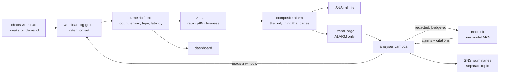

# Day 06 — Monitoring & AI-Powered Incident Analysis

**CareerByteCode · Enterprise AWS Cloud Architecture & AIOps Bootcamp**

> **Enterprise scenario**
> Incidents take too long to understand. The alarm fires at 03:12, someone
> opens a dashboard, and forty minutes later the team still cannot say what
> happened — because the dashboard answers *how much* and the question is
> *why*. The logs contain the answer. There are four hundred thousand of them.
> The team needs observability that makes the numbers exact and instant, plus
> something that reads the logs and explains what happened, fast enough to
> matter.

Today you build the measurement layer properly — log groups with retention,
metric filters, alarms that mean the same thing at 03:00 as at midday, a
composite alarm you actually prove fires, and a dashboard that answers three
specific questions. Then you break a service on purpose, read the logs
yourself, write down what you think happened, and only *then* let a model
summarise them so you can check its answer against yours.

That ordering is the whole day and it is easy to get backwards.

| | |
|---|---|
| **Level** | Advanced |
| **Stack** | Terraform / OpenTofu + Python (boto3) + Amazon Bedrock |
| **Cost** | **~$1.01/month floor** — and on this day the floor is not the number that matters |
| **Time** | 3h 45m taught · ~2h 40m self-paced |
| **Region** | `us-east-1` · profile `bootcamp` · prefix `cbc-day06-` |

---

## The argument this day makes

> **A summary you cannot check is worse than no summary.**

An LLM handed a pile of log lines produces fluent, confident, plausible prose
whether or not it understood anything. It will not hedge unless you make
hedging possible. It will not say "I don't know" unless you give it a way to
say that and a reason to believe you meant it. And a tired engineer at 03:00
will act on whatever is on the screen, because it is the only thing written in
sentences.

"Can we summarise logs with an LLM" is solved, free, and demos beautifully. It
is not the engineering problem.

The engineering problem is: **can a human disprove this summary in thirty
seconds?** Every unusual thing in today's lab exists to answer yes — the
deterministic facts computed before any model runs, the sampling strategy that
keeps the beginning of the incident, the token budget that makes the tool
honest about how much it saw, and the thirty-line loop that resolves every
citation the model produces and checks the quoted fragment really appears at
that line.

This is not a day that is enthusiastic about AI. It is a day that is *useful*
about it, including the parts where the answer is "use a metric filter
instead".

---

## Table of contents

- [Learning objectives](#learning-objectives)
- [Prerequisites](#prerequisites)
- [Architecture](#architecture)
- [Part 1 — The measurement model](#part-1--the-measurement-model)
- [Part 2 — Log groups, retention, and the bill that never stops](#part-2--log-groups-retention-and-the-bill-that-never-stops)
- [Part 3 — Getting metrics out of an application](#part-3--getting-metrics-out-of-an-application)
- [Part 4 — Alarms, and the four things people get wrong](#part-4--alarms-and-the-four-things-people-get-wrong)
- [Part 5 — Logs Insights, and the five queries worth memorising](#part-5--logs-insights-and-the-five-queries-worth-memorising)
- [Part 6 — Dashboards, and why most of them are theatre](#part-6--dashboards-and-why-most-of-them-are-theatre)
- [Part 7 — The AI section](#part-7--the-ai-section)
- [Part 8 — The mistakes people actually make](#part-8--the-mistakes-people-actually-make)
- [Part 9 — Cost](#part-9--cost)
- [Part 10 — Auditing observability as configuration](#part-10--auditing-observability-as-configuration)
- [The finding contract](#the-finding-contract)
- [What you built](#what-you-built)

---

## Learning objectives

By the end of today you can:

1. Create log groups **in code, with retention, before the thing that writes to
   them**, and explain what the alternative costs.
2. Turn log text into metrics with metric filters, and say when EMF or
   `PutMetricData` is the right tool instead.
3. Recognise a dimension whose cardinality is unbounded, and explain why the
   mistake is permanent.
4. Set `treat_missing_data` deliberately, in all four positions, and build the
   dead-man's switch that every other alarm in a stack is blind to.
5. Alarm on a **rate** using metric math, with M-of-N datapoints, and prove a
   composite alarm can actually fire.
6. Write Logs Insights queries fast enough to use during an incident.
7. Build an AI incident summariser whose every claim carries a log line index
   and a verbatim quote **that the code checks**.
8. Budget tokens, sample logs so the cause survives, and state what must never
   reach a prompt.
9. Audit all of it with `obs_audit.py` and read a finding contract you can
   reconcile against a real run.

---

## Prerequisites

- Days 01–05, or equivalent: an AWS account, a `bootcamp` CLI profile,
  Terraform ≥ 1.10 or OpenTofu ≥ 1.8, Python 3.9+, `boto3`.
- **Bedrock model access requested and granted** in your region. This is a
  console click and it is the single most common first failure of the day —
  an un-requested model returns `AccessDeniedException` and the message does
  not say "go and press the button".
- Day 05's `iac_audit.py` read once. `obs_audit.py` is the same shape and this
  day assumes you recognise it.

Day 06 is **self-contained**: it depends on no state from Days 02–05.

---

## Architecture

The deterministic half is the top two thirds. The AI half hangs off the side
— deliberately, for the reasons in [Part 7](#part-7--the-ai-section).



Full set: [`diagrams/README.md`](diagrams/README.md).

---

## Part 1 — The measurement model

CloudWatch has four things in it and they stack in one direction:

```
log events  →  metrics  →  alarms  →  actions
              (numbers)   (state)   (notification, automation)
                   ↓
              dashboards
```

Everything else is a variation. What matters is where each layer's cost and
each layer's blindness live:

| Layer | What it is good at | What it cannot see | What it costs |
|---|---|---|---|
| Log events | Everything that happened, verbatim | Anything you did not log | $0.50/GB in, $0.03/GB-month stored |
| Metrics | How many, how fast, over time | Anything not extracted into a metric | $0.30/custom metric/month, undeletable |
| Alarms | State: is it bad right now | Why | $0.10 standard, $0.50 composite, per month |
| Dashboards | Several signals at once, for a human | Anything nobody looks at | $3.00/month beyond three |

The two failures that follow from this table are the whole first half of the
day:

- **A metric you did not create cannot be alarmed on.** So the field you need
  during an incident is the one nobody thought to extract, and by the time you
  notice, the data is in a log group with no retention.
- **An alarm sees state, never cause.** So an alarm can be correct, timely, and
  completely unhelpful. That gap is where Part 7 lives.

---

## Part 2 — Log groups, retention, and the bill that never stops

### "Never expire" is not a setting anyone chose

Almost nothing creates its own log group correctly. Lambda, ECS, API Gateway,
EKS, RDS — every one of them will happily create a log group for you on first
write if one does not exist, and every one of those groups is created with:

```
retention: Never expire
tags:      none
owner:     nobody
```

Ingestion is $0.50/GB, once. Storage is $0.03/GB-month, forever. Neither
number is large. The problem is that "forever" compounds and nothing ever
reminds you: log groups do not appear on a resource list you look at, they
survive `terraform destroy` when Terraform did not create them, and Cost
Explorer folds all of them into a single "CloudWatch" line.

The arithmetic that catches people:

| Volume | Ingestion/month | Storage after 12 months | Storage after 36 months |
|---|---|---|---|
| 100 MB/day | $1.50 | $1.08/month | $3.24/month |
| 1 GB/day | $15.00 | $10.80/month | $32.40/month |
| 10 GB/day | $150.00 | $108/month | $324/month |

Ten gigabytes a day is one moderately chatty service with debug logging left
on after an incident in March.

### The habit that fixes it, permanently

Create every log group **in code, with retention, before the thing that writes
to it**. Then the service finds the group already there and writes into yours.

```hcl
resource "aws_cloudwatch_log_group" "chaos" {
  name              = "/aws/lambda/${local.prefix}-chaos-${local.suffix}"
  retention_in_days = var.log_retention_days
}

resource "aws_lambda_function" "chaos" {
  function_name = "${local.prefix}-chaos-${local.suffix}"
  # ...
  depends_on = [aws_cloudwatch_log_group.chaos]
}
```

For Lambda the name is not negotiable — it must be exactly
`/aws/lambda/<function-name>`. The `depends_on` is doing real work: Terraform
cannot infer the ordering, because the function does not reference the group.

Missing retention is check **OBS-001**, and in a real account it is the
highest-frequency finding this auditor produces. Find every offender:

```bash
aws logs describe-log-groups --profile bootcamp --region us-east-1 \
  --query 'logGroups[?!not_null(retentionInDays)].{Name:logGroupName,Bytes:storedBytes}' \
  --output table
```

### Retention is not archival

Anything you need beyond about 90 days does not belong in CloudWatch Logs. Put
a **subscription filter** on the group, stream it to S3 (via Firehose) at
$0.023/GB-month, and let CloudWatch retention expire. You keep the data,
Athena can query it, and you stop paying CloudWatch prices for cold storage.

The rule of thumb: CloudWatch Logs is for data you might query **this month**.

### The log group class trap

`log_group_class` has two values and the cheap one silently removes today's
entire subject:

| Class | Ingestion | Metric filters | Subscription filters | Live Tail | Logs Insights |
|---|---|---|---|---|---|
| `STANDARD` | $0.50/GB | yes | yes | yes | yes |
| `INFREQUENT_ACCESS` | $0.25/GB | **no** | **no** | **no** | yes |

Infrequent Access is correct for the audit trail you must keep and will read
twice a year. It is wrong for anything you alarm on, and the failure is
silent: you set the class, the metric filter API rejects the attachment, and
whoever set it up moves on. **The class cannot be changed after creation** —
fixing it means a new log group.

---

## Part 3 — Getting metrics out of an application

### Three mechanisms, and the ratio you should aim for

| Mechanism | Cost to run | Lag | Dimensions | Use when |
|---|---|---|---|---|
| **Metric filter** | **Free at any volume** | ~1 minute | up to 3, from JSON fields | Default. You are already writing the log line. |
| **EMF** | Free (extracted at ingestion) | seconds | full support | The application knows something the log line does not — cache hit ratio, queue depth at decision time. |
| **`PutMetricData`** | $0.01 per 1,000 calls | seconds | full support | You need it within seconds and there is no log line to hang it on. |

Ninety per cent of custom metrics should be metric filters. Most of the rest
should be EMF. `PutMetricData` is a specialist tool that gets reached for first
because it is the one that appears in the SDK docs — and it puts a synchronous
API call, with its own latency and its own failure mode, on your hot path.

### The filter is free. The metric is not.

This is the sentence to remember:

> **Every distinct combination of namespace, metric name and dimension VALUES
> is one custom metric, at $0.30/month, and it cannot be deleted.**

There is no `DeleteMetric` API. No console button. No support ticket. A custom
metric ages out **fifteen months after its last datapoint** and not one day
sooner.

So this line, which looks helpful in review:

```hcl
dimensions = { RequestId = "$.request_id" }
```

creates one custom metric per unique request ID. Forty thousand requests in an
afternoon is forty thousand custom metrics: **$12,000/month, for fifteen
months, for data you deleted the same day you noticed.** It is not a rare
story.

**The rule:** a dimension value must come from a set you could write down on a
napkin. Status codes, error types, environments, regions. Never an ID, never a
path, never a user, never anything with the word "trace" in it. Everything else
stays in the log line, where Logs Insights can query it for $0.005/GB scanned
and nothing accumulates.

`chaos_workload.py` bounds its error types to a four-element tuple for exactly
this reason. Check **OBS-003** finds the other kind.

### Two mechanics worth knowing

**`default_value` publishes a zero for periods where nothing matched.** Without
it, a quiet period produces *no datapoint at all*, not a zero — and "no
datapoint" is what every alarm's `treat_missing_data` has to guess about.
Setting `default_value = 0` turns a guessing problem into arithmetic.

The catch: **AWS does not allow `default_value` together with `dimensions`.**
So a dimensioned filter genuinely has gaps, which is usually correct — you do
not want a manufactured zero for `CIRCUIT_OPEN` on a quiet Sunday.

**`value` decides whether percentiles are possible.** A filter with
`value = "1"` can only be counted, summed or averaged. A filter with
`value = "$.latency_ms"` publishes the actual number, which gives CloudWatch a
full statistic set — and a full statistic set is what makes p95 work. If you
have ever wondered why an extended statistic on your metric returns nothing,
this is why.

### Pattern syntax

JSON selectors, when your logs are structured:

```
{ $.level = "ERROR" }
{ $.status >= 500 }
{ $.level = "ERROR" && $.status = 503 }
{ $.event = "request_completed" && $.latency_ms = * }
```

Positional patterns, when they are not:

```
[ts, level = ERROR, ...]
"connection refused"
```

Structured logs are worth the migration for this alone. Positional patterns
break the day somebody adds a field, and they break silently — the filter stops
matching, the metric stops being published, and the alarm built on it drifts to
`INSUFFICIENT_DATA` and goes grey.

---

## Part 4 — Alarms, and the four things people get wrong

### 4.1 `treat_missing_data` — read this one

CloudWatch evaluates an alarm on a fixed schedule whether or not data arrived.
When a period has no datapoint, this setting decides what happens.

| Value | Behaviour | Use when |
|---|---|---|
| `missing` **(the default)** | Ignore the period; look further back. Find nothing, sit in `INSUFFICIENT_DATA` **forever**. | Almost never on purpose. |
| `notBreaching` | Absence counts as fine. | Absence genuinely means health — an error count with no datapoints. |
| `breaching` | Absence counts as a breach. | Silence is itself the bad news. **The dead-man's switch.** |
| `ignore` | Hold the current state; never transition on missing data. | A genuinely bursty metric where you would rather hold than flap. |

The default is the option most likely to hide an outage. Here is how:

> A deploy renames the field a metric filter matched on. The filter stops
> matching. The metric stops being published. The alarm built on it looks back
> for real datapoints, finds none, goes to `INSUFFICIENT_DATA`, and stays
> there. It will not notify. It is not red. On a dashboard it is a polite grey.
> Four months later there is an incident and somebody says "but we have an
> alarm for that".

Leaving it at the default is check **OBS-005**, and it is not a style rule.

**An honest limitation:** the CloudWatch API returns `missing` both for an
alarm that never set the attribute and for one that set it deliberately. They
are indistinguishable from outside. `obs_audit.py` flags both, and the
remediation says: if you meant it, say why in the alarm description, because
nobody can tell your choice from the default.

### 4.2 Alarm on a RATE or a RATIO, never a raw count

"More than 50 errors in 5 minutes" is a different statement at 03:00 than at
midday.

- Traffic doubles. The alarm fires. Nothing is wrong.
- The load balancer goes unhealthy and traffic collapses. Errors fall below 50.
  **The alarm goes quiet during your worst outage.**

5% of requests failing is 5% of requests failing at every hour of the day, and
the number means the same thing to whoever reads the page as it did to whoever
set it.

The mechanism is **metric math over two metric filters**. This is the shape
worth memorising:

```hcl
metric_query {
  id          = "m_errors"
  return_data = false
  metric {
    metric_name = "ErrorCount"
    namespace   = "CareerByteCode/Day06"
    period      = 60
    stat        = "Sum"
  }
}

metric_query {
  id          = "m_requests"
  return_data = false
  metric { /* RequestCount, same shape */ }
}

metric_query { id = "e", expression = "FILL(m_errors, 0)",   return_data = false }
metric_query { id = "r", expression = "FILL(m_requests, 0)", return_data = false }

metric_query {
  id          = "error_rate"
  expression  = "IF(r > 0, 100 * e / r, 0)"
  return_data = true
}
```

Two details that are not defensive programming for its own sake:

- **`FILL(x, 0)`** turns gaps into explicit zeros, so the expression is
  reasoning about numbers rather than absences.
- **`IF(r > 0, ..., 0)`** stops the division by zero. Without it, a period with
  no traffic produces no datapoint for the expression, and the alarm falls back
  to `treat_missing_data` — which means the behaviour of your alarm during
  quiet periods is decided by a setting three lines further down instead of by
  the expression you wrote. Make it explicit.

Raw-count alarms are check **OBS-006**.

### 4.3 M out of N

`datapoints_to_alarm` (M) and `evaluation_periods` (N). **3 of 5** means: over
the last five minutes, at least three individual minutes breached.

1-of-1 is the shape people build by accident, and it pages somebody for a blip
that resolved before they found a laptop. Do that twice and the team has
learned to ignore the topic, which is a far more expensive outcome than the
alarm you were trying to build. That is check **OBS-010**.

Do not reach for a longer averaging period instead. **Averaging hides the
shape**: three catastrophic minutes and two perfect ones average to "slightly
elevated" and may not cross the threshold at all. M-of-N sees the three bad
minutes for what they are.

### 4.4 The dead-man's switch — the best alarm in the stack

Every alarm above answers *is the data bad*. None answers *is there any data*.

When a service crashes on boot, a log driver breaks, a deploy renames a field,
or an IAM change revokes `logs:PutLogEvents`, the metrics simply stop. The
error-rate alarm sees no errors. The latency alarm sees no slow requests. Both
sit in a comfortable `OK` — or drift to `INSUFFICIENT_DATA` and go grey — while
the service is dark.

```hcl
resource "aws_cloudwatch_metric_alarm" "no_telemetry" {
  metric_name         = "RequestCount"
  statistic           = "Sum"
  comparison_operator = "LessThanThreshold"
  threshold           = 1
  evaluation_periods  = 10
  datapoints_to_alarm = 10
  treat_missing_data  = "breaching"   # <- the whole point
}
```

Missing data **is** the breach. This is the one place where the setting people
are warned away from is exactly right.

Two practical notes:

- Set the threshold from your genuinely quietest period. A dead-man's switch
  that flaps every Sunday at 04:00 gets muted, and **a muted dead-man's switch
  is worse than none, because it looks like coverage.**
- Use a longer evaluation window than your other alarms. You are detecting
  absence, and absence needs more evidence than presence.

Having none anywhere is check **OBS-009**.

### 4.5 Composite alarms, and the trap

The three alarms above have **no notification actions**. The composite has all
of them:

```hcl
alarm_rule = "ALARM(error-rate) OR ALARM(latency-p95) OR ALARM(no-telemetry)"
```

- The children are **diagnostic**: when you are paged you see which of the
  three signals tripped.
- The parent is **the page**: one notification per incident, not three.

Without this, a real cascade sends error-rate mail, then latency mail, then
no-telemetry mail — at which point somebody writes an inbox rule and the next
incident is discovered by a customer.

**The trap: a composite alarm that can never fire.** The rule language accepts
anything syntactically valid, including rules that are logically impossible:

```hcl
alarm_rule = "ALARM(x) AND OK(x)"   # accepted, created, billed, green
```

CloudWatch creates it, bills $0.50/month for it, displays a reassuring green
`OK`, and it cannot transition under any circumstances. The version that ships
in real repositories is subtler — an `AND` across two conditions that never
co-occur, written by someone reducing noise, tested by nobody, discovered
eighteen months later during a postmortem.

**There is no validation for this and no plan that catches it.** The only proof
is forcing a child into ALARM and watching the parent:

```bash
aws cloudwatch set-alarm-state --alarm-name cbc-day06-error-rate-XXXX \
  --state-value ALARM --state-reason "deliberate test" \
  --profile bootcamp --region us-east-1
```

Ninety seconds. Do it for every composite alarm you ever build. That is check
**OBS-007**, and lab Step 5.

---

## Part 5 — Logs Insights, and the five queries worth memorising

Logs Insights costs **$0.005 per GB scanned** and returns in seconds. It is the
tool between "the alarm fired" and "I know what happened", and being slow with
it is the difference between a ten-minute incident and an hour.

Scan cost is driven by the **time range**, not by how clever the query is. Narrow
the window first, always.

### Syntax, in one screen

```
fields @timestamp, @message, level, latency_ms   # choose columns
| filter level = "ERROR"                          # boolean, regex with =~
| filter @message like /timeout/
| stats count(*) by error_type                    # aggregate
| sort @timestamp desc                            # or by a stats output
| limit 50
| parse @message /pool=(?<pool>\w+)/              # extract from unstructured text
```

For JSON logs, fields are addressed by dotted path and CloudWatch flattens them
automatically: a log line containing `{"error_type": "..."}` gives you a field
called `error_type`.

### The five

**1. What is failing, and how much?**

```
fields @timestamp, error_type
| filter level = "ERROR"
| stats count(*) as n by error_type
| sort n desc
```

**2. When did it start?** — the single most useful query during an incident.

```
fields @timestamp
| filter level = "ERROR"
| stats count(*) as errors by bin(1m)
| sort @timestamp asc
```

The first non-zero bin is your incident start. Now narrow every other query to
the five minutes before it.

**3. What changed?** — the first question of every incident review.

```
fields @timestamp, @message
| filter event in ["config_applied", "deploy_completed", "feature_flag_changed"]
| sort @timestamp asc
```

If your logs contain no deploy markers, adding them is the highest-value
observability change you can make this quarter. It converts "what changed" from
an archaeology project into a one-line query.

**4. Is it one caller, one host, one tenant?**

```
fields @timestamp
| filter level = "ERROR"
| stats count(*) as n by endpoint, status
| sort n desc
| limit 20
```

A failure concentrated in one dimension is a completely different incident from
one spread evenly, and the two have different fixes.

**5. Percentiles over the window**, when you need more resolution than the
alarm gave you:

```
fields latency_ms
| filter ispresent(latency_ms)
| stats count(*) as n,
        pct(latency_ms, 50) as p50,
        pct(latency_ms, 95) as p95,
        pct(latency_ms, 99) as p99
        by bin(1m)
```

### Insights vs `filter-log-events`

| | Logs Insights | `filter_log_events` |
|---|---|---|
| Aggregation | yes (`stats`) | no |
| Cost | $0.005/GB scanned | free |
| Call style | asynchronous — start, then poll | synchronous, paginated |
| Best for | humans, exploring | code, fetching lines |

The analyser Lambda uses `filter_log_events`, and the comment in
`incident_analyser.py` says why: inside a Lambda, polling an async query means
paying Lambda duration for every second of the wait.

---

## Part 6 — Dashboards, and why most of them are theatre

A dashboard nobody opens is not observability. It is a screensaver with a
$3/month bill and — worse — a false sense of coverage. *"We have a dashboard
for that"* is one of the more expensive sentences in operations.

**The test a dashboard has to pass:** can a person who has just been paged, at
03:00, on a phone, answer a specific question with it in under thirty seconds?
If the answer needs three widgets and a mental join, the dashboard has failed
and an alarm should have carried the answer instead.

This lab's dashboard exists to answer exactly three questions, in this order:

1. **Is it happening now?** — alarm status widget, top row. If the composite is
   green, stop here.
2. **How bad, and getting worse?** — error rate and p95 side by side.
3. **What kind of failure?** — errors by type, and the raw log lines
   underneath.

Question 3 is what makes it worth keeping: the bottom-right widget is a `log`
widget running a real Logs Insights query, so the last stop before you leave
the dashboard is the actual evidence. **A dashboard that cannot get you to the
logs sends you to the console to start over.**

### The failure that survives a refactor

CloudWatch dashboards **do not validate metric references**. A widget naming a
namespace and metric that were never published renders as an empty graph with a
legend — visually indistinguishable from a healthy flat line.

Somebody renames a metric in one repository. The widget in another repository
keeps rendering. The line is flat. For four months everyone reads the flat line
as good news. There is no error, no warning, and no signal anywhere.

That is check **OBS-008**, it is mechanical to detect — enumerate what the
widgets reference, compare against `ListMetrics` — and it belongs in CI.

One more mechanical detail: **put `region` on every widget.** Omit it and the
widget renders against whatever region the console happens to be showing, which
produces the "the dashboard is empty but the metrics exist" support question.

---

## Part 7 — The AI section

This is the day.

### 7.1 What the model is for, and what it is not for

Everything in Parts 1 to 6 answers *how many*, *when*, *how bad* and *is it
still happening* — exactly, in milliseconds, for free, and it will still be
right next year. A language model answers none of those better and several of
them worse.

There is one question it genuinely helps with:

> **What happened here, and where should I look first?**

That question is hard, slow for a human at 03:00, and the one place the model
earns its cost.

| Question | Right tool | Why |
|---|---|---|
| How many 5xx did we serve? | Metric filter | Exact, instant, free, and correct forever |
| When did it start? | Logs Insights `bin(1m)` | Exact, seconds, half a cent |
| Is it still happening? | Alarm state | It is literally what an alarm is |
| Which endpoint is worst? | Logs Insights `stats by` | Exact |
| **What happened?** | **Model** | Nothing else reads four hundred lines of prose and finds the thread |
| Should we roll back? | **A human** | The model does not know your blast radius |

**Never** wire this output into automated remediation. An LLM's root-cause
guess driving a rollback is how you get a confident, fluent, well-cited restart
of the wrong service.

### 7.2 Deterministic first — the ordering that decides everything

`incident_analyser.py` computes, in plain Python, before any model is involved
and regardless of whether one is involved at all:

- line counts by level
- error rate, from status codes
- error type breakdown
- p50 / p95 / p99 / max latency
- first and last error, with their indices
- **every change event in the window** — `config_applied`, `deploy_completed`,
  `feature_flag_changed`

Those go at the **top** of the notification, above the prose. The ordering is
the argument:

> A reader who meets the narrative first reads the numbers as confirmation of
> it. A reader who meets the numbers first reads the narrative as a hypothesis
> about them. Same content, completely different epistemics, and it costs
> nothing to get right.

In practice that block answers the incident on its own maybe two times in
three. That is not the AI half failing. That is the AI half being correctly
scoped.

It also means the tool degrades well: when the model call fails — throttled,
region down, access revoked — the numbers are still correct and still shipped.
`handler()` catches the exception and sends the facts anyway.

### 7.3 Sampling — the function that decides whether the answer can be right

The obvious implementation is one line:

```python
sample = events[-200:]
```

That line is in a lot of production code and it is wrong for exactly the reason
incidents are shaped the way they are. **A cascade begins with one cause and
ends with a thousand consequences.** Keep the last 200 lines of a 5,000-line
incident and you keep 200 consequences and zero causes.

The model then does what it was asked: it explains the consequences. It blames
the database, because every line it can see mentions the database. It will be
fluent, structured, confident and wrong, and — this is the part that matters —
**there is nothing in its output to suggest the answer is missing.** It cannot
report a gap it was never told about.

The strategy that works:

| Portion | Budget | Why |
|---|---|---|
| **Head** | 25% | Deploys, config changes, the first WARN. Things that happened before anyone noticed. **This is where causes live.** |
| **Middle** | 50% | Evenly spaced. Preserves the *shape*: escalation, plateau, recovery attempts. |
| **Tail** | 25% | The current state — what the reader needs to decide whether it is still happening. |

And one non-negotiable mechanic: **every sampled line keeps its original
index.** The model cites those indices, `verify_claims` resolves them, and the
reader can jump straight to the real line. A sample that renumbers its lines
has thrown away the only thing that makes the citation checkable.

`SAMPLE_STRATEGY=tail` is kept switchable on purpose so the trainer demo can
run the same pipeline twice and show it produce a correct answer and then a
confident, wrong one, with nothing else changed.

### 7.4 The token budget

"The model can take 200,000 tokens" and "you should send it 200,000 tokens" are
different claims, and only the first is true.

**Cost.** At roughly $0.0008 per 1,000 input tokens, one 200,000-token
invocation is $0.16. Behind an alarm that flaps forty times an hour overnight,
that is $77 by breakfast on a system that is not broken.

**Latency.** Time-to-first-token scales with input. A summary that arrives
after the incident is over is a postmortem, not a tool.

**Quality — the one people do not expect.** Recall degrades over a very long
context. A specific line buried in 180,000 tokens is genuinely harder for a
model to use than the same line in 12,000. **Sending everything makes the
answer worse, not just slower.**

12,000 tokens is roughly 48,000 characters, roughly 175 log lines at this
stack's average line length. That is enough to hold a whole incident *when it
is sampled properly* — which is the analyser's actual job.

The budget also makes the tool honest. The output states how many lines
existed, how many were sent, and by what strategy. **A summary based on 4% of
the evidence should say so.** No budget at all is check **OBS-012**.

### 7.5 Prompt design for grounding

Four things in the system prompt do the work:

**1. Every claim must cite a line index and a verbatim fragment.** Not "cite
your sources" — an index into a numbered list, and text copied exactly, because
a separate program is about to check it.

**2. Permission to say nothing.** The schema has `insufficient_evidence`, and
the prompt says in as many words that returning it is a correct and expected
answer. Without that, a model asked "what caused this" will always produce a
cause, because producing a cause is what it was asked for. Telling it the input
is a *sample* of a larger log is what makes "the cause may not be in front of
me" a reachable conclusion.

**3. Cause versus consequence, named explicitly.** "In a cascade, most lines
describe consequences. The cause is usually earlier, quieter, and often not an
error at all — a deployment, a configuration change, a feature flag."

**4. A ceiling on advice.** "Do not recommend remediation beyond the next
diagnostic step. You do not know the system's topology, its blast radius, or
what else is running."

Plus two settings: `temperature = 0.0`, because this is an extraction task and
nothing about incident analysis benefits from variety; and a small
`maxTokens`, because a long answer to a short schema is a sign of padding.

### 7.6 Verifying the citations — the thirty lines that matter

```python
for claim in parsed.get("claims", []):
    quote = _normalise(claim.get("quote", ""))
    for cite in claim.get("cite") or []:
        line = index_to_line.get(cite)
        if line is None:
            problems.append(f"line {cite} was not in the sample shown to the model")
        elif quote in _normalise(line):
            ok = True
        else:
            problems.append(f"quoted text does not appear in line {cite}")
    claim["verified"] = ok
```

That is the difference between a demo and a tool.

A model can produce a confident sentence about a log line that does not exist.
It **cannot** produce a fragment that survives an `in` check against the exact
text it was shown. The loop converts "sounds right" into "is checkable", which
is the only difference that matters at 03:00.

Three things it catches, all of which the unit tests assert:

- a **fabricated quote** — the citation points at a real line, the quoted text
  is not in it
- an **out-of-range citation** — the line was never in the sample
- a **missing citation** — a claim with no index or no quote at all

Failures are **marked, not dropped**. Hiding the model's failures from the
reader is the same mistake as trusting them. The notification prints:

```
  *** 2 claim(s) could not be verified against the log lines the
  *** model was shown. Treat those as invented until you check them.
```

And a grounding percentage, so a summary with 1 of 4 claims verified looks as
weak as it is.

### 7.7 What never goes in a prompt

A CloudWatch log line from a real system contains, routinely and without anyone
intending it: bearer tokens, session cookies, connection strings, email
addresses, full request bodies, and stack traces with local variables still in
them. **Nobody put them there on purpose. That is the point** — you cannot
decide not to send data you do not know you are logging.

`redact()` strips the high-confidence shapes: AWS access key IDs, JWTs,
`token=`/`password=`/`api_key=` assignments, credentials in URLs, email
addresses, long digit runs.

**It is not a solution and it does not claim to be.** It will not catch a
customer's full name in a free-text field, a session identifier your framework
invented, an internal hostname, or a stack trace with locals in it. None of
those have a shape a regex can find, and all of them are in production logs
somewhere right now.

> Redaction is the seatbelt. The brakes are not logging it.

Then answer these three questions **out loud**, before you enable anything:

1. **Where does the data go?** To Bedrock, in whichever region
   `bedrock_region` resolves to. If that is a different region from the logs,
   that is a data-residency decision somebody needs to have made on purpose —
   check **OBS-013**. And check the model ID: an inference profile beginning
   `us.` or `eu.` may route to other regions in its group regardless of what
   your configuration says.
2. **Who can read it afterwards?** If model invocation logging is on, a copy of
   every prompt lands in a CloudWatch log group in your account — readable by
   everyone with CloudWatch read access, which in most organisations is a much
   wider group than those who can read the original application logs.
3. **What is it allowed to invoke?** `bedrock:InvokeModel` on `Resource: "*"`
   is a blank cheque against every model in the account. Check **OBS-014**.

On that last one, the ARN shape is worth memorising because getting it wrong is
what *causes* the wildcard:

```
WRONG  arn:aws:bedrock:us-east-1:123456789012:foundation-model/anthropic...
RIGHT  arn:aws:bedrock:us-east-1::foundation-model/anthropic...
                                ^^ empty. The model is not yours.
```

The wrong one matches nothing, produces `AccessDeniedException` with no
explanation, and after twenty minutes somebody writes `"*"` and ships it on a
Friday.

### 7.8 The audit trail, and why it is off by default

Bedrock model invocation logging records every prompt and every completion. You
need it the first time a summary is confidently wrong, because the prompt is
gone the moment the Lambda returns and the log window has since moved on.

And turning it on writes all of that log content to a CloudWatch log group with
whatever access controls that group happens to have. **It fixes an audit gap by
opening a data-access gap.**

So: enable it **and** set retention on the destination **and** put a resource
policy on it. Both halves or neither. That is why `enable_bedrock_invocation_logging`
defaults to `false` in this lab and why check **OBS-016** fires by default — the
finding is not "you did something stupid", it is "nothing here can tell you what
you sent".

Two operational notes people meet the hard way: it is an **account-level,
region-singleton** setting, so two stacks that both manage it will fight and
`terraform destroy` turns it off for the whole region; and the destination log
group needs a resource policy allowing `bedrock.amazonaws.com` to write, without
which the setting applies and silently logs nothing.

### 7.9 Why the summary is not a widget

You could put the generated summary on the dashboard. Do not.

- **A dashboard widget implies a measurement.** Everything else on that screen
  is arithmetic. Putting a generated narrative among them borrows their
  authority, and the reader has no way to tell which is which.
- **The summary needs its evidence beside it.** Its value is the citations, and
  a widget has no room for four claims, four line indices, four quotes and a
  verification status.
- **A dashboard is always-on; a summary is per-incident.** A stale summary of
  last Tuesday's incident, sitting on the dashboard during this Tuesday's, is
  actively misleading.

The same reasoning is why the summaries go to a **separate SNS topic** from the
pages: different data sensitivity, different mute policy, different reliability
bar. When the summaries turn out to be noisy — and the first month they will —
you want to switch them off without switching off the alarm that pages you.

---

## Part 8 — The mistakes people actually make

| Mistake | What it costs | Check |
|---|---|---|
| Letting a service create its own log group | $0.03/GB-month forever, invisible | OBS-001 |
| Logging into a group nothing reads | Full ingestion price for a backup nobody tests | OBS-002 |
| A request ID in a metric filter dimension | Four to five figures a month, for 15 months, undeletable | OBS-003 |
| Building an alarm during an incident and never wiring the topic | Red in a console nobody has open | OBS-004 |
| Leaving `treat_missing_data` alone | The alarm goes grey and quiet exactly when the metric dies | OBS-005 |
| Alarming on a count | Fires on growth, silent during collapse | OBS-006 |
| Never testing a composite alarm | $0.50/month of comforting green | OBS-007 |
| Renaming a metric a dashboard uses | A flat line that reads as good news | OBS-008 |
| No dead-man's switch anywhere | Nothing detects a service that went dark | OBS-009 |
| 1-of-1 datapoints | The team learns to ignore the topic | OBS-010 |
| Raw log text in a prompt | Secrets you did not know you were logging | OBS-011 |
| No token budget | A flapping alarm bills per token, all night | OBS-012 |
| Model in another region | A residency decision nobody made | OBS-013 |
| `bedrock:InvokeModel` on `*` | Any model, any price, no allow-list | OBS-014 |
| The analyser's own logs unretained | No way to debug the debugger | OBS-015 |
| No invocation logging | No way to answer "what did it actually see" | OBS-016 |

And three that no auditor can catch, which is why they are here:

- **An unconfirmed SNS subscription.** Every publish succeeds, every message is
  discarded, the alarm history records the action as delivered, and nobody is
  told. There is nothing in CloudWatch or Terraform that finds this. Check it
  by hand.
- **Tail-only sampling.** It is not a misconfiguration — it is a defensible
  engineering choice that happens to discard the cause of every cascade. No
  static check can call it wrong. Only the demo shows you.
- **Believing a quiet check means coverage.** Some checks are quiet because the
  fault is impossible; some are quiet because today's configuration happens to
  be fine. See the contract below on the difference.

---

## Part 9 — Cost

Day 06 breaks a pattern the first five days established. On Days 01–05 the bill
was a function of what **exists** — an instance, a NAT gateway, a KMS key. You
could look at the resource list and know the number.

**Day 06's bill is a function of what happens:** gigabytes ingested, custom
metrics created, tokens sent. Terraform knows how many alarms it made. It has
no idea how chatty your application is.

### The floor

| Item | This stack | Free tier | Cost |
|---|---|---|---|
| Composite alarms | 2 | **none** | **$1.00/month** |
| Standard alarms | 4 | 10 | $0.00 |
| Custom metrics | 7 | 10 | $0.00 |
| Dashboards | 2 | 3 | $0.00 |
| Log ingestion | <1 MB | 5 GB/month | ~$0.01 |
| Lambda, SNS, SQS, DynamoDB, EventBridge | trivial | permanent | $0.00 |
| **Bedrock** | **per token** | **none** | **see below** |
| **TOTAL floor** | | | **~$1.01/month** |

The CloudWatch free tier is **permanent**, not the 12-month kind. But it is
*per account*: if you have been doing Days 01–05 in this account you have
already spent some of it, so every "free" line above may be a real charge on
your bill. That gap between "what this stack costs" and "what this stack adds
to your bill" is Day 09's subject.

### The worked example — one careless "analyse the last 24 hours"

A chatty service logs 1 GB/day. At ~275 bytes per line that is about 3.9
million lines, roughly 268 million tokens. No context window holds that, so a
naive implementation sends whatever fits — call it 200,000 tokens.

```
Logs Insights scan, 1 GB                     $0.005
Model input, 200k tokens
  at ~$0.0008/1K  (Claude 3.5 Haiku)         $0.160
  at ~$0.003/1K   (Claude 3.5 Sonnet)        $0.600
```

**The query is half a cent. The model is thirty to a hundred and twenty times
the query.** That ratio is the whole reason "just send it all" is not a
strategy.

Now put it behind an alarm with `datapoints_to_alarm = 1` on a noisy metric.
Forty transitions an hour, twelve hours overnight:

```
480 invocations x $0.16  =  $76.80   (Haiku)
480 invocations x $0.60  = $288.00   (Sonnet)
```

Nothing was broken. No dashboard turned red. The alarm did exactly what it was
asked to do.

Three guards, and you want all three:

1. **M-of-N on the triggering alarm.** The only one that stops the transition
   happening at all. If your alarm is noisy, no amount of downstream
   deduplication makes the AI half cheap.
2. **A hard token budget.**
3. **An idempotency window**, so one incident is summarised once rather than
   once per flap.

### Silent growth traps

- **Log groups with no retention.** Ingested once, stored forever, invisible.
- **Custom metrics.** No delete API. Fifteen months to age out. The mistake is
  permanent even after you fix the filter.
- **An analyser behind a flapping alarm.** Priced per request, leaves nothing
  behind to delete, and shows up in no teardown sweep.

That last property is what makes Day 06 different at teardown: **the expensive
thing does not exist as a resource.** `terraform destroy` cannot find it,
because there is nothing to find. See
[`teardown-checklist.md`](teardown-checklist.md).

---

## Part 10 — Auditing observability as configuration

`obs_audit.py` is the fifth of these tools and the same shape as the other
four: `Finding` dataclass, `CRITICAL 25 / HIGH 10 / MEDIUM 4 / LOW 1 / INFO 0`,
score from 100 floored at zero, `--format table|json|csv`, `--min-severity`,
`--fail-on`.

Two things are different, and both follow from the subject:

**Every check reads AWS.** Day 05 could answer most of its questions from `.tf`
files, because the faults it looked for are written down. Nothing here is:
whether a dashboard points at a metric that exists depends on what has been
*published*; whether a metric filter dimension has exploded into forty thousand
custom metrics depends on the *traffic*. A static auditor tells you what you
wrote. A live one tells you what you have. You want both, and by Day 10 you
will have both.

**Every check takes the same argument** — a normalised `stack` dict — because
half of them need cross-resource context to be correct. OBS-004 has to resolve
composite alarm rules before it can call an actionless alarm a fault; OBS-001
has to know which functions invoke Bedrock before it can hand a log group to
OBS-015.

```bash
cd lab/python
pip install -r requirements.txt
python3 obs_audit.py --profile bootcamp --region us-east-1
python3 obs_audit.py --prefix cbc-day06          # this lab only
python3 obs_audit.py --format json --quiet > findings.json
python3 obs_audit.py --fail-on CRITICAL ; echo "exit: $?"
```

`--min-severity` filters **display only, never the score**. Otherwise people
improve their posture by passing `--min-severity CRITICAL`.

### Build it yourself

[`lab/python/challenge/obs_audit_challenge.py`](lab/python/challenge/obs_audit_challenge.py)
is the same file with the sixteen check bodies removed — 16 numbered TODOs with
exact fields, hints and checkpoints, about 130 minutes of work. The 47 unit
tests point at your version:

```bash
cd lab/python
OBS_AUDIT_MODULE=obs_audit_challenge python3 -m unittest discover -s tests -v
```

No credentials, no account, under a second. Every check has one test proving it
**fires** and one proving it stays **silent**.

---

## The finding contract

```
=============================================================================
DAY 06 FINDING CONTRACT — LOCKED AT CP2
=============================================================================
This block is reproduced identically in five places. Change one, change all
five: README.md, lab/README.md, lab/terraform/outputs.tf (next_steps),
lab/python/obs_audit.py (module docstring), lab/python/tests/test_checks.py.

Weights are the repo-wide ones, identical to Days 03, 04 and 05:
CRITICAL 25, HIGH 10, MEDIUM 4, LOW 1, INFO 0. Score is 100 minus the sum,
floored at 0. Grades: 90+ A, 75+ B, 60+ C, 40+ D, below that F.

STATIC STATE — after terraform apply with the shipped defaults
(create_insecure_examples = true, enable_bedrock_invocation_logging = false),
before anything has been invoked.

  ID       SEVERITY   W   N  PTS  SOURCE RESOURCE
  -------  --------  --  --  ---  ------------------------------------------
  OBS-001  HIGH      10   1   10  aws_cloudwatch_log_group.unretained
  OBS-002  MEDIUM     4   2    8  aws_cloudwatch_log_group.unretained
                                  aws_cloudwatch_log_group.write_only
  OBS-003  CRITICAL  25   1   25  aws_cloudwatch_log_metric_filter.high_cardinality
  OBS-004  HIGH      10   1   10  aws_cloudwatch_metric_alarm.orphan
  OBS-005  MEDIUM     4   1    4  aws_cloudwatch_metric_alarm.orphan
  OBS-006  MEDIUM     4   1    4  aws_cloudwatch_metric_alarm.orphan
  OBS-007  HIGH      10   1   10  aws_cloudwatch_composite_alarm.impossible
  OBS-008  MEDIUM     4   1    4  aws_cloudwatch_dashboard.broken
  OBS-009  HIGH      10   0    0  none — SILENT BY SITUATION, see below
  OBS-010  LOW        1   1    1  aws_cloudwatch_metric_alarm.orphan
  OBS-011  CRITICAL  25   1   25  aws_lambda_function.naive_analyser
  OBS-012  HIGH      10   1   10  aws_lambda_function.naive_analyser
  OBS-013  HIGH      10   0    0  none — SILENT BY DESIGN, see below
  OBS-014  CRITICAL  25   1   25  aws_iam_role_policy.naive_analyser
  OBS-015  MEDIUM     4   1    4  aws_cloudwatch_log_group.naive_analyser
  OBS-016  MEDIUM     4   1    4  account-level Bedrock invocation logging
  -------  --------  --  --  ---  ------------------------------------------
  TOTALS                    15  144

  FIFTEEN findings from SIXTEEN checks. Check count and finding count are not
  the same number and never will be: OBS-002 fires twice, and OBS-009 and
  OBS-013 do not fire at all. If you are reconciling this table against a real
  run, reconcile the N column, not the number of rows.

  Score: 100 - 144 = -44, floored to 0/100. Grade F.

THE THREE STATES

  STATE                                        FINDINGS  POINTS    SCORE  GRADE
  -------------------------------------------  --------  ------  -------  -----
  Static: after apply, before anything runs          15     144    0/100      F
  Live: after lab steps 1-6 — incident
    generated, alarms transitioned, composite
    proven, both analysers run                       15     144    0/100      F
  After lab step 8 — bedrock_region pointed at
    another region, and the no-telemetry
    alarm's treat_missing_data changed to
    notBreaching outside Terraform                   18     174    0/100      F
  -------------------------------------------  --------  ------  -------  -----
  Reference build: create_insecure_examples =
    false AND enable_bedrock_invocation_logging
    = true                                            0       0  100/100      A

  STATIC AND LIVE ARE IDENTICAL, AND THAT IS THE POINT. obs_audit.py audits
  CONFIGURATION, not runtime. Generating a real incident, watching three
  alarms transition, paging yourself and running both analysers changes
  nothing in its output. A
  configuration auditor and a monitoring system answer different questions,
  and treating either one as the other is the category error this day exists
  to prevent.

  Setting create_insecure_examples = false on its own leaves exactly one
  finding — OBS-016 — for 4 points and 96/100, grade A. Both toggles are
  needed for 100/100, and turning invocation logging on obliges you to set
  retention and a resource policy on its destination log group. That is
  stated in the variable description and it is not optional.

  Step 8 adds THREE findings, not two: OBS-009 once, and OBS-013 twice.
  bedrock_region is a single variable feeding BOTH analysers, so pointing it
  at another region moves the good one's log data as well as the naive one's.
  That is worth noticing — the misconfiguration is in a shared setting, and a
  shared setting does not care which of your functions was carefully written.

SILENT BY DESIGN — OBS-013, log data crossing a region boundary to reach the
model. bedrock_region defaults to the empty string, which resolves to
aws_region, and the model ARN in the analyser's IAM policy is built from that
same resolved value. No combination of shipped defaults can put the logs and
the model in different regions. The check fires only if you edit a variable on
purpose, which lab step 8 asks you to do. A check that stays silent because
the stack cannot produce the misconfiguration is evidence that the auditor
does not cry wolf.

SILENT BY SITUATION — OBS-009, no liveness alarm anywhere in the region. This
is silent only because aws_cloudwatch_metric_alarm.no_telemetry happens to
exist with treat_missing_data set to breaching. Nothing structural prevents it
firing. One attribute on one alarm, changed in the console in thirty seconds,
and it fires — which is exactly what lab step 8 does.

THE DIFFERENCE MATTERS. Silent by design tells you something about the
auditor. Silent by situation tells you nothing about the auditor and
everything about today's configuration. Never read the second as the first: a
check that is silent by situation must be re-run, never assumed.

CHECK INTERACTIONS THAT ARE DELIBERATE, NOT BUGS

  OBS-001 skips the log group of any function that holds bedrock:InvokeModel;
  OBS-015 owns those. An unretained analyser log group is ONE finding, not
  two.

  OBS-002 skips log groups under /aws/lambda/. A function's own execution log
  is a diagnostic artefact, not a data feed, and having no metric filter on it
  is correct rather than negligent.

  OBS-004 exempts alarms referenced by a composite alarm's rule. The three
  metric alarms in main.tf section 5 have no actions and are correct, because
  the composite in section 7 notifies on their behalf.

  OBS-006 exempts liveness alarms — treat_missing_data set to breaching with
  a LessThan comparison. A dead-man's switch is legitimately a raw count, and
  flagging it would be the auditor crying wolf about the best alarm in the
  stack.

  OBS-004's composite exemption only counts a composite that notifies AND
  whose rule can actually fire. An alarm watched solely by an unsatisfiable
  composite is exactly as silent as an orphan — and worse, because a reviewer
  scanning for orphans sees the reference and moves on. So OBS-007 firing on a
  composite also makes OBS-004 fire on its children. In this stack that is
  precisely what happens: the orphan alarm IS referenced, by the deliberately
  impossible composite, and is still reported as notifying nobody. Cause and
  consequence, not duplicates — fixing the rule clears both.
=============================================================================
```

---

## What you built

- A log group with retention, four metric filters, and a workload that fails on
  demand in a realistic way.
- Three alarms — a rate, a percentile, and a dead-man's switch — behind one
  composite alarm that you **proved** can fire.
- A dashboard that answers three questions and gets you to the raw logs.
- An incident analyser whose every claim carries a log line index and a
  verbatim quote, checked in code, with a token budget, redaction, and
  permission to say "insufficient evidence".
- The same analyser deployed badly, on purpose, from the identical zip file —
  because nobody writes a bad log summariser, people deploy a good one badly.
- A sixteen-check auditor, 47 tests, and a finding contract you can reconcile
  against a real run.

**Next:** [`lab/README.md`](lab/README.md) for the step-by-step, then
[`interview-qa.md`](interview-qa.md), and
[`teardown-checklist.md`](teardown-checklist.md) before you close the laptop —
on this day, `terraform destroy` is genuinely not enough.
