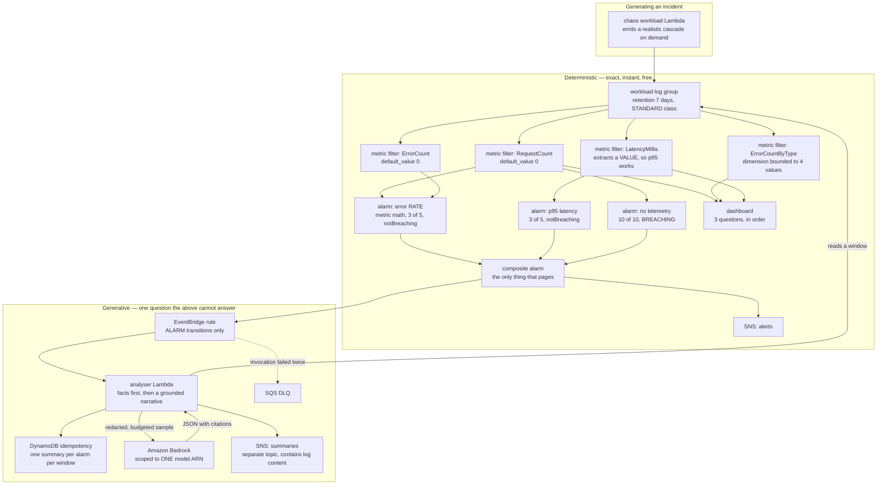
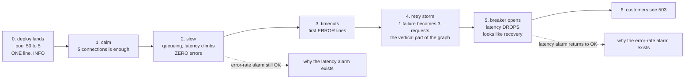
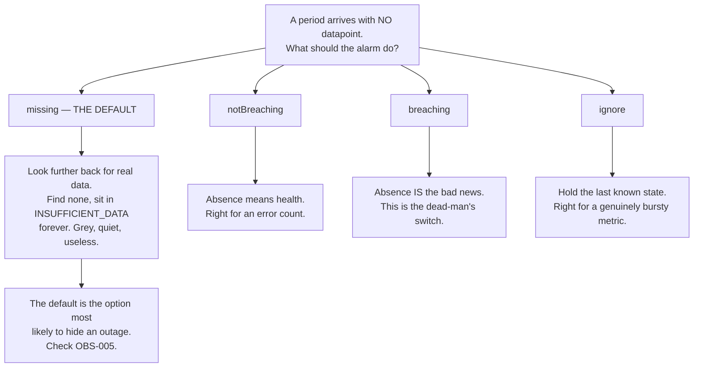
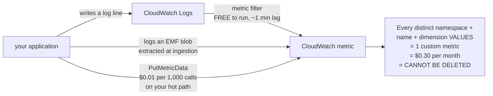
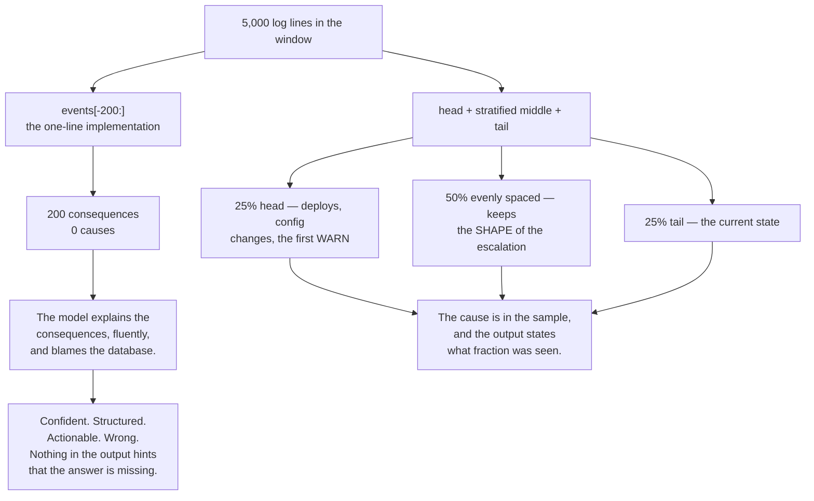
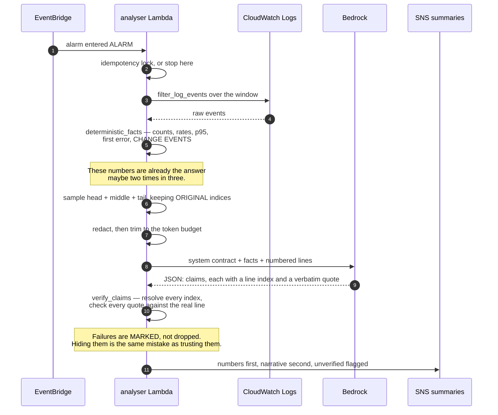
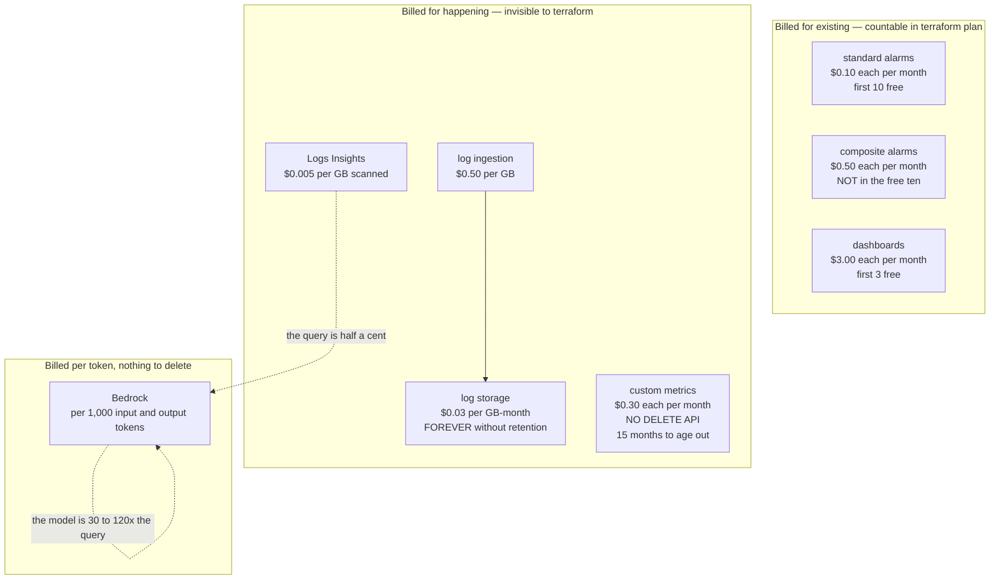
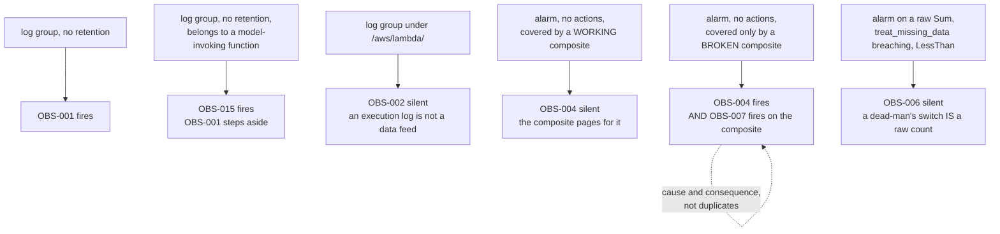

# Day 06 — Diagrams

Every diagram for Day 06, in one file, so there is one place to fix them.

All of these are validated by actually parsing them, not by looking at them.
The check is in the CP6 sweep and it is worth stealing: a Mermaid block that
does not parse renders as a grey error box in GitHub, and nobody notices until
a learner does.

---

## 1. The whole stack

The deterministic half is on top. The AI half hangs off the side, deliberately
— it observes the alerting path rather than sitting inside it, for the reasons
in `lab/terraform/main.tf` section 6.



---

## 2. What the incident actually looks like

The shape that matters is the last two phases. Latency **falls** when the
circuit breaker opens, because failing fast is fast. On a latency-only
dashboard that reads as recovery.



---

## 3. `treat_missing_data`, which is the setting people get wrong



---

## 4. Three ways to get a metric out of an application



Ninety per cent of custom metrics should be metric filters. Most of the rest
should be EMF. `PutMetricData` is a specialist tool that gets reached for first
because it is the one in the SDK docs.

---

## 5. Sampling, which decides whether the answer can be right



---

## 6. The grounding loop

This is the day's argument, as code. Everything before `verify` is ordinary.
`verify` is what turns "sounds right" into "is checkable".



---

## 7. Where the money goes

The dashed box is the one that breaks the pattern of Days 01 to 05: it is
priced per request and leaves nothing behind to delete.



---

## 8. Which check owns which fault

Four of the sixteen checks are not independent. Drawing it is quicker than
explaining it, and the arrows are the reason a single unretained log group
produces one finding rather than two.



---

## Validating these

```bash
cd /path/with/node_modules
node check_mermaid.mjs day-06-monitoring-ai-incident-analysis/diagrams/README.md \
                      day-06-monitoring-ai-incident-analysis/README.md
```

The validator loads each block under a JSDOM global and calls
`mermaid.parse()`. One caveat worth writing down because it costs half an hour
the first time: on Node 22, `global.navigator` is getter-only. Assigning to it
throws before Mermaid ever loads, and the error does not mention Mermaid.
