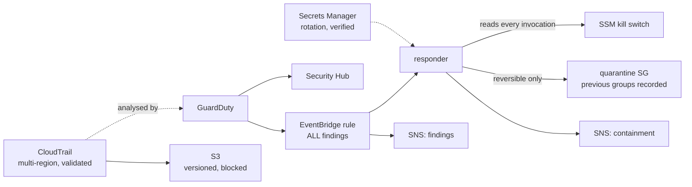

# Day 07 — Enterprise Cloud Security

**CareerByteCode · Enterprise AWS Cloud Architecture & AIOps Bootcamp**

> **Enterprise scenario**
> Security is reactive. Somebody notices a finding on Tuesday that GuardDuty
> raised on Saturday. The trail exists but nobody has ever validated it, so
> "was this file modified" is not a question anyone can answer. There are
> access keys in the account older than the person who created them. The
> business wants threats detected and responded to automatically, across the
> whole account, without a human in the loop — and the security team is
> nervous, correctly, about what "without a human in the loop" means at 03:00.

Today you build detection that actually reaches somebody, evidence that holds
up, and automation that contains a threat in seconds. Then you make the
detector wrong on purpose and watch the same automation contain something it
should not have — and reverse it, by hand, before you are shown the documented
rollback.

| | |
|---|---|
| **Level** | Advanced |
| **Stack** | Terraform / OpenTofu + Python (boto3) + AI-adjacent automation |
| **Cost** | **~$2.85/month countable** — and three of the five cost lines are not countable |
| **Time** | 3h 50m taught · ~2h 45m self-paced |
| **Region** | `us-east-1` · profile `bootcamp` · prefix `cbc-day07-` |

---

## The argument this day makes

> **An automated response is a decision you are making now, to be executed
> later, by nobody, on evidence that might be wrong.**

Wiring GuardDuty to a Lambda that isolates an instance is about forty lines and
it demos beautifully. It is not the engineering problem.

The engineering problem is what happens on the night the detector is wrong —
and it will be wrong, because GuardDuty is a probabilistic detector and your
own penetration test looks exactly like an attacker to it.

Everything unusual in today's lab exists because of that: an allow-list of
finding **types** rather than a severity threshold, a kill switch read at
runtime rather than a variable that needs a deploy, containment that is
reversible by one recorded command, four explicit Denies on the responder's own
role, and a default mode of `dry-run`.

This is not a day that is enthusiastic about auto-remediation. It is a day that
is *useful* about it, including the part where it tells you what must never be
automated.

---

## Table of contents

- [Learning objectives](#learning-objectives)
- [Prerequisites](#prerequisites)
- [Architecture](#architecture)
- [Part 1 — GuardDuty, and the sentence the day turns on](#part-1--guardduty-and-the-sentence-the-day-turns-on)
- [Part 2 — Security Hub, and the number nobody drives to zero](#part-2--security-hub-and-the-number-nobody-drives-to-zero)
- [Part 3 — CloudTrail: logging versus evidence](#part-3--cloudtrail-logging-versus-evidence)
- [Part 4 — Secrets Manager, and the failure that looks like success](#part-4--secrets-manager-and-the-failure-that-looks-like-success)
- [Part 5 — Automated response](#part-5--automated-response)
- [Part 6 — The mistakes people actually make](#part-6--the-mistakes-people-actually-make)
- [Part 7 — Cost](#part-7--cost)
- [Part 8 — Auditing security posture](#part-8--auditing-security-posture)
- [The finding contract](#the-finding-contract)
- [What you built](#what-you-built)

---

## Learning objectives

By the end of today you can:

1. Explain why GuardDuty severity is **impact, not confidence**, and design
   automation that does not confuse them.
2. Build a trail that is **evidence** — multi-region, global service events,
   log file validation — and run the validation command.
3. Enable Security Hub without producing a compliance number nobody believes.
4. Tell the difference between rotation that is configured and rotation that
   has run, and name the field that distinguishes them.
5. Design containment that is **reversible, scoped, recorded and refusable**.
6. Build a **runtime** kill switch, and explain why an apply-time toggle is not
   one.
7. Write an IAM policy for an automated responder using explicit Denies, and
   say what each one prevents.
8. State plainly what must never be automated.
9. Audit all of it with `sec_audit.py`, and read a contract in which the
   finding count is the same before and after and the finding set is not.

---

## Prerequisites

- Days 01–06, or equivalent: an AWS account, a `bootcamp` CLI profile,
  Terraform ≥ 1.10 or OpenTofu ≥ 1.8, Python 3.9+, `boto3`.
- **An account you are willing to enable GuardDuty and Security Hub in.** Both
  are account-and-region-level services with a 30-day free trial and a real
  cost afterwards, and both keep billing until disabled in every region.
- Day 06 read, or at least its OBS-011. Part 4 depends on it.

Day 07 is **self-contained**: it depends on no state from Days 02–06.

---

## Architecture



Full set: [`diagrams/README.md`](diagrams/README.md).

---

## Part 1 — GuardDuty, and the sentence the day turns on

### Severity is impact, not confidence

GuardDuty severity is a number from 1 to 8.9, bucketed Low (1.0–3.9), Medium
(4.0–6.9), High (7.0–8.9).

It scores **how bad this would be if it is real**. It does not score how likely
it is to be real. Those are different questions and conflating them is the root
of almost every bad automated-response design.

A HIGH finding is routinely:

- your own penetration test
- a vulnerability scanner your security team runs on a schedule
- a security researcher probing a public endpoint
- a developer who ran something odd from a coffee shop
- a genuine compromise

All five produce the same severity. **If your automation triggers on
`severity >= 7`, all five get the same response — and four of them are your own
people, which means four of them are an outage you caused.**

What actually correlates with confidence is the finding **type**:

| Type | Typical confidence |
|---|---|
| `CryptoCurrencyMining:EC2/BitcoinTool.B!DNS` | high — rarely a false positive |
| `Backdoor:EC2/C&CActivity.B!DNS` | high |
| `UnauthorizedAccess:EC2/MaliciousIPCaller.Custom` | high, if your threat list is good |
| `UnauthorizedAccess:EC2/SSHBruteForce` | low — constant background noise on anything internet-facing |
| `Recon:EC2/PortProbeUnprotectedPort` | low — this is the internet |

So automation belongs on an **allow-list of specific types you have decided
about individually**, and adding an entry should get the same review as a
deploy. That is check **SEC-005**, and it is CRITICAL.

### Publishing frequency

`finding_publishing_frequency` controls how often GuardDuty publishes **updates
to existing findings**. It does **not** delay the first notification of a new
finding — those arrive in about five minutes regardless, which is why people
reasonably ignore this setting.

It still matters: *"this is now occurring on four more instances"* is exactly
the update you want inside fifteen minutes rather than six hours, and by six
hours the incident is decided one way or another. `FIFTEEN_MINUTES` costs
nothing extra. Check **SEC-004**, LOW.

### Sample findings, and the trap in them

`aws guardduty create-sample-findings` generates one finding of each type on
demand. It is what makes this lab possible without attacking anything.

They differ from real findings in three ways: the resource identifiers are fake
(`i-99999999`), they arrive instantly, and their titles are prefixed
`[SAMPLE]`.

That last one is useful and dangerous. Useful, because a responder can
recognise samples and refuse to act. **Dangerous, because a responder that
tests the prefix the wrong way round does nothing at all in production and
looks perfectly healthy in the lab.** Step 4 of the lab makes you prove which
way round yours is.

---

## Part 2 — Security Hub, and the number nobody drives to zero

Security Hub does two separable things, and the pricing follows the split:

- **Ingests** findings from GuardDuty, Inspector, Macie, Config and anything
  speaking ASFF, so there is one place to look instead of six.
- **Runs its own compliance checks** against enabled standards.

The second is where the money and the disillusionment both come from.

**Enable one standard.** Enabling every available standard on day one produces
several thousand failed controls across sets that overlap heavily — the same
"S3 bucket should block public access" control appearing three times under
three names. The result is a compliance percentage nobody believes and nobody
will ever drive to zero, and a team that learns to scroll past the security
dashboard.

**That is a worse outcome than having no dashboard, because it looks like
coverage.**

Start with `aws-foundational-security-best-practices`: broadest, most
actionable, and the one whose findings map most directly onto things you can
fix this week. Add CIS or PCI when somebody actually needs the attestation, and
budget real time for suppressing controls that do not apply — **with a written
reason**, because an unexplained suppression is indistinguishable from an
oversight six months later.

Two mechanics worth knowing:

- **`control_finding_generator = "SECURITY_CONTROL"`** gives you one finding per
  control rather than one per control per standard. With one standard it
  changes nothing; the day you add a second it is the difference between 400
  findings and 1,200.
- **The GuardDuty integration is automatic** when both services are enabled in
  a region. There is no resource wiring them together, which is why people go
  looking for one.

Cost: ~$0.0010 per security check, counted **per control per resource per day**.
A hundred resources against a two-hundred-control standard is closer to twenty
thousand checks a day than to two hundred.

---

## Part 3 — CloudTrail: logging versus evidence

Almost every account has a trail. Far fewer have evidence.

### Log file validation is the difference

With it on, CloudTrail writes a **signed digest file every hour** listing the
log files delivered and their hashes. `aws cloudtrail validate-logs` then proves
no file was modified or deleted since delivery.

That matters exactly once, and then completely: during an incident where the
question is whether an attacker with `s3:PutObject` edited the trail to remove
their own activity. Without validation you cannot answer it. With it you can,
and the answer holds up.

It is free. Its absence is check **SEC-007**.

```bash
aws cloudtrail validate-logs \
  --trail-arn arn:aws:cloudtrail:us-east-1:123456789012:trail/cbc-day07-trail-XXXX \
  --start-time "$(date -u -d '2 hours ago' +%Y-%m-%dT%H:%M:%SZ)" \
  --profile bootcamp --region us-east-1
```

**Run that once, now.** Not because you need the answer today, but because you
need to know the command works before the day you do.

### Multi-region, and global service events

An attacker with credentials does not politely operate in your primary region.
Creating an instance in `ap-south-1` is exactly as easy for them, and a
single-region trail records none of it.

Global service events are the other half: **IAM, STS and CloudFront emit in
`us-east-1` regardless of where you are.** A trail outside `us-east-1` without
`include_global_service_events` records no IAM activity at all — which is the
activity you most want. Together that is check **SEC-006**.

Neither costs anything: the first trail delivering management events is free
per account, multi-region included.

### The bucket is part of the evidence

Versioning is not a nice-to-have on a trail bucket — it is the **rollback
path**. Validation tells you a file changed; versioning is what lets you see
what it said before. Add a complete public access block, because a publicly
readable trail bucket is a complete map of your account's control plane
including every principal that has touched it. That is check **SEC-009**.

Two mechanics people get wrong:

- **`aws:SourceArn` in the bucket policy.** Without it, any account's
  CloudTrail could be pointed at your bucket. That is the confused-deputy
  problem, and it is why AWS added SourceArn conditions across the service
  surface.
- **The chicken-and-egg.** The bucket policy must name the trail ARN and the
  trail must name the bucket. Terraform can only resolve one direction, so the
  policy uses a **constructed** ARN. Referencing the trail resource creates a
  cycle.

### Data events

Data events record object-level activity — every `GetObject`, every `PutObject`
— rather than control-plane calls. They are how you answer *"which objects did
the compromised role actually read"*, which is the question that decides
whether you have a breach-notification obligation.

They are also generated at **application volume** rather than human volume, and
there is **no free allowance**. A bucket serving a few hundred reads a second
produces ~26 million events a day: ~$26/day, ~$780/month, for one bucket.

Enable them on the buckets whose contents you would have to notify about, with
an explicit selector. Never account-wide. Never `arn:aws:s3:::*/*`.

---

## Part 4 — Secrets Manager, and the failure that looks like success

### Rotation that is configured is not rotation that works

The failure mode worth knowing: rotation is configured, the rotation Lambda
throws on every invocation, and the console shows a schedule with a
next-rotation date that keeps moving. Nothing is red. `RotationEnabled` is
`true`. And the credential has not changed since March.

**The only field that means anything is `LastRotatedDate`.**

```bash
aws secretsmanager describe-secret --secret-id <id> \
  --query '{Enabled:RotationEnabled,Last:LastRotatedDate,Rules:RotationRules}'
```

Absent, or far older than `AutomaticallyAfterDays` implies, means it has been
failing — silently, since whenever. That is check **SEC-011**, and it is the
check most likely to fire in an account that believes it is fine.

### The four-step protocol, and where it goes wrong

Secrets Manager invokes your rotation function **four times** per rotation with
a different `Step`. The design exists so that a rotation which fails halfway
leaves a working credential behind.

| Step | What it does | Getting it wrong |
|---|---|---|
| `createSecret` | Generate the new value, store as `AWSPENDING` | Not idempotent → the value you tested is not the value you finish with |
| `setSecret` | **Push it to the actual service** | Stubbed out → every rotation "succeeds" and nothing changes |
| `testSecret` | Connect using `AWSPENDING` | Skipped → a caught failure becomes an outage |
| `finishSecret` | Move `AWSCURRENT`, atomically | Two calls instead of one → a window with no `AWSCURRENT` |

**The stubbed `setSecret` is the dangerous one.** It produces a scheduled
outage that passes its own compliance check: rotation reports success, the
credential in the database never changes, and the value your application
fetches stops working the moment somebody fixes the stub.

`lab/terraform/lambda/secret_rotator.py` implements all four honestly and marks
`setSecret` as a no-op **loudly**, because this lab has no database to push to.

### What rotation does not fix

> **Rotating a credential does nothing about the copies of the old one.**

If the application logged its connection string on startup — once, in March,
into a CloudWatch log group set to Never expire — then eleven rotations later
that March value is still there, readable by anyone with CloudWatch read
access. Rotation has given you **eleven credentials to worry about instead of
one**.

That is Day 06's OBS-011 seen from the other side, and it is why credential
hygiene and log hygiene are one subject rather than two. Check both.

---

## Part 5 — Automated response

This is the day.

### 5.1 What must never be automated

Three categories, stated plainly:

1. **Anything that touches production data.** Deleting, encrypting, moving.
2. **Anything that can revoke the responder's own access**, or the access of
   the people who would have to fix it.
3. **Anything whose failure mode cascades** — terminating one instance in an
   auto-scaling group that then launches a replacement that trips the same
   detection.

And the general form: **anything a human cannot undo with one documented
command.**

Not because those actions are never correct. Because they are decisions a human
makes on Monday, with the finding in front of them and somebody to ask — not
decisions a Lambda makes at 03:00 on a probabilistic signal with nobody
watching.

### 5.2 Contain, do not destroy

| Instead of | Do this | Why |
|---|---|---|
| Terminate the instance | Replace its security groups with a quarantine group | Reversible; the volume survives for forensics |
| Delete the access key | Attach a deny-all policy to the user | Reversible; you can still see what tried to use it |
| Delete the security group | Detach it and record what it was attached to | Reversible |
| Revoke the role | Add a deny statement with a condition | Reversible, and auditable |

And **snapshot before you act** on anything that holds state. Containment that
destroys the evidence has solved the wrong problem.

### 5.3 Reversible in principle versus reversible at 03:00

This is the distinction that matters and it is easy to miss.

"Isolate rather than terminate" is reversible **in principle**. It is only
reversible **in practice** if somebody can reconstruct the original security
groups — and at 03:00, from memory, they cannot.

So the responder records the previous groups **before** it changes anything,
tags the instance with them, and puts the exact rollback command in the
notification:

```
  instance     : i-0abc123
  previous SGs : ['sg-0aaa', 'sg-0bbb']

  TO REVERSE THIS:
    aws ec2 modify-instance-attribute --instance-id i-0abc123 \
      --groups sg-0aaa sg-0bbb --region us-east-1
```

The tags matter for a reason that is not obvious: **an isolated instance nobody
can explain gets terminated by somebody tidying up**, three weeks later, along
with the evidence.

### 5.4 The kill switch

Two switches, and you want both:

| | Changes how | Right for |
|---|---|---|
| `enable_auto_response` | `terraform apply` — plan, review, pipeline | A considered decision |
| **The SSM parameter** | One CLI command | **03:00** |

```bash
aws ssm put-parameter --name /cbc-day07/kill-switch \
  --value DISARMED --type String --overwrite
```

Four properties it must have:

- **Read at runtime, every invocation, no cache.** Caching saves milliseconds
  and means a warm container keeps acting for minutes after somebody flipped
  it — during exactly the incident where they flipped it.
- **Fail safe, not fail open.** If the parameter is unreadable, take no action.
  Automation that keeps containing production while its own control plane is
  broken is worse than automation that stops.
- **Not writable by the responder.** The brake must not be reachable by the
  thing it brakes — hence `DenyDisablingItsOwnBrake`.
- **Tested.** A kill switch nobody has ever flipped is a hypothesis. Step 7 of
  the lab makes you flip it.

Its absence is check **SEC-014**.

### 5.5 The responder's own permissions

An automated responder is, by construction, a principal that can change your
account without a human. **That makes it the most valuable thing in the account
to compromise** — more valuable than most human roles, because it acts at
machine speed and its actions look normal in CloudTrail.

Four explicit **Denies**, not four absences:

```hcl
statement {
  sid    = "DenyTamperingWithTheEvidence"
  effect = "Deny"
  actions = ["cloudtrail:StopLogging", "cloudtrail:DeleteTrail",
             "cloudtrail:UpdateTrail", "cloudtrail:PutEventSelectors"]
  resources = ["*"]
}
```

plus `iam:*`, plus writing the kill switch, plus the destructive EC2/IAM/Secrets
actions.

**Denies rather than omissions**, because an omission is one careless policy
attachment away from not being an omission, and an explicit Deny cannot be
overridden by any Allow in any policy, ever. It is also the statement a
reviewer reads to understand what the automation *cannot* do — "there is no
Allow for it" is a much weaker sentence than "there is a Deny".

Check **SEC-008** reads those Denies before calling an Allow a fault, which is
what makes it more than a wildcard grep.

### 5.6 Filter in the responder, not in the event pattern

The EventBridge rule matches **all** GuardDuty findings. It could filter on
type or severity — EventBridge supports it — and deliberately does not.

The decision belongs in one place, and that place is the responder, **because
the responder is the thing that can explain itself.** A finding filtered out by
an event pattern produces no invocation, no log line and no notification: it is
indistinguishable from the rule being broken. A finding rejected by
`should_respond()` produces a record saying which allow-list it missed and why.

> **"Why did nothing happen" is asked far more often than "why did something
> happen", and only one of these designs can answer it.**

The cost is one invocation per finding, which is free at GuardDuty volumes.

### 5.7 Lambda or Step Functions?

Step Functions is the better answer as soon as your response has more than one
step: an explicit state machine, an execution history you can hand an auditor,
per-state retries, and a wait state for "notify, wait for human approval, then
act".

This lab uses a Lambda because the response is one decision and one action, and
a single-state state machine is ceremony that obscures the argument. **Switch
the moment you add "snapshot the volume, wait for the snapshot, then isolate"**
— and the honest reason is not elegance, it is that a multi-step response
implemented as one Lambda has no story for what happens when step two fails
after step one succeeded.

### 5.8 Start in dry-run

`containment_mode = "dry-run"` logs and notifies what it *would* have done and
changes nothing.

Run it for a week. Read the output. **That week always changes the allow-list**
— usually by removing a type somebody was confident about, and occasionally by
revealing that a "rare" finding type fires nine times a day because of a
scanner nobody remembered.

---

## Part 6 — The mistakes people actually make

| Mistake | What it costs | Check |
|---|---|---|
| GuardDuty in one region only | An attacker operating in ap-south-1 is invisible | SEC-001 |
| Security Hub on, no standards | The service is billed and evaluating nothing | SEC-002 |
| A findings backlog | Detection you are paying for and not using | SEC-003 |
| Publishing frequency at six hours | Updates land after the incident is decided | SEC-004 |
| Triggering on `severity >= 7` | Four outages you caused per real detection | SEC-005 |
| A single-region trail | The regions you do not watch are the ones they use | SEC-006 |
| No log file validation | You cannot prove the trail is intact | SEC-007 |
| A responder that can update the trail | It can erase what it did | SEC-008 |
| An unversioned trail bucket | No previous copy of an overwritten log file | SEC-009 |
| A secret nobody configured rotation for | Every leaked copy is still valid | SEC-010 |
| Rotation that has never run | A green dashboard over an unchanged credential | SEC-011 |
| Containment that terminates | An outage you cannot undo, caused by a guess | SEC-012 |
| A three-year-old access key | A copyable string that looks legitimate once copied | SEC-013 |
| No runtime kill switch | Stopping the automation needs a pull request | SEC-014 |
| A response rule left DISABLED | Automation everybody believes is running | SEC-015 |
| A target with no DLQ | A detection that vanished, silently | SEC-016 |

And three no auditor can catch:

- **An unconfirmed SNS subscription.** The automation isolates a production
  instance and the notification is discarded. Nothing in AWS finds this.
- **A quarantine security group in the wrong VPC.** It cannot be attached, and
  you find out during the incident.
- **A sample-finding test the wrong way round.** Works perfectly in the lab,
  does nothing in production, identical from outside.

---

## Part 7 — Cost

Day 06 billed for things that *happen*. Day 07 bills for **the volume of data
its services analyse**, which is a function of how busy your account is and has
nothing to do with what the Terraform creates.

| Line | Shape | Figure |
|---|---|---|
| Secrets Manager | **Per resource** — the only countable one | $0.40/secret/month; 2 secrets = **$0.80** |
| Security Hub | Per check, per control per resource **per day** | ~$0.0010 each; **~$2.00/month estimated** for a small lab |
| S3 (trail objects) | Per GB | ~**$0.05** |
| **Countable total** | | **~$2.85/month** |
| GuardDuty | Per GB / per million events analysed | ~$4.00/M CloudTrail events, ~$1.00/GB flow+DNS. **Free 30 days.** |
| GuardDuty S3 protection | Per million data events | ~$0.80/M. Off by default here. |
| CloudTrail data events | Per event, **no free allowance** | ~$0.10/100k. Off by default here. |

### The worked example

A moderately busy account: 5 million CloudTrail management events/month,
200 GB of VPC flow and DNS logs, 400 resources against one Security Hub
standard.

```
GuardDuty  CloudTrail events    5M x $4.00/M           $20.00
GuardDuty  flow + DNS logs      200 GB x $1.00/GB     $200.00
Security Hub  400 resources x ~180 controls x 30 days
              = ~2.16M checks, tiered                 ~$150.00
Secrets Manager  12 secrets                              $4.80
CloudTrail  first trail, management events               $0.00
                                                      ---------
                                                       ~$375/month
```

**Now add data events on one busy bucket** — 26 million/day at $0.10 per
100,000 — and that is **$780/month on its own**, more than doubling the bill
for one checkbox.

### The three silent-growth traps

1. **GuardDuty and Security Hub enabled in regions nobody uses.** Both are
   regional. Somebody enables them everywhere during a compliance push and the
   account keeps paying for detection in fifteen regions that have never held a
   resource.

   ```bash
   for r in $(aws ec2 describe-regions --query 'Regions[].RegionName' --output text); do
     echo -n "$r: "
     aws guardduty list-detectors --region "$r" --profile bootcamp \
       --query 'DetectorIds[0]' --output text
   done
   ```

2. **Data events on a busy bucket.** See above.

3. **A quarantine security group left attached after a false positive.** This
   one does not cost dollars directly. It costs an instance isolated since a
   Tuesday in March, serving nothing, billing hourly, while everyone assumes it
   is fine because nothing alerted.

**And the one that is not a trap but catches everyone: day 31.** GuardDuty's
free trial is 30 days per account per region. Set the budget alarm before it
ends, not after the first real invoice.

---

## Part 8 — Auditing security posture

`sec_audit.py` is the fifth of these tools and the same shape as the other four:
`Finding` dataclass, `CRITICAL 25 / HIGH 10 / MEDIUM 4 / LOW 1 / INFO 0`, score
from 100 floored at zero, `--format table|json|csv`, `--min-severity`,
`--fail-on`.

```bash
cd lab/python
pip install -r requirements.txt
python3 sec_audit.py --profile bootcamp --region us-east-1
python3 sec_audit.py --prefix cbc-day07          # this lab only
python3 sec_audit.py --fail-on CRITICAL ; echo "exit: $?"
```

Two things are distinctive, and both matter for how you use it:

**Three checks read runtime state, not configuration** — SEC-003 (untriaged
findings), SEC-011 (rotation history) and SEC-013 (key age). The JSON output
names them in `runtime_dependent_checks`, because a consumer diffing two runs
needs to know which checks can change **without anybody having touched the
account**.

**Which means "when you ran it" is part of the answer.** SEC-013 is the clearest
case: the account passes today and fails in ninety-one days with nothing
changed. A merge-time-only audit certifies the account as it was on the day
somebody last changed it, and a point-in-time pass is not a property that
persists. **Run this on a schedule.**

### Build it yourself

[`lab/python/challenge/sec_audit_challenge.py`](lab/python/challenge/sec_audit_challenge.py)
is the same file with the sixteen check bodies removed — 16 numbered TODOs with
exact fields, hints and checkpoints, about two hours of work. The 47 unit tests
point at your version:

```bash
cd lab/python
SEC_AUDIT_MODULE=sec_audit_challenge python3 -m unittest discover -s tests -v
```

---

## The finding contract

```
=============================================================================
DAY 07 FINDING CONTRACT — LOCKED AT CP2
=============================================================================
This block is reproduced identically in five places. Change one, change all
five: README.md, lab/README.md, lab/terraform/outputs.tf (next_steps),
lab/python/sec_audit.py (module docstring), lab/python/tests/test_checks.py.

Weights are the repo-wide ones, identical to Days 03 through 06:
CRITICAL 25, HIGH 10, MEDIUM 4, LOW 1, INFO 0. Score is 100 minus the sum,
floored at 0. Grades: 90+ A, 75+ B, 60+ C, 40+ D, below that F.

STATIC STATE — after terraform apply with the shipped defaults
(create_insecure_examples = true), before anything has been invoked and
before rotation has run.

  ID       SEVERITY   W   N  PTS  SOURCE RESOURCE
  -------  --------  --  --  ---  ------------------------------------------
  SEC-001  CRITICAL  25   0    0  none - GuardDuty is enabled
  SEC-002  HIGH      10   0    0  none - Security Hub is enabled with a standard
  SEC-003  MEDIUM     4   0    0  none - no findings exist yet. LIVE ONLY.
  SEC-004  LOW        1   0    0  none - SILENT BY DESIGN, see below
  SEC-005  CRITICAL  25   1   25  aws_lambda_function.naive_responder
  SEC-006  HIGH      10   1   10  aws_cloudtrail.shadow
  SEC-007  HIGH      10   1   10  aws_cloudtrail.shadow
  SEC-008  CRITICAL  25   1   25  aws_iam_role_policy.naive_responder
  SEC-009  HIGH      10   1   10  aws_s3_bucket.shadow
  SEC-010  MEDIUM     4   1    4  aws_secretsmanager_secret.legacy
  SEC-011  HIGH      10   1   10  aws_secretsmanager_secret.app
  SEC-012  CRITICAL  25   1   25  aws_lambda_function.naive_responder
  SEC-013  MEDIUM     4   0    0  none - SILENT BY SITUATION, see below
  SEC-014  HIGH      10   1   10  aws_lambda_function.naive_responder
  SEC-015  MEDIUM     4   1    4  aws_cloudwatch_event_rule.naive_responder
  SEC-016  MEDIUM     4   1    4  aws_cloudwatch_event_target.naive_responder
  -------  --------  --  --  ---  ------------------------------------------
  TOTALS                    11  137

  ELEVEN findings from SIXTEEN checks. Five are silent at this point and they
  are silent for four different reasons, which is the most useful thing in
  this table: two because the stack is built correctly (SEC-001, SEC-002), one
  because it reads runtime state that does not exist yet (SEC-003), one
  because the stack cannot produce the fault (SEC-004), and one because not
  enough time has passed (SEC-013).

  Score: 100 - 137 = -37, floored to 0/100. Grade F.

THE THREE STATES

  STATE                                        FINDINGS  POINTS    SCORE  GRADE
  -------------------------------------------  --------  ------  -------  -----
  Static: after apply, before anything runs          11     137    0/100      F
  Live: after lab steps 1-5 — sample findings
    generated and left unresolved, and one
    rotation forced                                  11     131    0/100      F
  After lab step 8 — publishing frequency set
    to SIX_HOURS, and max_access_key_age_days
    lowered to 0                                     13     136    0/100      F
  -------------------------------------------  --------  ------  -------  -----
  Reference build: create_insecure_examples =
    false, after rotation has run at least once       0       0  100/100      A

  STATIC AND LIVE HAVE THE SAME COUNT AND A DIFFERENT SET, AND THAT IS THE
  POINT. Two checks move in opposite directions between them:

    SEC-011 FIRES at static and goes SILENT live. Rotation is configured but
            has never run, because rotate_immediately is false. Forcing one
            rotation in lab step 5 clears it.
    SEC-003 is SILENT at static and FIRES live. It reads the age of unresolved
            findings, and there are none until you generate them.

  Eleven findings before, eleven after, six points apart, and a different
  problem. NEVER DIFF ON THE COUNT. Two audit runs with the same total can
  describe completely different accounts, and a dashboard that trends the
  number without the set is worse than no dashboard.

  This is also the direct contrast with Day 06, where static and live were
  IDENTICAL because every check read configuration only. Day 07 has checks
  that read runtime state — findings, rotation history, key age — and the
  moment an auditor does that, "when you ran it" becomes part of the answer.

  Setting create_insecure_examples = false BEFORE rotation has run leaves
  exactly one finding — SEC-011 — for 10 points and 90/100, grade A. Both
  conditions are needed for 100/100.

SILENT BY DESIGN — SEC-004, GuardDuty finding publishing frequency left at
SIX_HOURS. The variable defaults to FIFTEEN_MINUTES and its validation accepts
only the three documented values, so no shipped default and no typo can
produce the fault. The check fires only if somebody edits the variable on
purpose, which lab step 8a asks you to do. A check that stays silent because
the stack cannot produce the fault is evidence that the auditor does not cry
wolf.

SILENT BY SITUATION — SEC-013, an active IAM access key older than
max_access_key_age_days. The deliberately broken example creates exactly the
credential this check exists to find, and the check does not fire, because the
key is hours old.

  NOTHING HAS TO CHANGE FOR THAT TO STOP BEING TRUE. No edit, no deploy, no
  console click. In 91 days the same unchanged account fails the same
  unchanged check. The calendar is the situation.

  That makes SEC-013 the clearest argument in this repo for running an auditor
  on a SCHEDULE rather than at merge time. A merge-time-only audit certifies
  the account as it was on the day somebody last changed it, and a
  point-in-time pass is not a property that persists.

  Lab step 8b sets max_access_key_age_days to 0 to make the point in a second
  rather than in three months.

THE DIFFERENCE MATTERS. Silent by design tells you something about the
auditor. Silent by situation tells you nothing about the auditor and
everything about today — and in SEC-013's case, only about today. Never read
the second as the first.

CHECK INTERACTIONS THAT ARE DELIBERATE, NOT BUGS

  SEC-005 and SEC-012 both fire on aws_lambda_function.naive_responder, and
  they are not duplicates. SEC-005 is about WHEN it acts (a severity threshold
  rather than a reviewed allow-list of finding types). SEC-012 is about WHAT
  it does when it acts (an intent to terminate rather than to isolate). Fixing
  one leaves the other, and they have different owners in most organisations.

  SEC-012 fires on CONFIGURED INTENT, not on observed behaviour. The shared
  responder code refuses CONTAINMENT_MODE=terminate and changes nothing, which
  is correct and does not make the configuration acceptable — the next person
  to "fix" the responder will implement what the configuration asks for.

  SEC-014 (no kill switch) is scoped to functions that can actually take an
  action. A read-only Lambda with no containment permissions does not need a
  brake, and flagging it would train people to ignore the check.

  SEC-016 reports on the TARGET, not the rule. One rule with three targets and
  no dead-letter queue is three findings, because each target is a separate
  path a detection can vanish down.

  SEC-011 requires rotation to be CONFIGURED before it can fire. A secret with
  no rotation at all is SEC-010, not SEC-011 — one finding, not two, and the
  remediations are different: SEC-010 is "decide whether this should rotate",
  SEC-011 is "it says it rotates and it does not".
=============================================================================
```

---

## What you built

- Detection that reaches somebody: GuardDuty publishing every fifteen minutes,
  Security Hub with **one** standard, and a notification that labels severity
  as impact where somebody will read it.
- Evidence that holds up: a multi-region validated trail, delivering to a
  versioned, blocked, TLS-only bucket, with the validation command run once.
- Rotation you verified rather than assumed, and a rotator that implements all
  four steps honestly.
- Containment that is **reversible, recorded, refusable and switchable off** —
  an allow-list of types, a runtime kill switch that fails safe, previous
  security groups captured before anything changes, and the rollback command in
  the notification.
- A responder role with four explicit Denies, so the automation cannot erase
  what it did or escalate its own scope.
- The same responder deployed badly, on purpose, from the identical zip file.
- A sixteen-check auditor, 47 tests, and a contract in which the finding count
  is identical before and after the lab and the finding **set** is not.

**Next:** [`lab/README.md`](lab/README.md), then
[`interview-qa.md`](interview-qa.md), and
[`teardown-checklist.md`](teardown-checklist.md) before you close the laptop —
GuardDuty and Security Hub keep billing until disabled in **every** region.
