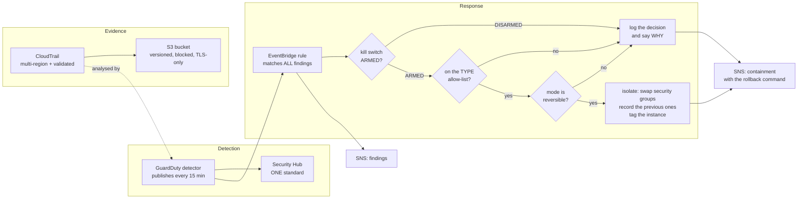
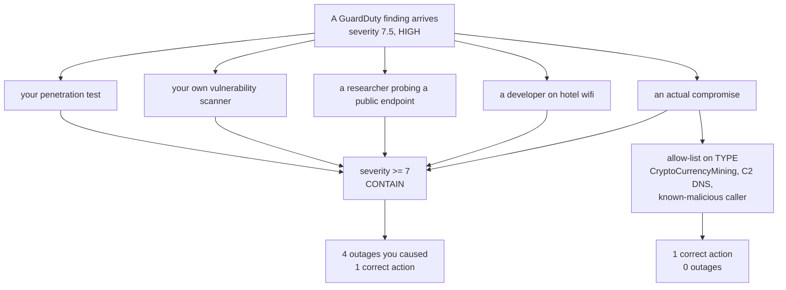
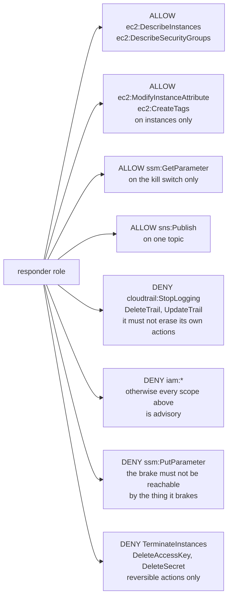
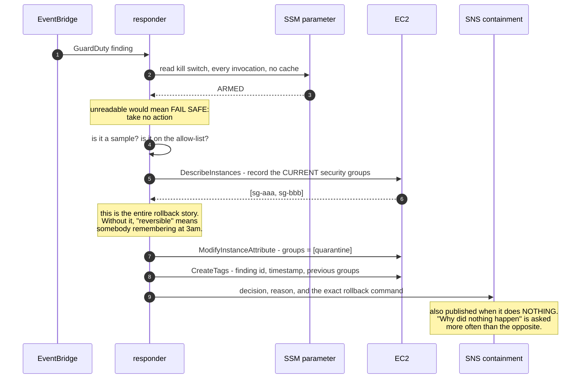
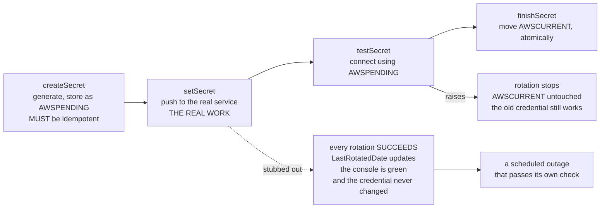
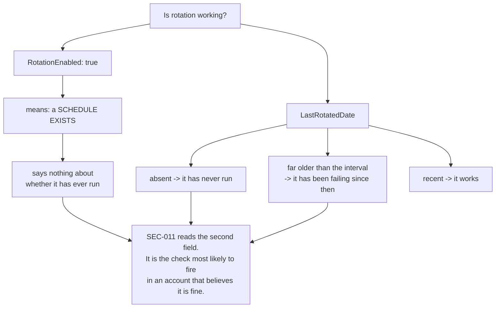
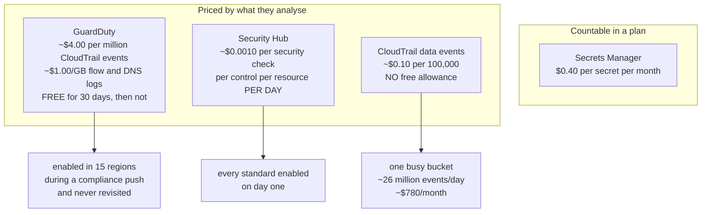
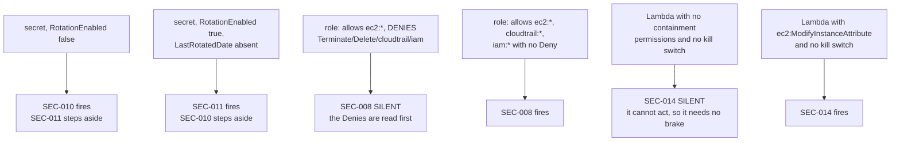

# Day 07 — Diagrams

Every diagram for Day 07, in one file, so there is one place to fix them.

All of these are validated by actually parsing them, not by looking at them.
The check is in the CP6 sweep.

---

## 1. The whole stack

Detection on the left, evidence underneath, response on the right. The three
things guarding the response path — the allow-list, the kill switch and the
Denies on the responder role — are drawn as gates rather than as boxes,
because that is what they are.



---

## 2. Severity is impact, not confidence

The single most important idea on this day, drawn because the table version
does not land as hard.



---

## 3. What the responder is allowed to do, and what it is denied

The Denies are the interesting half. An explicit Deny cannot be overridden by
any Allow, in any policy, ever — which is why these are Denies and not merely
absences.



---

## 4. Reversible containment, and what it records



---

## 5. The four-step rotation protocol

The design exists so that a rotation which fails halfway leaves a WORKING
credential behind.



---

## 6. Why RotationEnabled is not the field to look at



---

## 7. Where the money goes

Nothing here is priced per resource. Everything is priced per unit of activity,
which means `terraform plan` cannot tell you the number.



---

## 8. Which check owns which fault

Five of the sixteen checks are not independent. The arrows are why a secret
with no rotation produces one finding rather than two.



---

## Validating these

```bash
cd /path/with/node_modules
node check_mermaid.mjs day-07-enterprise-cloud-security/diagrams/README.md \
                      day-07-enterprise-cloud-security/README.md
```

The validator loads each block under a JSDOM global and calls
`mermaid.parse()`. On Node 22, do not assign to `global.navigator` — it is
getter-only and the error does not mention Mermaid.
